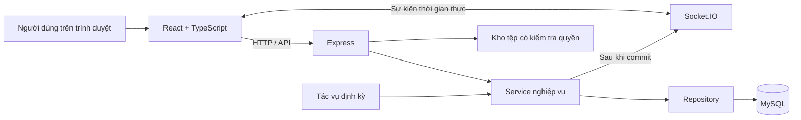
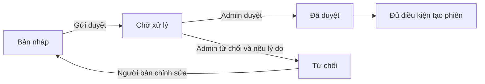
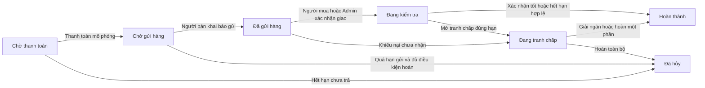
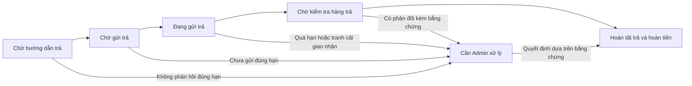
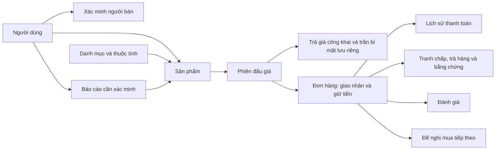

# ĐỒ ÁN 4 — XÂY DỰNG HỆ THỐNG ĐẤU GIÁ TRỰC TUYẾN

**Tài liệu đặc tả nghiệp vụ, công nghệ và phạm vi triển khai**  
**Phiên bản:** 2.0 — Đặc tả đề xuất để làm chuẩn triển khai  
**Ngày lập:** 22/09/2026  
**Project:** `DOAN4_HeThonDauGia`  
**Cơ sở dữ liệu:** `doan4_daugia`

> Tài liệu này mô tả đầy đủ nghiệp vụ dự kiến của bản đồ án và phân biệt với chức năng đang có trong code. Phiên bản 2.0 bổ sung giao nhận, trả hàng, hồ sơ uy tín, báo cáo sản phẩm và đăng lại; giữ nguyên yêu cầu bảo mật mức tối đa và giá Second Chance từ lượt trả công khai. Các thời hạn mới là giá trị thiết kế đề xuất cho đồ án, không phải quy định sao chép từ một sàn khác. Viết lại tài liệu chưa phải là thực hiện các thay đổi trên code hoặc MySQL.

**Thay đổi chính so với bản 1.0:** chốt phương án phí vận chuyển và tiền nguyên VND; bổ sung xử lý người bán không gửi/chưa nhận hàng; tách quyết định cho trả hàng khỏi thời điểm hoàn tiền; xác định cách xử lý khi một bên không hợp tác; công khai uy tín người bán đúng vai trò; thêm báo cáo cần xác minh; quy định đăng lại và nhắc hạn. Rút giá, đặt cọc, hạ giá sàn và đề nghị bán dưới sàn được để ngoài bản đầu.

**Lưu ý về số bảng:** phương án gộp hai bảng một-một tạo nền 25 bảng vẫn được giữ làm cơ sở. Chức năng báo cáo sản phẩm có vòng đời riêng nên bản này đề xuất thêm một bảng, thành **26 bảng ở thiết kế đích**. Đây là đề xuất cần duyệt ở bước SQL, không phải thay đổi đã áp dụng hoặc âm thầm thay quyết định trước của người dùng.

## Mục lục

1. [Mục tiêu và phạm vi hệ thống](#1-mục-tiêu-và-phạm-vi-hệ-thống)
2. [Tình trạng project và các quyết định hiện tại](#2-tình-trạng-project-và-các-quyết-định-hiện-tại)
3. [Công nghệ sử dụng](#3-công-nghệ-sử-dụng)
4. [Kiến trúc và nguyên tắc tổ chức code](#4-kiến-trúc-và-nguyên-tắc-tổ-chức-code)
5. [Tác nhân và quyền hạn](#5-tác-nhân-và-quyền-hạn)
6. [Thuật ngữ nghiệp vụ](#6-thuật-ngữ-nghiệp-vụ)
7. [Tài khoản, đăng nhập và địa chỉ](#7-tài-khoản-đăng-nhập-và-địa-chỉ)
8. [Xác minh người bán](#8-xác-minh-người-bán)
9. [Danh mục, thuộc tính và sản phẩm](#9-danh-mục-thuộc-tính-và-sản-phẩm)
10. [Tạo và quản lý phiên đấu giá](#10-tạo-và-quản-lý-phiên-đấu-giá)
11. [Đặt giá và đấu giá tự động](#11-đặt-giá-và-đấu-giá-tự-động)
12. [Gia hạn phút chót và thời gian thực](#12-gia-hạn-phút-chót-và-thời-gian-thực)
13. [Mua ngay, kết thúc và hủy phiên](#13-mua-ngay-kết-thúc-và-hủy-phiên)
14. [Đơn hàng và thanh toán mô phỏng](#14-đơn-hàng-và-thanh-toán-mô-phỏng)
15. [Giữ tiền, vận chuyển và kiểm tra hàng](#15-giữ-tiền-vận-chuyển-và-kiểm-tra-hàng)
16. [Tranh chấp và hoàn tiền](#16-tranh-chấp-và-hoàn-tiền)
17. [Đề nghị mua tiếp theo — Second Chance](#17-đề-nghị-mua-tiếp-theo--second-chance)
18. [Đánh giá, vi phạm và thông báo](#18-đánh-giá-vi-phạm-và-thông-báo)
19. [Quản trị và cấu hình hệ thống](#19-quản-trị-và-cấu-hình-hệ-thống)
20. [Các màn hình cần hoàn thiện](#20-các-màn-hình-cần-hoàn-thiện)
21. [Thiết kế dữ liệu và phương án số bảng](#21-thiết-kế-dữ-liệu-và-phương-án-số-bảng)
22. [Giao tiếp API và Socket.IO](#22-giao-tiếp-api-và-socketio)
23. [Bảo mật, đồng thời và tính nhất quán](#23-bảo-mật-đồng-thời-và-tính-nhất-quán)
24. [Yêu cầu chất lượng và vận hành](#24-yêu-cầu-chất-lượng-và-vận-hành)
25. [Kịch bản kiểm thử và nghiệm thu](#25-kịch-bản-kiểm-thử-và-nghiệm-thu)
26. [Phạm vi bản đầu, phần nâng cao và việc cần duyệt](#26-phạm-vi-bản-đầu-phần-nâng-cao-và-việc-cần-duyệt)
27. [Thứ tự triển khai sau khi duyệt tài liệu](#27-thứ-tự-triển-khai-sau-khi-duyệt-tài-liệu)
28. [Căn cứ đối chiếu trong project](#28-căn-cứ-đối-chiếu-trong-project)

## 1. Mục tiêu và phạm vi hệ thống

### 1.1. Bài toán

Xây dựng website giúp người bán đưa sản phẩm lên đấu giá và người mua cạnh tranh bằng các mức giá hợp lệ trong một khoảng thời gian xác định. Hệ thống phải quản lý được toàn bộ quá trình từ xác minh người bán, duyệt sản phẩm, tổ chức đấu giá đến giao hàng, giải quyết tranh chấp và hoàn tất giao dịch.

Đây là website đấu giá **đa danh mục**, không chỉ dành cho đồ cổ hoặc hàng xa xỉ. Các nhóm sản phẩm có thể gồm điện thoại, máy tính, thiết bị điện tử, âm thanh, máy ảnh, đồng hồ, thời trang, xe máy, ô tô, đồ sưu tầm, nội thất và gia dụng. Danh mục cụ thể do Admin quản lý.

### 1.2. Mục tiêu chính

- Người dùng dễ tìm sản phẩm, theo dõi phiên và tham gia đấu giá.
- Người bán phải được xác minh trước khi có quyền đăng bán.
- Sản phẩm phải được duyệt trước khi được đưa vào phiên đấu giá.
- Thuật toán đấu giá tự động phải công bằng, giữ kín mức giá tối đa và xử lý được nhiều yêu cầu cùng lúc.
- Tiền thanh toán được giữ trung gian, chỉ xử lý theo kết quả giao nhận hoặc tranh chấp.
- Các bước quan trọng có trạng thái, thời hạn và dấu vết để kiểm tra.
- Giao diện tiếng Việt, rõ ràng trên máy tính và điện thoại, phù hợp trình diễn và bảo vệ đồ án.

### 1.3. Phạm vi bản đồ án

Bản đồ án sử dụng thanh toán mô phỏng, quản lý vận chuyển thủ công và một backend chính. Tiền trong hệ thống là dữ liệu mô phỏng, không thu tiền thật hoặc chuyển tiền ngân hàng thật.

Một phiên đấu giá bán một sản phẩm. Bản đầu thực hiện giao hàng nội địa Việt Nam, một lượt giao đi và tối đa một lượt trả lại được phê duyệt trong cùng đơn. Không xây dựng giỏ hàng nhiều sản phẩm, chia nhiều kiện, đổi hàng, giao quốc tế, tự đến nhận hoặc bán nhiều số lượng trong cùng phiên.

Nền tảng không thu phí người mua, phí người bán hoặc phí đăng phiên trong bản đầu. Tổng thanh toán bằng giá sản phẩm cộng phí vận chuyển đã công bố. Dashboard dùng tên **giá trị giao dịch mô phỏng**, không gọi toàn bộ tiền đơn hàng là doanh thu nền tảng. Chính sách kiểm duyệt có thể giới hạn danh mục nào được giao dịch trong bản đầu; giao diện đa danh mục không có nghĩa mọi loại hàng đều mặc nhiên được phép bán.

Giao diện tham khảo tông đen–vàng do người dùng cung cấp. Tên hiển thị đang thử nghiệm là **Lạc Việt Auctions**; tên thương hiệu có thể đổi khi chốt giao diện và không làm thay đổi nghiệp vụ.

## 2. Tình trạng project và các quyết định hiện tại

### 2.1. Những gì đã kiểm tra

- Có hai phần `frontend` và `backend` trong cùng project.
- Frontend đã khởi tạo bằng React + TypeScript + Vite, đã cài các thư viện nêu ở mục 3.
- Đã bắt đầu soạn một số thành phần giao diện và lớp kết nối API. Các trang chưa được tích hợp và nghiệm thu thành một ứng dụng hoàn chỉnh; màn hình khởi động hiện vẫn thuộc bộ khung Vite.
- Backend đã có các module tài khoản, xác minh, sản phẩm, đấu giá, đơn hàng, thanh toán mô phỏng, tranh chấp, thông báo, quản trị và bộ kiểm thử. Backend không còn chỉ ở mức khởi tạo như mô tả ban đầu.
- Lần kiểm tra MySQL ngày 22/09/2026 ghi nhận **8.0.46**, database `doan4_daugia` có **27 bảng InnoDB, 49 khóa ngoại, 2 view và 2 trigger**. Đây là hiện trạng đã kiểm tra, không phải cấu trúc đích của bản 2.0.
- Chưa thực hiện thay đổi cấu trúc hoặc chuyển dữ liệu trên MySQL khi viết lại tài liệu.

### 2.2. Hướng cơ sở dữ liệu đã chọn

Người dùng đã chọn hướng **25 bảng**:

- Gộp thông tin `van_chuyen` vào `don_hang`.
- Gộp thông tin `giu_tien_trung_gian` vào `don_hang`.
- Giữ các bảng còn lại và các quan hệ nghiệp vụ quan trọng.

Hướng gộp này áp dụng cho phạm vi 1.0. Sau khi bổ sung báo cáo sản phẩm ở bản 2.0, đề xuất dữ liệu là **25 bảng nền + 1 bảng báo cáo = 26 bảng**, chi tiết tại mục 21. Không ép báo cáo chưa xác minh vào bảng vi phạm hoặc nhật ký chỉ để giữ đúng con số 25.

Database đang chạy vẫn theo cấu trúc 27 bảng đã kiểm tra. Phần sửa code gộp bảng trước đó đã được rút lại; backend hiện chưa triển khai cấu trúc mới.

Giảm số bảng giúp cách trình bày gọn hơn, nhưng không tự chứng minh hệ thống chạy nhanh hơn. Tối ưu hiệu năng cần dựa vào truy vấn, chỉ mục, dữ liệu và kết quả đo.

### 2.3. Cách hiểu tài liệu

- **Quy tắc của bản 2.0:** hành vi đích để lập trình và nghiệm thu sau khi tài liệu được duyệt. Các quy tắc mới có quyết định cụ thể thay cho các câu hỏi mở của bản 1.0.
- **Hiện trạng/khác biệt:** cách code đang hoạt động; phải sửa nếu chưa phù hợp với quy tắc đích. Không dùng mô tả hiện trạng để bỏ qua một yêu cầu mới.
- **Ngoài bản đầu:** chức năng nâng cao chủ động chưa làm, không hiển thị trên giao diện như thể đã có.
- **Cần duyệt trước triển khai:** phạm vi tài liệu, thời hạn cấu hình mới và bản thiết kế/chuyển đổi SQL; không yêu cầu xin phép lại cho từng file sau khi phạm vi tương ứng đã được đồng ý.

Các mã `NV-01` đến `NV-35` được giữ để đối chiếu tài liệu trước; nghiệp vụ bổ sung dùng `NV-36` trở đi.

## 3. Công nghệ sử dụng

Các nhóm phiên bản dưới đây được đối chiếu từ `package.json` hiện có; chúng thể hiện nhánh phiên bản project đang khai báo, không phải cam kết sử dụng phiên bản mới nhất trên Internet.

### 3.1. Frontend

**React 19** xây dựng giao diện bằng component. Trang khám phá, thẻ phiên, biểu mẫu, bảng quản trị và chi tiết đơn hàng được chia thành những phần có thể tái sử dụng.

**TypeScript 6** khai báo kiểu dữ liệu cho người dùng, sản phẩm, phiên đấu giá, đơn hàng và phản hồi API; giúp phát hiện lỗi sử dụng dữ liệu khi build.

**Vite 8** chạy môi trường phát triển và đóng gói frontend. Cổng phát triển dự kiến là 5173. Khi phát triển, các yêu cầu `/api` và kết nối Socket.IO có thể đi qua proxy sang backend.

**Ant Design 6** cung cấp biểu mẫu, bảng dữ liệu, hộp thoại, thông báo, chọn ngày, trạng thái chờ và các thành phần tương tác. Giao diện sẽ tùy chỉnh màu sắc, khoảng cách và kiểu chữ theo mẫu đen–vàng.

**Axios 1** gửi yêu cầu HTTP, thêm token xác thực, xử lý lỗi kết nối, tải tệp và thống nhất cách đọc phản hồi backend.

**React Router 7** điều hướng giữa các trang, bảo vệ các màn hình cần đăng nhập và chia bố cục người mua, người bán, Admin. Quyền truy cập vẫn phải được kiểm tra tại backend.

**TanStack Query 5** quản lý dữ liệu lấy từ máy chủ: tải, lưu tạm, tải lại sau thao tác và đồng bộ giao diện sau sự kiện đấu giá. Không dùng cache để quyết định người thắng hoặc xác nhận thanh toán.

**Zustand 5** quản lý trạng thái giao diện và phiên đăng nhập ở phía trình duyệt. Không sao chép toàn bộ dữ liệu máy chủ vào store nếu TanStack Query đã quản lý dữ liệu đó.

**Socket.IO Client 4** nhận thay đổi giá, trạng thái phiên, thời gian kết thúc mới và thông báo riêng. Khi mất kết nối rồi kết nối lại, frontend phải gọi API để lấy trạng thái mới nhất.

**Day.js 1** phục vụ định dạng thời gian, thời hạn và dữ liệu chọn ngày. Đồng hồ đếm ngược chỉ hỗ trợ hiển thị; thời gian máy chủ quyết định việc nhận giá.

**React Hook Form 7 và Zod 4** đã được cài. Quy ước đích: dùng React Hook Form quản lý biểu mẫu nghiệp vụ và Zod kiểm tra dữ liệu, phối hợp với các ô nhập của Ant Design. Không để Ant Design Form đồng thời giữ một bộ giá trị/kiểm tra khác cho cùng biểu mẫu. Các biểu mẫu nháp hiện có chưa được xem là đã thống nhất quy ước này. Backend vẫn kiểm tra lại mọi dữ liệu, dù phía trình duyệt báo hợp lệ.

**Framer Motion 13** đã được cài để tạo chuyển động giao diện vừa phải, ví dụ chuyển trang hoặc mở nội dung. Không dùng hiệu ứng làm chậm thao tác đặt giá hoặc che khuất trạng thái giao dịch.

**ESLint và công cụ kiểm tra TypeScript** kiểm tra chất lượng code frontend. Việc cài thư viện không có nghĩa mọi thư viện đã được sử dụng đầy đủ trong các trang hiện tại.

### 3.2. Backend

**Node.js** chạy JavaScript phía máy chủ; project đã được kiểm thử trước đó với Node.js 24.13.0.

**Express.js 5** khai báo API, nhận yêu cầu, chạy middleware và trả phản hồi. Backend dùng **CommonJS** với `require` và `module.exports`.

**mysql2 3** kết nối MySQL thông qua pool, chạy truy vấn có tham số và xử lý transaction. Project dùng SQL trực tiếp trong repository, không sử dụng Prisma hoặc Sequelize.

**jsonwebtoken 9 / JWT** ký và xác minh token đăng nhập. Cấu hình hiện có đặt thời hạn token 8 giờ. Khóa ký chỉ nằm ở máy chủ, không đưa sang frontend.

**bcrypt 6** băm mật khẩu trước khi lưu và đối chiếu khi đăng nhập. Mật khẩu không được lưu dưới dạng có thể đọc lại.

**Socket.IO 4** phát sự kiện cho phòng phiên đấu giá và phòng riêng của từng người dùng đã xác thực.

**Multer 2** nhận ảnh sản phẩm, ảnh đại diện, giấy tờ xác minh và bằng chứng tranh chấp. Dữ liệu tải lên phải kiểm tra loại, dung lượng và quyền truy cập.

**dotenv 17** nạp cấu hình khi ứng dụng chạy. Tài liệu chỉ mô tả tên biến, không chứa giá trị bí mật hoặc nội dung `.env`.

**cors 2** cấu hình nguồn frontend được phép gọi API qua trình duyệt. CORS không thay thế xác thực hoặc phân quyền.

**nodemon 3** tự khởi động lại backend khi thay đổi code trong môi trường phát triển.

**Prettier 3** định dạng code để dễ đọc. **Bộ kiểm thử tích hợp sẵn của Node.js** (`node:test`, `node:assert`) kiểm tra thuật toán, API và các nghiệp vụ chạy với MySQL.

### 3.3. Cơ sở dữ liệu và lưu trữ

- **MySQL 8, InnoDB:** lưu dữ liệu quan hệ, hỗ trợ khóa ngoại, transaction và khóa bản ghi.
- **utf8mb4:** lưu tiếng Việt và các ký tự Unicode cần thiết.
- **DECIMAL(15,2):** lưu số tiền có độ chính xác cố định. Backend tính tiền bằng BigInt ở đơn vị 1/100, tránh sai số số thực.
- **DATETIME/TIMESTAMP:** lưu các mốc nghiệp vụ và dấu thời gian. Múi giờ mặc định backend là `+07:00`.
- **Tệp trên máy chủ:** ảnh và tài liệu hiện lưu trong thư mục upload của backend. Chưa sử dụng dịch vụ lưu trữ đám mây trong phạm vi hiện tại.
- **MySQL Workbench:** có thể dùng để kiểm tra cấu trúc, truy vấn và dựng sơ đồ. Workbench là công cụ phát triển, không phải thành phần chạy nghiệp vụ website.

### 3.4. Công cụ và dịch vụ ngoài phạm vi hiện tại

Postman được dùng để kiểm thử API; Git phục vụ quản lý thay đổi mã nguồn. Hiện không đưa Redis, hàng đợi phân tán, cổng thanh toán thật, API đơn vị vận chuyển, gửi SMS, đăng nhập Google/Facebook hoặc hệ thống microservice vào phạm vi bắt buộc.

## 4. Kiến trúc và nguyên tắc tổ chức code

### 4.1. Kiến trúc tổng thể

### 4.2. Phân lớp backend

Luồng xử lý chuẩn: **Route → Controller → Service → Repository → MySQL**.

- Route khai báo đường dẫn và middleware áp dụng.
- Middleware xác thực token, kiểm tra vai trò, giới hạn yêu cầu và xử lý lỗi chung.
- Controller nhận đầu vào, gọi service, trả phản hồi; không chứa thuật toán đấu giá.
- Service xử lý điều kiện nghiệp vụ, transaction, chuyển trạng thái và gọi thông báo.
- Repository chứa SQL, chỉ nhận tên bảng/cột được kiểm soát.
- Validator kiểm tra dữ liệu đầu vào.
- Socket và job dùng lại service; không tạo một thuật toán tính giá riêng.
- Tiện ích tiền, thời gian và lọc dữ liệu công khai được dùng thống nhất.

### 4.3. Nguyên tắc frontend

- Trang chỉ tổ chức giao diện và thao tác của người dùng.
- Lớp API tập trung cấu hình Axios và cách xử lý lỗi.
- Hook quản lý truy vấn, tải lại và dữ liệu hiển thị.
- Component dùng chung cho ảnh, trạng thái, biểu mẫu, bảng, phân trang và xác nhận thao tác.
- Không tính kết quả đấu giá, giá thanh toán hay quyền sở hữu chỉ dựa trên dữ liệu trình duyệt.
- Phải có trạng thái đang tải, không có dữ liệu, lỗi kết nối và thử lại.

### 4.4. Quy ước mã nguồn

- Tên file và định danh nghiệp vụ dùng tiếng Việt không dấu, ví dụ `don-hang.js`, `taoPhienDauGia`, `nguoiBanId`.
- Thông báo cho người dùng và chú thích giải thích nghiệp vụ dùng tiếng Việt có dấu.
- Giữ nguyên từ khóa JavaScript, API thư viện và các hợp đồng HTTP/Socket.IO đã sử dụng.
- Mỗi thao tác hoặc điều kiện quan trọng cần trình bày rõ ràng; không nén nhiều lệnh vào cùng một dòng.
- Ưu tiên hàm ngắn, chia theo trách nhiệm; tránh một file chứa toàn bộ nghiệp vụ hệ thống.
- Không đổi hàng loạt đường dẫn API chỉ để Việt hóa tên nếu chưa cập nhật đồng bộ tài liệu, frontend và kiểm thử.

## 5. Tác nhân và quyền hạn

### 5.1. Khách chưa đăng nhập

Được xem danh mục, các sản phẩm công khai, danh sách phiên, chi tiết phiên, giá công khai, lịch sử trả giá đã ẩn danh và hướng dẫn. Được đăng ký hoặc đăng nhập.

Không được đặt giá, Mua ngay, theo dõi phiên trong tài khoản, xem dữ liệu giao dịch riêng hoặc truy cập quản trị.

### 5.2. Người dùng — `NGUOI_DUNG`

Một tài khoản người dùng có thể mua. Khi được xác minh người bán, chính tài khoản đó có thêm quyền bán; không tách thành hai tài khoản Buyer và Seller.

Người dùng có tài khoản hoạt động được quản lý hồ sơ, địa chỉ, theo dõi phiên, đặt giá, Mua ngay, xử lý đơn mua, phản hồi đề nghị mua tiếp, mở tranh chấp đúng điều kiện và đánh giá giao dịch đã hoàn tất.

### 5.3. Người bán đã xác minh

Là `NGUOI_DUNG` có `trang_thai_nguoi_ban = DA_XAC_MINH` và tài khoản còn hoạt động.

Ngoài quyền người mua, được quản lý sản phẩm của mình, gửi sản phẩm để duyệt, tạo phiên, yêu cầu hủy phiên, quản lý đơn bán, khai báo vận chuyển, cung cấp hướng dẫn nhận hàng trả, phản hồi tranh chấp và đề nghị mua tiếp theo khi đủ điều kiện.

Không được đấu giá hoặc Mua ngay sản phẩm do chính mình bán. Không được tự duyệt sản phẩm, tự xác minh mình hoặc tự giải quyết tranh chấp.

### 5.4. Quản trị viên — `QUAN_TRI`

Được quản lý danh mục, duyệt hồ sơ người bán, duyệt sản phẩm, xét yêu cầu hủy, tiếp nhận báo cáo, theo dõi đơn/tranh chấp/trả hàng, xử lý hoàn tiền mô phỏng, xem xét vi phạm, thay đổi trạng thái tài khoản, cấu hình nghiệp vụ và xem nhật ký. Các quyết định ảnh hưởng đến hàng hoặc tiền cần có lý do và dấu vết; không được thay bằng việc sửa trực tiếp dữ liệu trong MySQL.

Trong phạm vi hiện tại, Admin không tham gia đấu giá như người mua. API không cung cấp mức giá tối đa bí mật cho Admin. Việc người vận hành MySQL có quyền kỹ thuật đọc dữ liệu là vấn đề quản lý quyền máy chủ, không phải quyền của tài khoản Admin trên website.

### 5.5. Tác vụ hệ thống

Tự mở/kết thúc phiên đến hạn, tạo đơn, xử lý quá hạn thanh toán, chuyển đề nghị mua tiếp, xử lý đơn quá hạn gửi chưa ghi nhận giao đi, nhắc hạn, theo dõi các hạn giao/nhận trả và hoàn tất đơn đủ điều kiện. Các vụ việc cần đánh giá bằng chứng chuyển vào hàng đợi Admin; job không tự suy luận bên nào nói đúng chỉ vì một bên không bấm nút.

## 6. Thuật ngữ nghiệp vụ

- **Sản phẩm:** thông tin về món đồ, ảnh, danh mục, tình trạng và kết quả duyệt.
- **Phiên đấu giá:** thời gian và điều kiện đưa một sản phẩm ra cạnh tranh giá.
- **Giá khởi điểm:** giá mở đầu của phiên.
- **Giá sàn:** mức tối thiểu người bán chấp nhận để phiên thành công; có thể không thiết lập.
- **Giá Mua ngay:** giá cho phép chốt mua ngay khi tính năng còn hiệu lực.
- **Giá hiện tại:** giá công khai người đang dẫn đầu sẽ phải thanh toán nếu phiên chốt tại thời điểm đó và đủ điều kiện.
- **Mức giá tối đa:** giới hạn bí mật người mua cam kết, dùng cho đấu giá tự động; không đồng nghĩa với giá hiện tại.
- **Bước giá:** mức tăng được hệ thống cấu hình theo khoảng giá.
- **Người dẫn đầu:** người đang có vị trí dẫn đầu; chưa chắc trở thành người thắng cho đến khi chốt phiên.
- **Lượt trả giá công khai:** giá được ghi vào lịch sử công khai, có thể là lượt trực tiếp hoặc phản hồi tự động.
- **Giữ tiền trung gian:** giữ số tiền mô phỏng trong hệ thống cho đến khi giao dịch đủ điều kiện giải ngân hoặc hoàn tiền.
- **Second Chance:** đề nghị mua cho người trả giá hợp lệ tiếp theo khi đơn trước bị hủy do không thanh toán.
- **Ngày giao dự kiến:** mốc công bố khi gửi hàng để xét chậm giao; không phải bằng chứng đã giao.
- **Báo cáo sản phẩm:** phản ánh chưa được xác minh, cần được Admin kiểm tra; không đồng nghĩa một vi phạm đã được xác nhận.
- **Quyết định cho trả hàng:** chấp thuận một quy trình gửi trả, chưa có nghĩa tiền đã được hoàn.
- **Số tiền còn giữ:** phần tiền đã thu mô phỏng chưa được hoàn hoặc giải ngân; phải tính chính xác để ngăn xử lý vượt tiền.

## 7. Tài khoản, đăng nhập và địa chỉ

### NV-01. Đăng ký và đăng nhập

**Đầu vào đăng ký:** họ tên, email, mật khẩu; số điện thoại nếu cung cấp.

1. Kiểm tra định dạng và các trường bắt buộc.
2. Kiểm tra email và số điện thoại không trùng theo ràng buộc hiện có.
3. Băm mật khẩu rồi tạo tài khoản người dùng thường.
4. Tài khoản mới chưa có quyền bán.
5. Khi đăng nhập đúng và tài khoản hoạt động, trả token cùng thông tin hồ sơ được phép công khai cho chính người dùng.

Backend hiện yêu cầu mật khẩu đăng ký ít nhất 8 ký tự. Không trả mật khẩu hoặc mã băm ra API. Khi token hết hạn, frontend yêu cầu đăng nhập lại; không tiếp tục gửi thao tác nhạy cảm bằng phiên cũ.

Quên mật khẩu qua email, OTP và đăng nhập mạng xã hội chưa thuộc luồng hiện có. Giao diện không được hiển thị những chức năng này như thể đã hoạt động.

### NV-02. Hồ sơ và trạng thái tài khoản

Người dùng xem/cập nhật họ tên, số điện thoại và ảnh đại diện theo các trường API cho phép. Không tự cập nhật vai trò, kết quả xác minh hoặc trạng thái khóa tài khoản.

Trạng thái tài khoản gồm `HOAT_DONG`, `BI_KHOA`, `TAM_NGUNG`. Admin thay đổi trạng thái kèm lý do. Backend phải từ chối các yêu cầu không còn được phép, kể cả token đã được cấp trước khi khóa.

**Quy tắc bổ sung khi khóa giữa giao dịch:** chặn các giao dịch mới; lập danh sách đơn liên quan còn tiền giữ để Admin tiếp quản và đánh dấu cần xử lý. Không tự giải ngân, kết luận lỗi hoặc chuyển tiền chỉ vì tài khoản bị khóa. Đơn chưa thanh toán tiếp tục theo hạn thanh toán; đơn đã thanh toán được xem xét riêng. Admin có thể cập nhật mốc giao nhận dựa trên bằng chứng, mở vụ việc hỗ trợ và xử lý theo quyền, không đặt giá thay tài khoản bị khóa. Khi gỡ cờ cần xử lý phải ghi quyết định và thời hạn mới nếu cần, rồi mới cho các job thông thường tiếp tục. Backend hiện chưa có đầy đủ quy trình tiếp quản này.

### NV-03. Địa chỉ giao hàng

Mỗi người dùng được lưu nhiều địa chỉ: tên người nhận, số điện thoại, tỉnh/thành, quận/huyện, phường/xã và địa chỉ chi tiết. Có địa chỉ mặc định.

Trước khi đặt giá hoặc Mua ngay, người mua cần có địa chỉ nhận hàng. Khi tạo đơn, hệ thống lưu bản chụp địa chỉ vào đơn; thay đổi sổ địa chỉ sau đó không tự sửa địa chỉ của đơn cũ.

Không được sửa/xóa địa chỉ của người khác. Cách xử lý hiện có không cho xóa địa chỉ cuối cùng khi người dùng đang có cam kết đấu giá cần địa chỉ để tạo đơn. Đơn chưa thanh toán và còn hạn được chọn lại địa chỉ thuộc chính người mua.

## 8. Xác minh người bán

### NV-04. Nộp và xét duyệt hồ sơ

**Mục đích:** kiểm tra danh tính người bán trước khi cho phép đăng bán.

Hồ sơ gồm loại giấy tờ, số giấy tờ, ảnh giấy tờ, ảnh selfie và thông tin ngân hàng: tên ngân hàng, số tài khoản, chủ tài khoản. Với CCCD, cần các ảnh theo quy định của biểu mẫu, bao gồm hai mặt.

Luồng chính:

1. Người dùng đăng nhập, chọn đăng ký người bán.
2. Tải tệp hợp lệ và điền thông tin.
3. Gửi hồ sơ sang trạng thái chờ xử lý.
4. Admin xem hồ sơ và duyệt hoặc từ chối.
5. Nếu duyệt, tài khoản được xác minh người bán.
6. Nếu từ chối, lưu lý do để người dùng biết và nộp lại theo điều kiện API.

Trạng thái người bán: `CHUA_DANG_KY → CHO_XU_LY → DA_XAC_MINH` hoặc `TU_CHOI`.

Hồ sơ xác minh là dữ liệu riêng tư, chỉ chủ hồ sơ và Admin được phép xem. Không trả số giấy tờ, thông tin ngân hàng hoặc ảnh giấy tờ ở trang người bán công khai. Việc xác minh trong đồ án là xét duyệt thủ công, không tích hợp dịch vụ eKYC thật.

Dấu “Đã xác minh” chỉ nói rằng hồ sơ người bán đã được duyệt. Không diễn đạt thành chứng nhận hàng chính hãng, cam kết không gian lận hoặc bảo đảm tài chính.

## 9. Danh mục, thuộc tính và sản phẩm

### NV-05. Danh mục và thuộc tính động

Admin quản lý danh mục cha/con, tên, đường dẫn, mô tả, thứ tự và trạng thái hoạt động. Không được tạo chu trình trong cây danh mục.

Mỗi danh mục có thể có các thuộc tính phù hợp, ví dụ điện thoại có dung lượng/bộ nhớ, đồng hồ có loại máy, xe có năm sản xuất. Các kiểu thuộc tính gồm văn bản, số, lựa chọn, đúng/sai và ngày.

Thuộc tính có tên, khóa, kiểu nhập, đơn vị, danh sách lựa chọn nếu cần và cờ bắt buộc. Backend kiểm tra sản phẩm sử dụng đúng thuộc tính của danh mục. Cách xử lý hiện tại chưa tự kế thừa thuộc tính từ danh mục cha.

### NV-06. Tạo và duyệt sản phẩm

**Điều kiện:** người bán đã xác minh và tài khoản hoạt động.

Thông tin sản phẩm gồm danh mục, tiêu đề, mô tả, tình trạng, thương hiệu nếu có, danh sách ảnh và các giá trị thuộc tính.

Tình trạng sản phẩm hỗ trợ: mới, như mới, đã qua sử dụng tốt, đã qua sử dụng và lấy linh kiện.

Quy tắc:

- Chỉ chủ sản phẩm được sửa theo điều kiện trạng thái.
- Chỉ sửa sản phẩm nháp/bị từ chối và chưa có lịch sử phiên theo cách xử lý hiện có.
- Gửi duyệt cần ít nhất một ảnh và đủ thuộc tính bắt buộc.
- Giới hạn hiện có tối đa 12 ảnh một sản phẩm; có ảnh chính và thứ tự ảnh.
- Admin duyệt hoặc từ chối, lưu người duyệt, thời gian và lý do nếu từ chối.
- Sản phẩm không được duyệt không được đưa vào phiên công khai.
- Không tự sửa giá, mô tả hoặc các điều kiện giao dịch sau khi đã đưa sản phẩm vào phiên thông qua một đường cập nhật bỏ qua kiểm tra.

### NV-36. Hàng bị cấm/hạn chế và báo cáo sản phẩm

Admin duyệt dựa trên danh mục nội dung cho phép của đồ án. Các lý do kiểm duyệt gồm `HANG_CAM`, `NGHI_HANG_GIA`, `VI_PHAM_SO_HUU_TRI_TUE`, `HANG_NGUY_HIEM`, `THIEU_CHUNG_TU`, `KHAC`. Đây là mã xử lý nội bộ, không phải kết luận pháp lý hay chứng nhận chuyên môn.

Danh mục cần giấy tờ/xác thực bổ sung chỉ được mở bán khi quy trình kiểm tra tương ứng được thống nhất. Bản đầu không nhận các sản phẩm mà hệ thống chưa có khả năng kiểm tra điều kiện bán/giao nhận cần thiết. Nội dung chính sách do Admin quản lý theo phạm vi đã duyệt; không để mặc định “có danh mục là được bán mọi thứ trong danh mục”.

Luồng báo cáo:

1. Người đã đăng nhập, tài khoản hoạt động chọn sản phẩm/phiên, lý do và mô tả.
2. Mỗi người chỉ có một báo cáo đang mở cho cùng sản phẩm; các yêu cầu lặp không tạo nhiều bản ghi giống nhau. Có giới hạn tần suất.
3. Lưu người báo cáo, sản phẩm, phiên liên quan nếu có, thời gian và trạng thái `CHO_XU_LY`.
4. Admin tiếp nhận thành `DANG_XU_LY`, kiểm tra dữ liệu và kết luận `CO_CO_SO` hoặc `KHONG_CO_CO_SO`, kèm lý do và thời gian.
5. Báo cáo có cơ sở có thể dẫn đến ngừng đăng mới, hủy phiên còn mở hoặc tạo vụ việc xử lý đơn đã có; không tự động tạo điểm vi phạm chỉ vì có nhiều người báo cáo.

Bản đầu nhận mô tả văn bản và tham chiếu nội dung/ảnh đã có trên sản phẩm. Upload tài liệu bổ sung riêng cho báo cáo chưa nằm trong bản đầu; không lách quyền bằng cách dùng một tệp bằng chứng của tranh chấp khác.

Người báo cáo được xem kết quả của báo cáo mình gửi. Không công khai danh tính người báo cáo cho người bán. Người bán được nhận lý do kiểm duyệt và nội dung cần khắc phục, đã loại thông tin riêng không cần thiết.

Nếu Admin xác định có rủi ro cần dừng, phải khóa phiên/đơn liên quan trong transaction: phiên chưa kết thúc thì chặn đặt giá/Mua ngay và ghi lý do hủy; phiên đã có đơn thì xử lý tại đơn, giữ tiền nếu còn và mở vụ việc theo bằng chứng. Không xóa lịch sử trả giá hoặc hoàn tiền mặc định cho tất cả đơn chỉ bằng một thao tác trên báo cáo.

## 10. Tạo và quản lý phiên đấu giá

### NV-07. Tạo phiên

Người bán chọn sản phẩm đã được duyệt của mình và nhập giá khởi điểm, giá sàn nếu có, giá Mua ngay nếu có, thời gian bắt đầu/kết thúc và chính sách phí vận chuyển.

Điều kiện kiểm tra:

- Giá khởi điểm từ 1 VND trở lên; các giá đặt và phí của giao dịch mới là tiền nguyên VND, nằm trong giới hạn dữ liệu tiền. Không nhận giá âm, số lẻ VND hoặc làm tròn tự động một mức giá đã gửi.
- Giá sàn không thấp hơn giá khởi điểm.
- Giá Mua ngay không thấp hơn giá sàn nếu có sàn; nếu không có sàn, không thấp hơn giá khởi điểm.
- Thời gian kết thúc phải sau thời gian bắt đầu và còn trong tương lai.
- Đầu vào thời gian cần có múi giờ; không nhận thời gian mơ hồ từ trình duyệt.
- Không tạo thêm phiên có thể làm bán trùng sản phẩm đang có phiên chờ, đang hoạt động hoặc đã kết thúc thành công và còn liên quan đến xử lý giao dịch.

Khi tạo phiên, chụp cấu hình gia hạn đang áp dụng vào phiên. Admin sửa cấu hình sau này không tự thay điều kiện đã chụp của các phiên cũ.

Trạng thái phiên gồm `DA_LEN_LICH`, `HOAT_DONG`, `DA_KET_THUC`, `THAT_BAI`, `DA_HUY`.

Cách xử lý hiện có không cung cấp chỉnh sửa tùy ý giá/thời gian phiên sau khi tạo. Bản 2.0 giữ nguyên nguyên tắc khóa điều kiện phiên, bao gồm phí vận chuyển; muốn hủy phải qua luồng yêu cầu và xét duyệt. Hạ giá sàn trong phiên chưa thuộc bản đầu.

### NV-37. Phí vận chuyển và tổng chi phí

Bản đầu có hai lựa chọn: `MIEN_PHI` với phí bằng 0; `PHI_CO_DINH` với phí nguyên VND lớn hơn 0. Mức phí áp dụng cho phạm vi nội địa đã công bố trong điều kiện phiên; người bán chịu trách nhiệm báo mức phí trước khi tạo phiên.

Phí được khóa cùng điều kiện phiên từ khi tạo. Giao diện phải cho xem trước khi đặt giá/Mua ngay: giá hiện tại, phí vận chuyển và tổng tạm tính; trước khi xác nhận đặt trần cần làm rõ **trần chỉ áp dụng cho giá sản phẩm, phí vận chuyển tính riêng**.

Ví dụ người mua nhập trần sản phẩm 2.000.000 đ, phí vận chuyển 50.000 đ: cam kết tối đa cho giao dịch là 2.050.000 đ; nếu thắng ở 1.600.000 đ thì tổng đơn là 1.650.000 đ. Backend tính số tiền, không nhận tổng tự tính của client làm nguồn tin cậy.

Khi tạo đơn, chụp phí và phương thức từ phiên sang đơn. Second Chance của cùng phiên sử dụng chính sách phí đã công bố đó; người bán không được cộng thêm phí ở bước gửi đề nghị. Đổi địa chỉ trước thanh toán không được âm thầm làm thay phí cố định; địa chỉ ngoài phạm vi phục vụ bị từ chối rõ ràng.

Tự đến nhận, phí theo khoảng cách, phí thu hộ và thương lượng phí sau khi thắng để ngoài bản đầu. Nếu người bán nhập nhầm phí, phải xử lý theo yêu cầu hủy/đăng lại đúng điều kiện, không tăng phí khi người mua đã có cam kết.

## 11. Đặt giá và đấu giá tự động

### NV-08. Điều kiện được đặt giá

- Đã đăng nhập bằng tài khoản người dùng hoạt động.
- Có địa chỉ nhận hàng.
- Không phải người bán của sản phẩm.
- Phiên đã đến giờ bắt đầu và chưa hết giờ theo MySQL.
- Sản phẩm vẫn đáp ứng điều kiện tham gia phiên.
- Mức giá gửi lên hợp lệ theo giá hiện tại, bước giá và cam kết trước đó.

Người dùng nhập **mức tối đa sẵn sàng trả**. Hệ thống tự tính các lượt đáp trả công khai. Không yêu cầu người mua tự gửi mọi bước tăng giá qua nhiều request.

### NV-09. Giữ kín mức tối đa

Mức tối đa được lưu riêng trong `muc_gia_toi_da` và chỉ được backend đọc để tính đấu giá.

- Không có API đọc mức tối đa cho người khác, người bán hoặc Admin; hợp đồng hiện có cũng không có API đọc lại trần của chính mình.
- Không phát mức tối đa qua Socket.IO.
- Không ghi mức tối đa vào thông báo, nhật ký ứng dụng hoặc phản hồi lỗi.
- API công khai chỉ trả giá hiện tại, lịch sử công khai, trạng thái, người dẫn đầu đã ẩn danh và các trường cho phép.
- Sau khi gửi thành công, giao diện thông báo đã ghi nhận và có đang dẫn đầu hay không; không biến giá hiện tại thành nhãn “mức tối đa của đối thủ”.

Một lượt công khai đôi khi bằng mức tối đa đã dùng hết; điều đó khác với việc công bố trường dữ liệu bí mật hoặc phần cam kết chưa được sử dụng.

### NV-10. Nguyên tắc tính giá

1. Không có giá sàn và chưa có ai trả giá: người hợp lệ đầu tiên dẫn đầu tại giá khởi điểm. Bản 2.0 yêu cầu giá khởi điểm ít nhất 1 VND và sử dụng tiền nguyên VND. Backend hiện còn nhánh xử lý giá khởi điểm 0 thành 0,01; đây là khác biệt cần sửa cho giao dịch mới, không được lặng lẽ làm tròn dữ liệu cũ.
2. Người mới tham gia phải đáp ứng mức tối thiểu theo giá hiện tại và bước giá.
3. Nếu trần người mới cao hơn trần người đang dẫn đầu, người mới dẫn đầu với giá đủ để vượt đối thủ nhưng không quá trần của mình.
4. Nếu trần người mới thấp hơn, người dẫn đầu được tự động bảo vệ giá trong giới hạn đã cam kết.
5. Nếu hai mức tối đa bằng nhau, ưu tiên người đã được ghi nhận trước. Các yêu cầu cùng giây vẫn phải xử lý theo thứ tự khóa/ghi nhận trên máy chủ, không dựa vào đồng hồ phía khách.
6. Người đã đặt chỉ được tăng mức tối đa; không tự giảm hoặc rút cam kết.
7. Người đang dẫn đầu chỉ nâng trần không làm tăng giá công khai, trừ trường hợp cần tăng để đạt giá sàn theo chính sách hiện có.
8. Mỗi lượt giá công khai phải truy vết được phiên, người trả giá đã ẩn danh khi hiển thị, số tiền, loại lượt và thời gian.

### NV-11. Giá sàn

Theo cách xử lý backend hiện có, giá công khai có thể tăng đến giá sàn nhưng không vượt trần của người dẫn đầu. Khi chưa đủ trần để đạt sàn, phiên có thể có người dẫn đầu nhưng vẫn chưa đủ điều kiện bán thành công.

Giá sàn cụ thể không được xuất trong dữ liệu phiên công khai. Người mua được xem trạng thái **đã đạt/chưa đạt giá sàn**. Giữ nguyên việc lưu mức sàn để quyết định chốt phiên và kiểm tra điều kiện Second Chance.

### Ví dụ minh họa

Các số dưới đây là ví dụ nghiệp vụ, không phải cấu hình cố định cho mọi phiên. Giả sử giá khởi điểm 1.000.000 đ, không có giá sàn và bước giá 100.000 đ trong khoảng đang xét.

- A đặt tối đa 2.000.000 đ đầu tiên: giá công khai là 1.000.000 đ; A dẫn đầu.
- B đặt tối đa 1.500.000 đ: hệ thống ghi nhận cạnh tranh, A tiếp tục dẫn đầu ở 1.600.000 đ.
- C đặt tối đa 2.500.000 đ: C vượt trần của A và dẫn đầu ở 2.100.000 đ.
- Nếu một người khác đặt đúng 2.500.000 đ sau C: C vẫn dẫn đầu do được ghi nhận trước; giá công khai có thể lên 2.500.000 đ.
- Ở một phiên khác có giá sàn 1.800.000 đ, người đầu tiên đặt trần 2.000.000 đ: theo chính sách hiện có, giá có thể lên 1.800.000 đ để đạt sàn.

Những trần trong ví dụ chỉ xuất hiện ở phần giải thích thuật toán; không hiển thị chúng trong lịch sử công khai của website.

## 12. Gia hạn phút chót và thời gian thực

### NV-12. Chống đặt giá phút chót

Quy tắc mặc định: nếu có **lượt giá công khai hợp lệ khi còn trên 0 đến 60 giây**, cộng **90 giây vào thời gian kết thúc hiện tại**.

Ví dụ phiên kết thúc lúc 20:00:00, có giá hợp lệ lúc 19:59:30 thì giờ kết thúc mới là 20:01:30, không phải 20:01:00.

- Một request tạo nhiều lượt đáp trả tự động chỉ gia hạn một lần.
- Request sai, request bị từ chối hoặc chỉ nâng trần riêng mà không có lượt công khai mới không được tạo gia hạn giả.
- Có thể gia hạn tiếp khi lại có giá hợp lệ trong cửa sổ phút chót; hiện chưa đặt số lần gia hạn tối đa.
- Lưu giờ kết thúc cũ/mới, số giây thêm và lượt kích hoạt trong lịch sử gia hạn.
- Request đến lúc đã hết hạn bị từ chối, kể cả màn hình người dùng còn hiển thị thời gian do độ trễ.

### NV-13. Cập nhật thời gian thực

Người đang xem phiên được cập nhật giá, lượt trả, trạng thái và giờ kết thúc mới. Người dùng nhận thông báo riêng khi có sự kiện liên quan.

Chỉ phát sự kiện sau khi giao dịch MySQL commit thành công. Khi kết nối lại, giao diện tải lại dữ liệu từ API; không suy đoán trạng thái cuối chỉ từ những sự kiện đã nhận trước khi mất mạng.

## 13. Mua ngay, kết thúc và hủy phiên

### NV-14. Mua ngay

Mua ngay là hành động chốt phiên ở giá cố định còn hiệu lực. Điều kiện đăng nhập, hoạt động tài khoản, địa chỉ và cấm tự mua áp dụng như đặt giá.

Chính sách hiện có:

- Phiên không có giá sàn: Mua ngay tắt sau lượt giá công khai hợp lệ đầu tiên.
- Phiên có giá sàn: Mua ngay còn hiệu lực khi chưa đạt sàn và tắt khi đạt sàn.
- Phiên đã chốt/hết hạn/hủy không nhận Mua ngay.
- Giá thanh toán lấy từ giá Mua ngay trong database, không từ số tiền do frontend tự gửi.

Mua ngay và đặt giá phải khóa cùng bản ghi phiên để không có hai kết quả thắng đồng thời. Giao diện cần hiển thị giá và yêu cầu xác nhận trước khi chốt mua.

### NV-15. Chốt phiên

Khi đến hạn:

- Không có lượt trả hợp lệ: phiên thất bại do không có trả giá.
- Có trả giá nhưng chưa đạt sàn: phiên thất bại do chưa đạt sàn.
- Có người dẫn đầu và đạt điều kiện: phiên kết thúc thành công, tạo một đơn đang xử lý.

Giá của đơn trúng đấu giá lấy từ giá công khai cuối cùng đã chốt. Không lấy mức tối đa bí mật.

Cách lưu hiện tại dùng `nguon_don = THANG_DAU_GIA` cho cả đấu giá thắng và Mua ngay; trường `ly_do_ket_thuc = MUA_NGAY` trên phiên giúp phân biệt. Nếu cần đổi cách lưu phải cập nhật đồng bộ, không tự thêm một trạng thái vào frontend.

### NV-16. Yêu cầu hủy phiên

Người bán gửi lý do khi phiên còn trong trạng thái và thời hạn cho phép. Mỗi phiên không được có nhiều yêu cầu hủy đang chờ cùng lúc.

Admin duyệt hoặc từ chối kèm ghi chú. Nếu được duyệt, phiên chuyển đã hủy, ngừng nhận giá và thông báo cho các bên liên quan. Không dùng xóa bản ghi để thay cho hủy; lịch sử cần được giữ lại.

Việc hủy phiên đã kết thúc, đã thanh toán hoặc đã giao dịch phải đi qua quy trình tương ứng của đơn hàng/tranh chấp, không được sửa trực tiếp trạng thái phiên để bỏ qua các bước đó.

## 14. Đơn hàng và thanh toán mô phỏng

### NV-17. Tạo đơn

Đơn được tạo khi thắng đấu giá, Mua ngay hoặc chấp nhận Second Chance. Nội dung gồm mã đơn, phiên, người mua, người bán, nguồn đơn, giá sản phẩm, phương thức/phí vận chuyển đã công bố, tổng tiền, bản chụp địa chỉ và các thời hạn.

Mỗi phiên chỉ có tối đa một đơn đang được xử lý. Có thể có nhiều đơn lịch sử trong cùng phiên khi đơn trước đã hủy và phát sinh Second Chance.

Luồng đích của bản 2.0; các nhánh xử lý chưa nhận/trả hàng chưa được xem là đã có trong backend:

### NV-18. Thanh toán

1. Người mua mở đơn còn hạn thanh toán.
2. Giao diện hiển thị tổng tiền, người nhận và nhãn rõ **thanh toán mô phỏng**.
3. Người mua xác nhận thanh toán.
4. Backend kiểm tra quyền, trạng thái và thời hạn, lấy tổng tiền từ đơn đã khóa.
5. Ghi giao dịch thanh toán thành công và chuyển toàn bộ giá sản phẩm cộng phí vận chuyển sang trạng thái đang giữ.
6. Chuyển đơn sang chờ gửi hàng, xác định hạn gửi và thông báo cho người bán.

Gửi lại yêu cầu thanh toán đã thành công không được tạo lần thu hoặc giữ tiền trùng. Nếu người dùng sửa số tiền trên trình duyệt, backend không chấp nhận số tiền đó làm nguồn quyết định.

Hạn mặc định trong code là **48 giờ** từ thời điểm tạo đơn. Giá trị cấu hình hợp lệ trong MySQL được ưu tiên nếu đã tồn tại.

### NV-19. Quá hạn thanh toán

Đơn chưa thanh toán và hết hạn bị hủy với lý do không thanh toán; ghi nhận vi phạm một lần và gửi thông báo. Nếu đủ điều kiện, tạo đề nghị mua cho ứng viên tiếp theo theo mục 17.

**Khác biệt hiện tại:** backend đang tạo đơn mới với phí vận chuyển bằng 0. Bản 2.0 phải lấy phí đã chụp của phiên theo NV-37. Dữ liệu mẫu cũ có thể có phí khác 0; việc chuyển đổi phải giữ số tiền lịch sử, không tự tính lại từ một cấu hình mới.

## 15. Giữ tiền, vận chuyển và kiểm tra hàng

### NV-20. Giữ tiền trung gian

Thanh toán thành công chưa có nghĩa tiền được giao ngay cho người bán. Tiền được giữ cho đến khi người mua xác nhận hoặc hết hạn kiểm tra hợp lệ, hoặc Admin có quyết định tranh chấp.

Các trạng thái nghiệp vụ gồm chờ giữ, đang giữ, đã giải ngân, đã hoàn tiền và hoàn một phần. Không được giải ngân hai lần hoặc vừa hoàn toàn bộ vừa giải ngân toàn bộ. Khi đã cho trả hàng nhưng chưa đủ điều kiện quyết toán, tiền vẫn đang giữ.

Thông tin giữ tiền dự kiến chuyển vào nhóm cột của `don_hang`; việc gộp bảng không loại bỏ nghiệp vụ này. Bảng `thanh_toan` tiếp tục giữ lịch sử thanh toán riêng. Cấu trúc mới cần lưu được số tiền hoàn và số tiền giải ngân bằng trường tiền có kiểu rõ ràng, không chỉ giấu trong một ghi chú văn bản.

Quy tắc đối soát cho một đơn: **tổng tiền đã thu = tiền còn giữ + tổng đã hoàn + tổng đã giải ngân**. Cả ba phần không âm. Bản đầu xử lý một lần quyết toán cuối: giải ngân toàn bộ, hoàn toàn bộ hoặc hoàn một phần và giải ngân phần còn lại. Không thực hiện nhiều đợt hoàn rải rác hoặc tự phát sinh khoản hoàn lớn hơn số tiền đã thu.

### NV-21. Gửi và giao hàng

- Chỉ người bán của đơn được khai báo đơn vị vận chuyển, mã vận đơn và ngày giao dự kiến; Admin chỉ ghi nhận thay khi có lý do/bằng chứng trong vụ việc đang xử lý.
- Chỉ gửi hàng khi đơn đã thanh toán và tiền đang được giữ.
- Hạn gửi mặc định 3 ngày từ lúc thanh toán thành công.
- Ngày giao dự kiến phải sau thời điểm gửi được ghi nhận và không quá 7 ngày kể từ mốc đó theo cấu hình bản đầu. Người bán không được tự kéo dài ngày dự kiến sau khi đã gửi; sửa sai cần Admin ghi rõ lý do và thông báo hai bên.
- Thời điểm gửi được máy chủ ghi nhận khi nhận khai báo hợp lệ, không tin một ngày quá khứ do client tự nhập để vượt hạn. Mã vận đơn là thông tin khai báo, không tự chứng minh hàng đã gửi/đã giao vì chưa có tích hợp hãng vận chuyển.
- Người mua hoặc Admin được xác nhận hàng đã giao trong luồng hiện có.
- Người bán không được tự khởi động thời hạn kiểm tra hàng bằng việc đánh dấu người mua đã nhận.

Website chỉ theo dõi thông tin do các bên cập nhật. Chưa gọi API vận chuyển thật hoặc tự xác minh vị trí kiện hàng.

### NV-38. Người bán không gửi hàng đúng hạn

Khi hết hạn gửi, nếu hệ thống chưa ghi nhận gửi hàng hợp lệ, đơn vẫn chờ gửi, tiền đang giữ và không có vụ việc/cờ cần Admin xử lý:

1. Khóa phiên và đơn; kiểm tra lại điều kiện, thời gian tại MySQL.
2. Hủy đơn với lý do `NGUOI_BAN_KHONG_GUI_HANG`.
3. Hoàn toàn bộ giá sản phẩm và phí vận chuyển đã thu mô phỏng cho người mua.
4. Ghi vi phạm đang chờ xét cho người bán một lần; Admin xác nhận hoặc hủy vi phạm sau đó.
5. Thông báo hai bên, lưu nhật ký và không tạo Second Chance cho lỗi của người bán.

Sau hạn, API khai báo gửi hàng thông thường phải từ chối, ngay cả khi job chưa quét đến. Gửi hàng và xử lý quá hạn dùng chung khóa để không thể cùng hoàn tiền rồi chuyển lại đơn sang đã gửi.

Nếu có bằng chứng hàng đã gửi nhưng khai báo chậm, hoặc đơn đang được Admin tiếp quản, chuyển xem xét bằng chứng; không tự coi thiếu thao tác trên website là chứng minh chắc chắn hàng chưa rời người bán. Đơn đã hoàn tiền không được tự mở lại hoặc thu lại tiền người mua chỉ bằng một mã vận đơn nhập muộn. Khi job gặp cờ cần Admin xử lý, giữ tiền và đưa vào hàng đợi quá hạn, không bỏ qua âm thầm.

**Khác biệt hiện tại:** code mới chỉ ghi nhận giao hàng muộn. Tự hủy/hoàn tiền có điều kiện và ngăn khai báo muộn theo quy tắc trên phải được bổ sung.

### NV-39. Chưa nhận hàng và quá ngày giao dự kiến

Người mua được mở tranh chấp `CHUA_NHAN_HANG` khi đơn đã gửi nhưng chưa xác nhận giao và đã qua **ngày giao dự kiến + 48 giờ chờ**. Không bắt người mua đánh dấu đã nhận rồi mới được khiếu nại.

Sau mốc này, hệ thống nhắc người mua và tạo việc cần kiểm tra trong khu vực Admin, kể cả người mua chưa mở yêu cầu. Admin kiểm tra bằng chứng, yêu cầu phản hồi hoặc mở vụ việc hỗ trợ cho đơn; tiền vẫn giữ. Không tự xác nhận nhận hàng hay giải ngân chỉ vì người mua im lặng.

Nếu có rủi ro rõ ràng như vận đơn giả hoặc sản phẩm bị xác định vi phạm, Admin có thể tiếp nhận vụ việc trước mốc thông thường dựa trên bằng chứng và lý do. Không tự chuyển mọi báo cáo chưa xác minh thành tranh chấp đã có kết luận.

Các hướng xử lý: ghi nhận đã giao khi có bằng chứng hợp lệ; tiếp tục chờ có mốc mới do Admin quyết định; hoặc hoàn toàn bộ khi kết luận không giao/mất hàng. Mọi thay đổi thời hạn phải lưu mốc cũ, mốc mới, lý do và thông báo, không để người bán liên tục dời ngày để né khiếu nại.

Khi Admin xác nhận giao dựa trên bằng chứng, thời gian kiểm tra của người mua bắt đầu từ thời điểm xác nhận hợp lệ trên hệ thống, không bị truy hồi về một ngày quá khứ khiến người mua mất cửa sổ phản hồi.

### NV-22. Kiểm tra và hoàn tất

Thời gian kiểm tra mặc định 3 ngày từ lúc xác nhận đã giao. Giao diện cần thông báo ngay khi bắt đầu thời hạn. Người mua có thể xác nhận hàng phù hợp hoặc mở tranh chấp khi còn hạn.

Nếu người mua xác nhận hàng tốt, hệ thống hoàn thành đơn và giải ngân. Nếu hết hạn kiểm tra mà không có tranh chấp đang mở, tác vụ hệ thống được hoàn thành đơn theo cùng quy tắc.

Hệ thống không được tự giải ngân đơn đang tranh chấp, đang trả hàng hoặc có cờ cần Admin xử lý. Mốc kiểm tra cũ không tiếp tục kích hoạt giải ngân sau khi mở tranh chấp; khi xử lý xong phải đi theo quyết định cuối hoặc một mốc mới được ghi nhận rõ. Thời hạn đã lưu trên đơn không tự thay đổi chỉ vì Admin sửa cấu hình chung sau đó.

## 16. Tranh chấp và hoàn tiền

### NV-23. Mở và xử lý tranh chấp

Một đơn chỉ có một tranh chấp đang mở tại một thời điểm và chỉ xử lý hoàn/giải ngân khi tiền còn được giữ. Bản 2.0 nhận yêu cầu ở hai giai đoạn:

- **Trước xác nhận giao:** lý do `CHUA_NHAN_HANG`, theo điều kiện quá ngày giao dự kiến tại NV-39.
- **Sau xác nhận giao:** trong thời hạn kiểm tra, với lý do không đúng mô tả, hỏng hóc, nghi hàng giả, chưa nhận thực tế dù hệ thống ghi đã giao, hoặc lý do khác có mô tả/bằng chứng.

Ngoài các trường hợp người mua tự mở đúng điều kiện, Admin có thể tiếp nhận vụ việc cho đơn khi có báo cáo đã được thẩm định hoặc tài khoản liên quan bị khóa. Phải lưu người khởi tạo thực tế và lý do; không ghi giả rằng người mua đã tự gửi yêu cầu.

**Khác biệt hiện tại:** backend chỉ mở sau bước giao trong thời gian kiểm tra. Nhánh trước giao, quyền tiếp nhận có lý do của Admin và quy trình trả hàng là phần phải bổ sung.

Quy trình:

1. Người mua chọn lý do, mô tả vấn đề và gửi yêu cầu.
2. Đơn chuyển đang tranh chấp; giữ nguyên tiền trung gian.
3. Các bên cung cấp bằng chứng; người bán gửi phản hồi.
4. Admin tiếp nhận, kiểm tra thông tin và ra quyết định kèm giải thích.
5. Admin chọn phương án giải quyết. Nếu yêu cầu trả hàng, lưu quyết định có điều kiện, tiếp tục giữ tiền và chạy NV-40; chưa ghi “đã hoàn tiền”.
6. Khi đủ điều kiện quyết toán, backend kiểm tra số tiền hoàn và cập nhật tiền/trạng thái trong cùng transaction.
7. Lưu quyết định, người xử lý, bằng chứng, thời gian và gửi thông báo. Quyết định đã quyết toán không được sửa để thực hiện lại dòng tiền.

Bằng chứng chỉ cho các bên có quyền và Admin xem, không đưa vào thư viện ảnh công khai. Giới hạn hiện có tối đa 30 bằng chứng một tranh chấp.

### NV-24. Các kết quả xử lý tiền

**Quyết định cho người bán:** số tiền hoàn bằng 0, giải ngân số tiền đang giữ và hoàn thành đơn, sau khi Admin xác định người bán đã đáp ứng nghĩa vụ giao dịch. Không dùng phương án này chỉ vì người bán im lặng hoặc người mua đang trong hạn gửi trả.

**Hoàn toàn bộ cho người mua:** hoàn toàn bộ giá sản phẩm và phí vận chuyển đã thu của đơn, đơn chuyển đã hủy và thanh toán được đánh dấu đã hoàn tiền. Với hàng chưa giao/mất hàng, không phát sinh yêu cầu người mua trả một món hàng chưa nhận. Với hàng đã nhận, thông thường phải hoàn tất quy trình trả hàng trước; Admin chỉ miễn trả khi có quyết định riêng và bằng chứng phù hợp.

**Hoàn một phần, người mua giữ hàng:** số tiền hoàn nguyên VND lớn hơn 0, nhỏ hơn số tiền đang giữ; phần còn lại giải ngân cho người bán, đơn hoàn thành. Admin ghi rõ số tiền và giải thích phần bồi hoàn; không cộng thêm một khoản phí ngoài tổng đang giữ. Ghi số tiền hoàn/giải ngân bằng dữ liệu tiền có thể đối soát. Lịch sử thanh toán vẫn phản ánh lần thu ban đầu và kết quả quyết toán tương ứng, không sửa giá đã thu ban đầu thành giá mới.

Mọi trường hợp đều là mô phỏng. Chỉ Admin được quyết định kết quả; người mua/người bán không tự gửi một trạng thái “đã hoàn tiền” để kết thúc giao dịch.

### NV-40. Trả hàng sau tranh chấp

Bản đầu hỗ trợ một lần trả hàng được phê duyệt cho một đơn trong cùng vụ việc. Không xây dựng đổi sản phẩm hoặc trả do tự đổi ý; các trường hợp mới ngoài phạm vi này cần được thiết kế riêng.

Trạng thái trả hàng nằm ở quy trình tranh chấp; **đơn giữ `DANG_TRANH_CHAP` và tiền giữ `DANG_GIU`** cho đến khi quyết toán. Các trạng thái nghiệp vụ dưới đây là thiết kế đích, chưa phải enum đã có trong MySQL:

Nút “Cần Admin xử lý” cũng có thể kết thúc theo hướng từ chối yêu cầu và giải ngân hoặc đưa trở lại một bước có hạn mới; sơ đồ chỉ thể hiện nhánh hoàn tiền để dễ đọc. Kết quả thực tế phải theo hồ sơ, không mặc định hoàn khi phát sinh trễ.

Mã dự kiến: `CHO_HUONG_DAN_TRA`, `CHO_GUI_TRA`, `DANG_GUI_TRA`, `CHO_KIEM_TRA_HANG_TRA`, `CAN_ADMIN_XU_LY`, `HOAN_TAT`, `KHONG_CHAP_NHAN`. `HOAN_TAT` chỉ dùng khi việc trả/quyết toán theo kết quả cho người mua đã hoàn thành; `KHONG_CHAP_NHAN` ghi nhận kết thúc theo quyết định từ chối yêu cầu. Các đường chuyển phải được giới hạn theo người thực hiện và điều kiện, không nhận mã trạng thái tùy ý từ client.

**Bước 1 — Chấp thuận và hướng dẫn:** Admin quyết định cần trả hàng. Người bán có 48 giờ để cung cấp địa chỉ nhận trả, người nhận và phương án vận chuyển đã thanh toán/thu xếp phí. Lưu bản chụp hướng dẫn; không tự dùng địa chỉ giao hàng của người mua làm địa chỉ trả. Nếu người bán không hợp tác, chuyển Admin, không bắt đầu đếm hạn gửi của người mua khi chưa có hướng dẫn dùng được.

**Bước 2 — Người mua gửi trả:** từ khi nhận hướng dẫn hợp lệ, người mua có 3 ngày gửi hàng, nhập đơn vị vận chuyển/mã vận đơn và tải bằng chứng. Hệ thống ghi thời điểm gửi, ngày nhận trả dự kiến không quá 7 ngày theo cấu hình. Không chấp nhận chỉ bấm “đã trả” rồi hoàn tiền ngay.

**Bước 3 — Nhận hàng trả:** người bán xác nhận đã nhận hoặc Admin xác định đã giao dựa trên bằng chứng. Nếu quá ngày nhận trả dự kiến + 48 giờ mà chưa có xác nhận, chuyển hàng đợi Admin. Người bán không thể giữ tiền vô thời hạn bằng cách không bấm xác nhận, nhưng hệ thống cũng không tự coi một mã vận đơn là bằng chứng đã nhận.

**Bước 4 — Kiểm tra hàng trả:** từ xác nhận nhận trả hợp lệ, người bán có 48 giờ phản hồi nếu sai hàng, thiếu hàng hoặc phát sinh hư hỏng. Phản hồi cần bằng chứng và giữ tiền chờ Admin. Nếu người bán đồng ý hoặc hết 48 giờ không phản đối, hệ thống hoàn toàn bộ theo quyết định đã chấp thuận, với kiểm tra khóa/chống xử lý trùng.

**Bước 5 — Ngoại lệ:** người mua không gửi đúng hạn, thất lạc hàng trả, tranh cãi tình trạng hoặc người bán từ chối nhận đều chuyển Admin. Không tự giải ngân vì một bên chậm bấm nút khi đã có khiếu nại hợp lệ. Admin quyết định dựa trên bằng chứng, có thể đặt hạn mới hoặc quyết toán; lý do phải được lưu và thông báo.

**Phí gửi trả:** trong các yêu cầu trả hàng do sai/hỏng/không đúng mô tả được chấp thuận ở bản đầu, người bán chịu trách nhiệm thu xếp và trả trước phí gửi trả. Hệ thống ghi trách nhiệm này trong quyết định; không trừ vào khoản hoàn của người mua và không tự hoàn vượt số tiền đơn đang giữ. Bản đầu không có ví, đối soát hãng vận chuyển hoặc thanh toán thêm phí gửi trả qua website.

**Miễn trả:** Admin có thể quyết định không cần trả khi hồ sơ cho thấy không phù hợp/không cần thiết, kèm lý do và bằng chứng. Không tự miễn trả chỉ vì người mua chọn nhãn “hàng giả”, và không đưa hướng dẫn vận chuyển/tiêu hủy hàng nguy hiểm vào một nút tự động.

Mục tiêu nội bộ là Admin phản hồi bước cần xử lý trong 48 giờ; quá mốc thì nhắc và hiển thị quá hạn quản trị. Đây là mục tiêu vận hành, không phải cam kết phần mềm tự xử thắng/thua khi Admin chưa xử lý.

## 17. Đề nghị mua tiếp theo — Second Chance

### NV-25. Điều kiện tạo đề nghị

Chỉ áp dụng khi phiên đã kết thúc thành công nhưng đơn trước bị hủy do người thắng không thanh toán. Không dùng cho mọi loại hủy, ví dụ hủy sau khi hoàn tiền tranh chấp.

Không tạo khi phiên đang có một đơn xử lý hoặc một đề nghị chờ phản hồi. Người bán phải còn hoạt động và đủ điều kiện bán.

### NV-26. Chọn ứng viên và xác định giá

1. Lấy **lượt trả giá công khai hợp lệ cuối cùng của từng người** trong thời gian phiên.
2. Loại người bán, tài khoản không hoạt động và người đã từng có đơn/đề nghị trong phiên theo chính sách hiện có.
3. Nếu có giá sàn, ứng viên cần có giá công khai đáp ứng sàn.
4. Sắp giá công khai giảm dần; bằng giá thì ưu tiên thời gian và ID lượt sớm hơn.
5. Chọn một ứng viên phù hợp và tạo đề nghị có thời hạn.

**Giá Second Chance chính là giá trả công khai hợp lệ của ứng viên được chọn. Không đọc hoặc sao chép `gia_toi_da` để tạo giá đề nghị.**

Ví dụ: sau khi người thắng không thanh toán, B có giá công khai hợp lệ cuối là 1.800.000 đ, C là 1.700.000 đ. Nếu B đủ điều kiện, đề nghị cho B có giá 1.800.000 đ. Hệ thống không được dùng một trần bí mật khác của B để tăng giá đề nghị.

### NV-27. Phản hồi và hết hạn

Chỉ người nhận được chấp nhận hoặc từ chối. Trước khi chấp nhận, backend kiểm tra lại thời hạn, giá công khai, tài khoản, địa chỉ và khả năng tạo đơn.

Chấp nhận tạo đơn mới với đúng giá đề nghị. Chấp nhận lặp lại không tạo đơn trùng. Từ chối hoặc hết hạn chuyển sang ứng viên tiếp theo nếu có; không có ai phù hợp thì dừng.

Hạn phản hồi mặc định 24 giờ. Trạng thái đề nghị: chờ xử lý, đã chấp nhận, từ chối, hết hạn.

Second Chance khi **chưa đạt giá sàn** chưa thuộc bản đầu. Không nới điều kiện hiện có thành tự động bán dưới sàn, không tạo một đơn gốc giả chỉ để đáp ứng liên kết dữ liệu. Nếu làm sau này, cần một loại đề nghị riêng ghi nhận người bán chủ động chấp nhận giá dưới sàn và người mua tự nguyện đồng ý.

### NV-41. Đăng lại sản phẩm

Đăng lại là tạo **một phiên mới có ID và điều kiện mới**, không sửa ngày rồi mở lại phiên cũ. Lịch sử phiên, lượt giá, cam kết và đề nghị trước được giữ nguyên; không sao chép trần bí mật, lượt giá hoặc nghĩa vụ thanh toán sang phiên mới.

Đủ điều kiện khi đồng thời đáp ứng:

- Chủ sản phẩm vẫn là người bán đã xác minh, tài khoản hoạt động; sản phẩm còn được duyệt và không bị chặn do kiểm duyệt.
- Không có phiên mới khác đang chờ/hoạt động cho sản phẩm.
- Không có đơn đang xử lý, tiền còn giữ, tranh chấp hoặc trả hàng chưa kết thúc của sản phẩm.
- Không có Second Chance chờ phản hồi hoặc tác vụ chuẩn bị tạo đề nghị chưa được xử lý trong cùng luồng khóa.
- Phiên trước đã thất bại/hủy hợp lệ; hoặc đã kết thúc nhưng tất cả đơn liên quan đều hủy do không thanh toán và chuỗi Second Chance đã kết thúc, không còn ứng viên cần xử lý.
- Sản phẩm chưa có giao dịch bán hoàn tất. Đơn hoàn một phần vẫn là giao dịch đã hoàn thành, không phải hàng tự động được đăng lại.

Sản phẩm từng bị dừng vì nghi gian lận/hàng không phù hợp không tự được đăng lại. Admin phải xử lý nguyên nhân và xác nhận lại điều kiện. Đơn hủy do lỗi giao hàng hoặc hoàn tiền tranh chấp cũng không thuộc nhánh đăng lại tự động của bản đầu.

Nếu thông tin món hàng không đổi, có thể dùng sản phẩm đã duyệt để tạo phiên mới. Nếu phải sửa nội dung quan trọng, tạo bản nháp mới liên kết nguồn qua nhật ký để duyệt lại, không sửa mô tả của sản phẩm đang được dùng trong lịch sử giao dịch. Việc tạo bản nháp mới không được dùng để né lệnh chặn kiểm duyệt.

Khi đăng lại có thể đặt giá khởi điểm/sàn/Mua ngay và phí khác cho **phiên mới**; người mua phải xem và cam kết lại. Có thể thông báo cho người từng theo dõi, nhưng không tự đăng ký họ tham gia hoặc chuyển họ thành người dẫn đầu.

Điều kiện đăng lại và tạo Second Chance phải kiểm tra trong cùng cơ chế khóa sản phẩm/phiên liên quan để tránh bán trùng. Backend hiện chặn rộng các sản phẩm đã có phiên kết thúc thành công; phải cập nhật theo điều kiện nghĩa vụ còn tồn tại, không chỉ bỏ toàn bộ điều kiện chặn.

## 18. Đánh giá, vi phạm và thông báo

### NV-28. Đánh giá giao dịch

Chỉ các bên của đơn đã hoàn thành được đánh giá bên còn lại. Mỗi bên đánh giá một lần cho một đơn, từ 1 đến 5 sao và nhận xét nếu có.

Không cho người ngoài đánh giá, tự đánh giá mình hoặc tạo nhiều đánh giá cho cùng vai trò trong đơn. Trang công khai chỉ hiển thị dữ liệu đánh giá được phép công khai.

### NV-42. Hồ sơ uy tín người bán

Trang công khai của người bán hiển thị tên/ảnh đại diện phù hợp, ngày tham gia, trạng thái đã xác minh hiện tại, số đơn bán hoàn thành, số đánh giá của người mua, điểm sao trung bình và đánh giá gần đây. Kèm danh sách sản phẩm/phiên công khai còn hợp lệ.

Chỉ lấy các đánh giá gắn với đơn mà tài khoản này là **người bán** và người đánh giá là **người mua của đơn**. Không cộng đánh giá họ nhận khi đi mua hàng vào uy tín bán hàng. Số đơn bán hoàn thành được đếm từ đơn, không đếm bằng số đánh giá hoặc nhân lên do join nhiều bảng.

Chưa có đánh giá thì hiển thị “Chưa có đánh giá”, không mặc định 5 sao. Nếu hiển thị điểm trung bình phải kèm số lượt và quy tắc làm tròn. Bản đầu dùng thang 1–5 sao, chưa tạo tỷ lệ tích cực hoặc các điểm giao tiếp/vận chuyển không có dữ liệu riêng.

Không công khai email đăng nhập, địa chỉ riêng, số điện thoại nhận hàng, giấy tờ, số tài khoản ngân hàng hoặc danh tính người báo cáo. Không thêm bảng tổng hợp chỉ để dựng hồ sơ; trước hết truy vấn từ `nguoi_dung`, `don_hang`, `danh_gia` và đo hiệu năng.

### NV-29. Vi phạm

Loại vi phạm gồm không thanh toán, giao hàng muộn, tự đấu giá, gian lận, lạm dụng và loại khác. Mỗi bản ghi có người vi phạm, đối tượng liên quan nếu có, mô tả, điểm và trạng thái.

Quá hạn thanh toán/gửi hàng được hệ thống ghi nhận; Admin xác nhận hoặc hủy vi phạm. Tổng điểm tính từ các vi phạm đã xác nhận.

Ngưỡng mặc định là 3 điểm để gợi ý xem xét khóa. Backend hiện **không tự khóa tài khoản chỉ vì đạt ngưỡng**; Admin quyết định trạng thái tài khoản qua chức năng quản lý người dùng.

### NV-30. Theo dõi phiên

Người dùng thêm/bỏ theo dõi một phiên và xem danh sách trong tài khoản. Theo dõi không đồng nghĩa đã đặt giá, không giữ chỗ và không tạo nghĩa vụ thanh toán.

### NV-31. Thông báo

Thông báo gồm kết quả xét duyệt, diễn biến đấu giá liên quan, phiên sắp kết thúc, có đơn cần thanh toán, hạn thanh toán, cập nhật giao hàng, tranh chấp, đề nghị mua tiếp và hoàn thành đơn.

Người dùng chỉ xem và đánh dấu thông báo của mình. Có số lượng chưa đọc, đánh dấu từng thông báo hoặc tất cả. Liên kết trong thông báo phải dẫn đến màn hình có thật và vẫn kiểm tra quyền khi mở.

Không gửi trùng một thông báo nhắc hạn cho cùng người nhận, đối tượng và mốc nhắc. Thông báo trong website và Socket.IO thuộc phạm vi hiện tại; email/SMS là phần mở rộng.

Lịch nhắc của bản 2.0:

- **Thanh toán:** ngay khi tạo đơn, trước hạn 24 giờ, trước hạn 6 giờ, và khi đơn thực sự bị xử lý quá hạn.
- **Gửi hàng:** ngay sau thanh toán thành công, trước hạn gửi 24 giờ, và khi quá hạn được chuyển hủy/hoàn hoặc cần Admin xử lý.
- **Chưa nhận:** nhắc khi qua ngày giao dự kiến và khi qua thêm khoảng chờ để được mở tranh chấp; không đồng nghĩa xác nhận đã giao.
- **Kiểm tra hàng:** ngay lúc bắt đầu, trước hạn 24 giờ, và khi hoàn tất/được chuyển xử lý theo trạng thái thực tế.
- **Second Chance:** ngay khi tạo, trước hạn 6 giờ, và khi được xử lý hết hạn.
- **Trả hàng:** lúc nhận quyết định/hướng dẫn, trước hạn gửi trả 24 giờ, các mốc nhận/kiểm tra hàng trả và khi cần Admin xử lý.
- **Hàng đợi Admin:** thông báo có vụ việc mới; nhắc khi vượt mục tiêu phản hồi 48 giờ, không gửi lặp ở mỗi vòng quét.

Các mốc dựa trên thời hạn đã chụp của từng đối tượng. Nếu cấu hình cho khoảng thời gian ngắn hơn một mốc nhắc, bỏ mốc nằm trước lúc bắt đầu. Nếu máy chủ ngừng lâu và bỏ lỡ nhiều mốc, gửi mốc còn phù hợp gần hạn nhất thay vì dồn nhiều thông báo cùng nội dung; đối tượng đã kết thúc thì không gửi nhắc thanh toán/gửi hàng cũ.

Chống trùng cần được bảo vệ bằng khóa/ràng buộc dữ liệu phù hợp, không chỉ cờ trong bộ nhớ tiến trình. Thông báo có thể gửi lại qua Socket sau mất mạng, nhưng bản ghi thông báo và việc xử lý tiền không được tạo lại.

## 19. Quản trị và cấu hình hệ thống

### NV-32. Khu vực Admin

Admin cần có các màn hình:

- Tổng quan: số người dùng, sản phẩm, phiên, đơn, giao dịch mô phỏng, tiền đang giữ và tranh chấp theo trạng thái.
- Người dùng: tìm kiếm, xem thông tin được phép, khóa/tạm ngưng/khôi phục hoạt động kèm lý do.
- Xác minh người bán: danh sách hồ sơ chờ, xem tệp riêng tư, duyệt hoặc từ chối.
- Sản phẩm: kiểm tra mô tả, ảnh, thuộc tính, điều kiện mặt hàng và xét duyệt; tiếp nhận báo cáo trong hàng đợi riêng.
- Phiên: xem hoạt động, lịch sử công khai và xử lý yêu cầu hủy.
- Danh mục và thuộc tính: tạo/cập nhật dữ liệu cấu hình sản phẩm.
- Đơn hàng, tranh chấp, trả hàng và vi phạm: theo dõi thời hạn, bằng chứng, tiền còn giữ và xử lý đúng quyền; có danh sách vụ việc chậm xử lý và các đơn có tài khoản bị khóa.
- Cấu hình, nhật ký và tình trạng tác vụ tự động.

Thống kê phải tách: tổng giá trị đơn tạo, tổng đã thu mô phỏng, đang giữ, đã hoàn và đã giải ngân. Chỉ tính trạng thái phù hợp, không cộng một lần thanh toán hai lần vì gửi lặp hoặc vì join nhiều bằng chứng/ảnh.

Nhãn **giá trị giao dịch hoàn thành** cần nêu rõ quy ước là tổng của các đơn hoàn thành sau khi trừ phần đã hoàn cho người mua. Nền tảng không thu phí trong bản đầu nên không có biểu đồ “doanh thu nền tảng” mang số tiền hàng của người bán. Mọi số tiền đều có nhãn mô phỏng.

### NV-33. Cấu hình thời hạn

Giá trị mặc định trong backend khi chưa có bản ghi cấu hình:

- `PAYMENT_DEADLINE_HOURS`: 48 giờ thanh toán.
- `SELLER_SHIP_DEADLINE_DAYS`: 3 ngày gửi hàng.
- `BUYER_INSPECTION_DAYS`: 3 ngày kiểm tra hàng.
- `ANTI_SNIPE_THRESHOLD_SECONDS`: ngưỡng 60 giây cuối.
- `ANTI_SNIPE_EXTENSION_SECONDS`: gia hạn thêm 90 giây.
- `SECOND_CHANCE_EXPIRE_HOURS`: 24 giờ phản hồi đề nghị.
- `MAX_CONFIRMED_VIOLATION_POINTS`: 3 điểm để xem xét khóa.

Nếu MySQL đã có cấu hình hợp lệ thì sử dụng cấu hình đó. Đầu vào cấu hình phải có giới hạn; không chấp nhận số âm, số không hợp lệ hoặc khóa tùy ý.

Các cấu hình **mới được đề xuất, chưa có sẵn trong backend**:

- `DELIVERY_MAX_DAYS`: 7 ngày là khoảng tối đa cho ngày giao dự kiến tính từ lúc ghi nhận gửi.
- `DELIVERY_OVERDUE_GRACE_HOURS`: 48 giờ chờ sau ngày giao dự kiến trước điều kiện mở tranh chấp chưa nhận thông thường.
- `RETURN_INSTRUCTIONS_HOURS`: 48 giờ người bán cung cấp hướng dẫn trả sau quyết định.
- `RETURN_SHIP_DEADLINE_DAYS`: 3 ngày người mua gửi trả từ khi có hướng dẫn hợp lệ.
- `RETURN_DELIVERY_MAX_DAYS`: 7 ngày tối đa cho ngày nhận trả dự kiến tính từ lúc ghi nhận gửi trả.
- `RETURN_DELIVERY_GRACE_HOURS`: 48 giờ chờ sau ngày nhận trả dự kiến trước khi đưa vụ việc chậm nhận trả tới Admin.
- `RETURN_INSPECTION_HOURS`: 48 giờ người bán kiểm tra sau khi nhận hàng trả được xác nhận.
- `ADMIN_REVIEW_TARGET_HOURS`: 48 giờ là mục tiêu nhắc việc cho quản trị; không tự làm mất quyền hoặc quyết toán tiền khi vượt mốc.

Một “ngày” trong bản đầu là 24 giờ liên tục, bao gồm cuối tuần; không gọi là ngày làm việc. Các giá trị mới được chụp tại lúc bắt đầu bước tương ứng. Admin sửa cấu hình chung chỉ áp dụng cho bước bắt đầu sau thay đổi; gia hạn một vụ việc cụ thể cần thao tác riêng có nhật ký. Các mốc 7 ngày/48 giờ là lựa chọn cho phạm vi đồ án nội địa, không phải tuyên bố về thời gian cam kết của hãng vận chuyển.

### NV-34. Bước giá

Admin cấu hình các khoảng giá và mức tăng tương ứng. Các khoảng phải phủ liên tục từ 0, không trùng nhau; khoảng cuối bao phủ phần giá còn lại. Mức tăng phải dương.

Không hard-code một bước giá duy nhất cho mọi sản phẩm. Backend đọc cấu hình và trả lỗi rõ khi gặp khoảng thiếu hoặc chồng lấn. Mức tăng của giao dịch mới là số nguyên VND dương; các biên khoảng lưu bằng DECIMAL cần được kiểm tra phủ liên tục theo độ chính xác dữ liệu.

**Chính sách bản đầu:** chưa làm phiên bản bộ bước giá theo từng phiên; chỉ cho đổi bộ bước giá chung khi không có phiên chờ hoặc đang hoạt động. Điều kiện phải kiểm tra cùng cơ chế khóa với việc tạo phiên, tránh hai thao tác cùng vượt kiểm tra. Backend hiện đọc bộ bước giá chung nhưng chưa có đầy đủ hạn chế thay đổi này. Cấu hình chống phút chót tiếp tục được chụp khi tạo phiên.

### NV-35. Nhật ký

Ghi các hành động quan trọng như duyệt hồ sơ, duyệt sản phẩm, xử lý báo cáo, tạo/chốt/hủy/đăng lại phiên, thanh toán, hoàn tiền/giải ngân, tiếp quản đơn, quyết định trả hàng, thay mốc thời gian và thay cấu hình.

Nhật ký giúp truy vết người thực hiện, loại hành động, đối tượng và thời gian. Không ghi mật khẩu, khóa JWT, token hoặc mức giá tối đa bí mật.

## 20. Các màn hình cần hoàn thiện

### 20.1. Khu vực công khai

- **Trang chủ:** ảnh giới thiệu, phiên từ dữ liệu thật, danh mục, hướng dẫn ngắn và lời mời trở thành người bán.
- **Khám phá phiên:** tìm tên sản phẩm, lọc danh mục/trạng thái, phân trang; sắp xếp khi backend hỗ trợ tương ứng.
- **Chi tiết phiên:** ảnh, thông tin sản phẩm, tình trạng, liên kết hồ sơ người bán, giá và phí vận chuyển, tổng tạm tính, giờ bắt đầu/kết thúc, đếm ngược, trạng thái giá sàn, lịch sử công khai, theo dõi, báo cáo, đặt trần và Mua ngay khi hợp lệ.
- **Hồ sơ người bán:** xác minh, điểm/số đánh giá đúng vai trò, số đơn bán hoàn thành, ngày tham gia và các phiên công khai.
- **Đăng nhập/đăng ký:** kiểm tra đầu vào, thông báo lỗi và chuyển đúng trang sau đăng nhập.
- **Hướng dẫn:** quy tắc đấu giá, giới hạn bí mật, nghĩa vụ khi thắng, giữ tiền, giao hàng và tranh chấp.

### 20.2. Khu vực tài khoản

Hồ sơ, ảnh đại diện, sổ địa chỉ, danh sách theo dõi, phiên đã tham gia, đơn mua, chi tiết đơn, đề nghị mua tiếp, thông báo, tranh chấp, hướng dẫn/trạng thái gửi trả, báo cáo đã gửi, vi phạm và đăng ký xác minh người bán. Chi tiết đơn phải hiển thị từng hạn và khoản tiền; không chỉ có một nhãn “đang xử lý” cho cả quá trình.

### 20.3. Khu vực người bán

Danh sách sản phẩm, tạo/sửa nháp, quản lý ảnh và thuộc tính, gửi duyệt, xem lý do từ chối, tạo phiên/phí vận chuyển từ sản phẩm đã duyệt, theo dõi phiên của mình, yêu cầu hủy, đăng lại khi đủ điều kiện, đơn bán, cập nhật ngày giao dự kiến và xử lý tranh chấp/trả hàng. Nút đăng lại phải giải thích vì sao chưa được phép nếu còn nghĩa vụ.

### 20.4. Khu vực quản trị

Các màn hình nêu tại mục 19; có kiểm soát quyền trên đường dẫn và API. Không để người dùng thường nhìn thấy dữ liệu riêng bằng cách tự nhập URL.

### 20.5. Nguyên tắc trải nghiệm

- Thông tin tiếng Việt có dấu; code nghiệp vụ tiếng Việt không dấu.
- Tông đen–vàng dựa trên mẫu tham khảo, chữ rõ, độ tương phản phù hợp.
- Số tiền và thời gian dễ đọc; trạng thái không chỉ phân biệt bằng màu.
- Các nút tạo cam kết, Mua ngay, thanh toán, xác nhận hàng tốt và quyết định tranh chấp cần thông tin xác nhận đủ rõ.
- Không hiển thị số người đấu giá, doanh số, ảnh sản phẩm hoặc đánh giá giả như dữ liệu thật.
- Ảnh giới thiệu mang tính trang trí; sản phẩm chưa có ảnh hợp lệ dùng thông báo/ảnh thay thế trung tính, không gán ảnh món đồ khác.
- Khi backend lỗi, hiển thị lỗi và cách thử lại; không âm thầm thay bằng dữ liệu mẫu.
- Bảng quản trị có cách xem trên màn hình nhỏ; menu và biểu mẫu dùng được bằng bàn phím.

## 21. Thiết kế dữ liệu và phương án số bảng

### 21.1. Nguyên tắc giảm bảng

Chỉ gộp hai quan hệ một-một phù hợp với phạm vi một đơn/một lượt giao đi và một bản ghi giữ tiền. Quy trình trả lại là một nhóm dữ liệu riêng của tranh chấp, không ghi đè vận đơn giao đi. Không chuyển toàn bộ nghiệp vụ sang JSON chỉ để giảm số đường nối.

Database đã kiểm tra có 27 bảng. Chỉ thực hiện hai phép gộp đã chọn thì còn **25 bảng và 47 khóa ngoại** nếu không thêm/bớt quan hệ khác. Bản 2.0 đề xuất thêm **`bao_cao_san_pham`**, thành **26 bảng**; số khóa ngoại cuối cần tính lại khi chốt SQL. Hai view và hai trigger không được tính là bảng nghiệp vụ.

Đây là thay đổi đề xuất của thiết kế, không phải MySQL đã thay đổi. Nếu vẫn yêu cầu đúng 25 bảng, cần chốt lại phạm vi báo cáo hoặc một phương án dữ liệu có đánh giá cụ thể; không tự bỏ lịch sử/khóa ngoại hay gộp báo cáo với vi phạm. Sơ đồ dễ đọc được giải quyết chủ yếu bằng chia theo nghiệp vụ, không chỉ giảm số bảng.

### 21.2. Nhóm tài khoản — 3 bảng

1. `nguoi_dung`: tài khoản, thông tin hồ sơ, vai trò, trạng thái tài khoản và trạng thái quyền bán.
2. `xac_minh_nguoi_ban`: hồ sơ xác minh, giấy tờ, thông tin ngân hàng và kết quả duyệt; giữ riêng do có thông tin nhạy cảm và lịch sử gửi hồ sơ.
3. `dia_chi_nguoi_dung`: nhiều địa chỉ thuộc một người dùng.

### 21.3. Nhóm danh mục và sản phẩm — 5 bảng

4. `danh_muc`: phân nhóm sản phẩm, quan hệ cha/con và trạng thái sử dụng.
5. `thuoc_tinh_danh_muc`: định nghĩa thuộc tính cần nhập theo danh mục.
6. `san_pham`: mô tả món đồ, chủ sở hữu và trạng thái duyệt.
7. `hinh_anh_san_pham`: nhiều ảnh, ảnh chính và thứ tự hiển thị.
8. `gia_tri_thuoc_tinh_san_pham`: giá trị của từng thuộc tính trên sản phẩm, có ràng buộc liên kết.

### 21.4. Nhóm đấu giá — 6 bảng

9. `buoc_gia`: các khoảng giá và mức tăng do hệ thống cấu hình.
10. `phien_dau_gia`: giá, thời gian, trạng thái và người dẫn đầu của phiên.
11. `muc_gia_toi_da`: mức cam kết bí mật theo người/phiên.
12. `luot_tra_gia`: lịch sử trả giá công khai phục vụ hiển thị và Second Chance.
13. `gia_han_phien_dau_gia`: lịch sử từng lần gia hạn và lượt kích hoạt.
14. `yeu_cau_huy_phien`: yêu cầu, lý do và kết quả xét duyệt hủy.

### 21.5. Nhóm giao dịch — 3 bảng

15. `don_hang`: đơn mua/bán, bản chụp địa chỉ và phí, tiền, trạng thái, thời hạn; **bổ sung các nhóm cột giữ tiền và vận chuyển giao đi**, các số tiền đã hoàn/giải ngân và trạng thái cần quản trị xử lý phù hợp.
16. `thanh_toan`: lịch sử các giao dịch/lần xử lý thanh toán của đơn, giữ riêng dù hiện mới mô phỏng.
17. `de_nghi_mua_tiep_theo`: ứng viên, giá công khai được đề nghị, thời hạn phản hồi và liên kết các đơn liên quan.

### 21.6. Nhóm hậu mãi — 4 bảng

18. `tranh_chap`: nội dung vụ việc, người khởi tạo thật, phản hồi, trạng thái, quyết định có điều kiện/kết quả cuối và số tiền hoàn; thêm nhóm thông tin một lần trả hàng được phê duyệt.
19. `bang_chung_tranh_chap`: các tệp, người tải lên và mô tả bằng chứng.
20. `danh_gia`: đánh giá hai chiều theo đơn đã hoàn tất.
21. `vi_pham`: hành vi, điểm, đối tượng liên quan và kết quả xét duyệt.

### 21.7. Nhóm hỗ trợ và quản trị — 5 bảng

22. `danh_sach_theo_doi`: quan hệ người dùng theo dõi phiên.
23. `thong_bao`: nội dung gửi tới từng tài khoản và trạng thái đọc.
24. `cau_hinh_he_thong`: thời hạn, ngưỡng và cấu hình nghiệp vụ.
25. `nhat_ky_hoat_dong`: dấu vết thao tác quản trị và nghiệp vụ.
26. `bao_cao_san_pham` — **bảng mới đề xuất:** người báo cáo, sản phẩm, phiên liên quan nếu có, lý do, mô tả, trạng thái tiếp nhận/xử lý, người xử lý, kết luận và thời gian. Có kiểm soát một báo cáo đang mở của cùng người/sản phẩm. Không chứa điểm phạt mặc định.

### 21.8. Nội dung chuyển vào đơn hàng

**Nhóm giữ tiền:** cần bảo toàn ID nguồn để đối chiếu, số tiền đã nhận giữ, trạng thái, ngày bắt đầu giữ, ngày giải ngân, ngày hoàn tiền, ghi chú, ngày tạo và ngày cập nhật. Bổ sung trường số tiền đã hoàn/giải ngân để đối soát theo NV-20; không suy diễn một khoản hoàn lịch sử từ ghi chú nếu chưa kiểm chứng.

**Nhóm vận chuyển giao đi:** cần bảo toàn ID nguồn để đối chiếu, đơn vị vận chuyển, mã vận đơn, trạng thái vận chuyển, ngày gửi, ngày giao, ngày tạo và ngày cập nhật. Bổ sung ngày giao dự kiến, mốc được khiếu nại, nguồn xác nhận giao và dấu vết thay thời hạn phù hợp.

Tên cột và cách giữ ID cụ thể cần hoàn thiện trong bản thiết kế SQL sau khi duyệt tài liệu. Không tự gộp hai cột cùng tên nếu chúng có thể mang ý nghĩa/mốc thời gian khác nhau; ví dụ ngày giao lưu ở đơn và ngày giao trong dữ liệu vận chuyển phải được đối chiếu trước.

Đơn chưa có thanh toán/vận chuyển phải phân biệt được với đơn đã tạo thông tin nhưng còn chờ xử lý. Không dùng số 0 hoặc ngày giả để thay mọi giá trị chưa có.

**Phí vận chuyển:** chính sách và số tiền được lưu trên phiên, chụp vào đơn cùng giá sản phẩm. Giá mới không được cập nhật hồi tố vào đơn lịch sử. Có dữ liệu để dựng màn hình tổng trước khi cam kết.

**Nhóm trả hàng trong tranh chấp:** cần lưu trạng thái trả, quyết định cần/miễn trả, địa chỉ nhận trả đã chụp, trách nhiệm phí, hạn cung cấp hướng dẫn, hạn gửi trả, hãng/mã vận đơn trả, ngày gửi/nhận dự kiến, xác nhận nhận trả, hạn kiểm tra, phản đối và kết quả. Bằng chứng dùng `bang_chung_tranh_chap`, phân biệt mục đích khi hiển thị, không làm mất người tải và thời gian. Không tạo thêm bảng trả hàng riêng ở phạm vi một quy trình trả được phê duyệt cho một đơn; nếu mở rộng nhiều kiện/nhiều lần thì phải thiết kế lại.

**Cấu hình, thông báo và kiểm duyệt:** bổ sung các khóa cấu hình mới, nhận diện mốc nhắc để chống trùng và dữ liệu lý do/chặn sản phẩm khi cần. Nhật ký chỉ lưu dấu vết quyết định; trạng thái đang chờ xử lý phải có dữ liệu nghiệp vụ để truy vấn và khóa, không chỉ nằm trong chuỗi log.

Các mã trạng thái trả hàng, trường mới và API bổ sung trong tài liệu đều là thiết kế đích. Không ghi chúng vào câu SQL hiện tại trước khi có migration và code hỗ trợ.

### 21.9. Các bảng không nên gộp

- Không gộp trần bí mật vào bảng lịch sử công khai.
- Không gộp toàn bộ lịch sử thanh toán vào một trạng thái đơn hàng.
- Không gộp hồ sơ xác minh và thông tin giấy tờ vào dữ liệu công khai người dùng.
- Không gộp danh sách ảnh, địa chỉ và bằng chứng thành những cột đánh số cố định như ảnh 1, ảnh 2, ảnh 3.
- Không xóa lịch sử gia hạn, yêu cầu hủy hoặc đề nghị mua chỉ vì ít dữ liệu mẫu.
- Không đồng nhất một báo cáo chưa xác minh với một vi phạm đã được kết luận.
- Không dùng cùng bộ cột vận đơn cho giao đi và gửi trả khiến lần cập nhật sau xóa thông tin lần trước.

### 21.10. Cách trình bày diagram

Nên dựng sơ đồ tổng quan chỉ thể hiện các nhóm nghiệp vụ, sau đó chia ERD chi tiết theo tài khoản, sản phẩm, đấu giá, giao dịch, hậu mãi và hỗ trợ. Một bảng có thể xuất hiện ở nhiều sơ đồ dưới dạng tham chiếu; điều đó không tạo thêm bảng vật lý.

Sơ đồ nghiệp vụ rút gọn sau đây giúp đọc luồng chính, không thay thế ERD có đủ khóa ngoại:

Ít bảng hơn vẫn còn nhiều quan hệ do hệ thống có nhiều tác nhân và lịch sử. Không bỏ khóa ngoại quan trọng chỉ để làm đẹp hình.

### 21.11. Điều kiện trước khi chuyển MySQL

1. Duyệt phạm vi bản 2.0, số bảng đích và bản SQL chuyển đổi cụ thể; không coi 26 bảng đã được áp dụng chỉ vì xuất hiện trong tài liệu.
2. Sao lưu và kiểm tra khả năng đọc/phục hồi bản sao; không coi việc đặt tên “backup” là đủ.
3. Tạm ngưng ghi dữ liệu và tác vụ có thể thay đổi đơn trong lúc chuyển.
4. Chuyển đầy đủ dữ liệu hai bảng vào đúng đơn và đối chiếu từng trường, không chỉ đếm số dòng. Giữ nguyên trạng thái, tiền và lịch sử cũ. Trường mới thiếu căn cứ phải để trạng thái chờ xác minh/NULL phù hợp; không gán đại một ngày giao dự kiến quá hạn rồi để job tự hoàn tiền dữ liệu cũ.
5. Cập nhật repository, service, thống kê, dữ liệu khởi tạo và kiểm thử.
6. Giữ tương thích cấu trúc phản hồi cần thiết, ví dụ chi tiết đơn vẫn có nhóm `giu_tien` và `van_chuyen` nếu frontend đang dùng.
7. Kiểm thử thanh toán lặp, phí đã chụp, không gửi/chưa nhận hàng, trả hàng, hoàn tiền một phần/toàn bộ, giải ngân và tranh chấp đồng thời. Xác định rõ đơn cũ nào được dùng luồng mới và cần dữ liệu nào trước khi bật các job mới.
8. Chỉ hoàn tất bỏ hai bảng khỏi cấu trúc hoạt động sau khi chuyển đổi và đối chiếu đạt; giữ bản sao phục hồi.

Không chạy lại tệp SQL khởi tạo lên database đang dùng. Tệp SQL gốc hiện có lệnh tạo lại database; việc cập nhật nó thành bản khởi tạo an toàn thuộc công việc SQL sau khi duyệt, chưa được thực hiện chỉ vì lập tài liệu này.

## 22. Giao tiếp API và Socket.IO

### 22.1. HTTP API

Backend hiện dùng tiền tố `/api`, cổng mặc định 5000. Phản hồi thành công có `success`, `message`, `data`; lỗi có mã HTTP và thông báo có thể đọc được.

Các nhóm API chính hiện có:

- `/api/auth`, `/api/users`: tài khoản, hồ sơ, địa chỉ và đánh giá.
- `/api/seller-verifications`: hồ sơ xác minh.
- `/api/categories`, `/api/products`: danh mục, thuộc tính, sản phẩm và ảnh.
- `/api/auctions`, `/api/bid-increments`, `/api/watchlist`: phiên, đặt giá, Mua ngay và theo dõi.
- `/api/orders`, `/api/second-chances`: đơn, thanh toán mô phỏng, giao nhận và đề nghị mua tiếp.
- `/api/disputes`, `/api/violations`, `/api/notifications`: hậu mãi và tương tác.
- `/api/admin/...`: các chức năng quản trị tương ứng.
- `/api/uploads/...`: tải/đọc tệp theo quyền.
- `/api/health`: kiểm tra ứng dụng và kết nối cơ sở dữ liệu.

Mã phản hồi cần sử dụng thống nhất: 400 cho đầu vào không hợp lệ, 401 khi cần đăng nhập, 403 khi không đủ quyền, 404 khi đối tượng không được tìm thấy/không được phép công khai, 409 khi xung đột trạng thái và 429 khi quá giới hạn yêu cầu.

Danh sách dùng phân trang. Hợp đồng hiện tại thường trả mảng với `page`, `limit` ở tham số, chưa trả tổng số bản ghi; frontend không được tự tạo một tổng giả để hiển thị phân trang.

Chi tiết đường dẫn và JSON được duy trì trong `backend/docs/danh-sach-api.md`; tài liệu nghiệp vụ không thay thế đặc tả từng endpoint.

**API cần bổ sung/cập nhật cho bản 2.0:** phí phiên và tổng đơn; hồ sơ uy tín công khai; tạo/xem/xử lý báo cáo sản phẩm; ngày giao dự kiến; mở tranh chấp trước giao; tiếp quản đơn; quyết định và các bước trả hàng; đăng lại đủ điều kiện; cấu hình/thống kê mới. Đường dẫn và JSON cụ thể sẽ được chốt trong tài liệu API khi triển khai. Không giả định những endpoint này đã tồn tại.

Không nhận các trường quản trị như trạng thái quyết toán, người xử lý, tổng tiền hoàn hoặc ngày xác nhận của máy chủ qua API thông thường của người mua/người bán. Trường nào chỉ được đọc phải loại khỏi danh sách đầu vào được phép ghi.

### 22.2. Socket.IO

Client vào/rời phòng bằng `auction:join`, `auction:leave` với ID phiên. Server tự cấp phòng riêng theo tài khoản đã xác thực; người dùng không tự chọn phòng của tài khoản khác.

Sự kiện đang có gồm `auction:started`, `auction:bid-updated`, `auction:ended`, `notification:new`.

Thao tác tạo cam kết vẫn gửi qua HTTP có xác thực. Socket giúp cập nhật màn hình, không được dùng để bỏ qua validator hoặc khóa transaction.

## 23. Bảo mật, đồng thời và tính nhất quán

### 23.1. Phân quyền và bảo vệ dữ liệu

- Xác thực tại backend cho mọi thao tác cần tài khoản.
- Kiểm tra cả vai trò, chủ sở hữu và trạng thái nghiệp vụ; chỉ kiểm tra “đã đăng nhập” là chưa đủ.
- Chỉ chủ giao dịch và Admin được xem đơn, địa chỉ nhận hàng và tranh chấp.
- Giấy tờ xác minh không được phục vụ như ảnh sản phẩm công khai.
- Không trả `mat_khau_bam`, mật khẩu, khóa bí mật hoặc `gia_toi_da` trong kết quả API/Socket.
- Không ghép chuỗi dữ liệu người dùng thành SQL; dùng tham số và danh sách cho phép khi cần chọn trường/sắp xếp.
- Đường dẫn upload phải được kiểm tra quyền sở hữu và loại tệp, không nhận đường dẫn tùy ý để đọc tệp trên máy chủ.
- Quyền xem bằng chứng trả hàng theo đúng tranh chấp của đơn; không mở công khai chỉ vì cả hai đều là ảnh vận đơn.
- Báo cáo sản phẩm không công khai người báo cáo và không thể dùng để khóa/hoàn tiền tự động khi chưa xét.

### 23.2. Tải tệp

Ảnh đại diện, sản phẩm và xác minh dùng các định dạng ảnh được hỗ trợ như JPEG/PNG/WebP, giới hạn hiện có 5 MB mỗi tệp. Bằng chứng hỗ trợ ảnh/PDF với giới hạn 10 MB mỗi tệp.

Không đưa token vào URL công khai để tải giấy tờ. Tệp riêng được đọc bằng yêu cầu có xác thực và quyền phù hợp. Cần có thông báo khi tệp mẫu trong database không tồn tại trên máy chủ.

### 23.3. Transaction và cạnh tranh đồng thời

Đặt giá phải khóa bản ghi phiên trước khi tính và ghi. Các bước cập nhật người dẫn đầu, mức cam kết, lịch sử công khai, thời gian gia hạn và trạng thái phải cùng transaction.

Thanh toán, chốt đơn, giải ngân, mở/xử lý tranh chấp và Second Chance phải tuân thủ cùng thứ tự khóa để hạn chế deadlock. Không được có tình huống hai người cùng Mua ngay thành công, hai đơn đang xử lý cho cùng phiên hoặc tiền được xử lý hai lần.

Các nhánh mới cũng phải dùng cùng cơ chế: hết hạn gửi cạnh tranh với khai báo gửi; mở khiếu nại cạnh tranh với xác nhận hoàn tất; quyết toán trả hàng cạnh tranh với phản đối có bằng chứng; đăng lại cạnh tranh với tạo đề nghị; kiểm duyệt phiên cạnh tranh với đặt giá/Mua ngay; khóa tài khoản và chuyển đơn cần quản trị cạnh tranh với job giải ngân. Thứ tự khóa cụ thể phải được thiết kế và kiểm thử, không ghép riêng từng service với thứ tự ngẫu nhiên.

Backend hiện thử lại toàn bộ transaction tối đa 3 lần khi gặp deadlock/lock timeout; nếu vẫn thất bại thì trả lỗi xung đột để khách thử lại. Rollback không phát các sự kiện chưa được lưu.

### 23.4. Tiền và thời gian

Không dùng số thực JavaScript để tính tiền. JSON có thể tiếp tục trả tiền dạng chuỗi thập phân `.00` theo hợp đồng hiện có; giao dịch mới chỉ nhận số nguyên VND. Frontend định dạng để hiển thị, không làm nguồn xác định tổng thanh toán. Những bản ghi cũ có phần lẻ cần được đối chiếu và hiển thị đủ chính xác, không tự làm tròn khi chuyển dữ liệu.

Thời gian xét hạn lấy từ MySQL. Đầu vào có múi giờ và dữ liệu lưu được hiểu thống nhất theo cấu hình. Khi máy chủ cập nhật gia hạn, mọi đồng hồ phía khách phải đổi theo giờ kết thúc mới.

## 24. Yêu cầu chất lượng và vận hành

### 24.1. Độ tin cậy

- Thao tác lặp không tạo thanh toán/đơn/hoàn tiền trùng.
- Lỗi ở giữa transaction không để dữ liệu nửa hoàn thành.
- API trả lỗi có ý nghĩa, không xuất chi tiết SQL, đường dẫn nhạy cảm hoặc cấu hình bí mật.
- Sự kiện realtime chậm không làm thay đổi tính đúng của kết quả trong database.

### 24.2. Tác vụ định kỳ

Bộ lập lịch hiện chạy mỗi 60 giây, mỗi nhóm xử lý tối đa 100 bản ghi một lượt. Bản 2.0 giữ cơ chế này cho phạm vi một backend nhưng bổ sung các nhóm hạn gửi, chậm giao, hướng dẫn/gửi/nhận/kiểm tra hàng trả, nhắc quản trị và lịch nhắc tại NV-31.

Không đảm bảo thông báo chốt xuất hiện chính xác từng mili giây tại giờ kết thúc: còn phụ thuộc chu kỳ và tải. Dù job chưa quét, API vẫn phải từ chối giá hoặc thanh toán đã quá hạn.

Khi backend dừng, bộ lập lịch trong tiến trình cũng dừng. Chưa có bộ lịch/hàng đợi độc lập hoặc đồng bộ nhiều máy chủ.

Một job phải kiểm tra trạng thái và các cờ tranh chấp/cần xử lý trước khi quyết toán. Không chỉ xét ngày rồi cập nhật đơn thành công. Lỗi một bản ghi cần được ghi nhận và tiếp tục các bản khác; khởi động lại không gửi trùng hàng loạt hoặc xử lý lại tiền đã quyết toán. Theo dõi số đơn chậm xử lý, thời điểm quét và lỗi để Admin nhận biết backlog.

### 24.3. Hiệu năng

Phân trang các danh sách lớn; chỉ lấy trường cần thiết; giới hạn ảnh và kích thước tải lên; hạn chế gọi lại dữ liệu quá thường xuyên. Tối ưu chỉ mục dựa trên truy vấn thực tế sau khi đo.

Chưa đặt chỉ tiêu số người dùng đồng thời hoặc thời gian đáp ứng như một kết quả đã đạt. Kiểm thử tải cần là công việc riêng khi môi trường và mức tải nghiệm thu được thống nhất.

### 24.4. Cấu hình vận hành

Các tên biến môi trường backend đang sử dụng gồm `DB_HOST`, `DB_PORT`, `DB_USER`, `DB_PASSWORD`, `DB_NAME`, `JWT_SECRET`, `PORT`, `FRONTEND_URL`, `DB_TIMEZONE`, `JOBS_ENABLED`.

Chỉ cấu hình giá trị bí mật trên máy chủ/máy phát triển phù hợp; không ghi vào tài liệu, frontend hoặc đưa lên kho mã công khai. Nếu triển khai thật, cần thiết kế HTTPS, sao lưu, quyền MySQL tối thiểu và quản lý bí mật phù hợp môi trường.

## 25. Kịch bản kiểm thử và nghiệm thu

Các tiêu chí dưới đây là chuẩn kiểm tra cho bản hoàn thiện, không phải tuyên bố tất cả đã được chạy lại ở thời điểm lập tài liệu.

### 25.1. Tài khoản và phân quyền

- Đăng ký đúng thành công; email trùng, mật khẩu thiếu điều kiện và dữ liệu sai bị từ chối.
- Đăng nhập đúng nhận phiên hợp lệ; sai mật khẩu, token sai/hết hạn bị từ chối.
- Người thường không truy cập được API quản trị.
- Người chưa xác minh không tạo sản phẩm/phiên theo quyền người bán.
- Khóa tài khoản làm những yêu cầu tiếp theo không còn được chấp nhận theo chính sách khóa.
- Người ngoài không đọc đơn, giấy tờ hoặc bằng chứng riêng của người khác.
- Khóa tài khoản giữa đơn có tiền giữ đưa đơn vào diện Admin xử lý; job không tự giải ngân vì mất khả năng phản hồi của một bên.

### 25.2. Sản phẩm và phiên

- Tạo nháp, thêm ảnh/thuộc tính, gửi duyệt, từ chối và duyệt lại đúng luồng.
- Sản phẩm thiếu ảnh hoặc thuộc tính bắt buộc không được gửi duyệt.
- Người không phải chủ sở hữu không chỉnh sửa sản phẩm.
- Sản phẩm chưa duyệt không được tạo phiên.
- Giá sàn/giá Mua ngay/thời gian sai bị từ chối.
- Không tạo phiên thứ hai làm bán trùng sản phẩm.
- Báo cáo yêu cầu đăng nhập, chống trùng/chống gửi rác và không tự phát sinh điểm vi phạm.
- Báo cáo chưa xác minh không làm ngừng/hủy giao dịch tự động; quyết định Admin có lý do và quyền phù hợp.
- Xử lý kiểm duyệt cạnh tranh với đặt giá/Mua ngay không để người dùng chốt phiên vừa bị dừng.

### 25.3. Đấu giá và bảo mật trần

- Người bán không tự đấu giá hoặc tự Mua ngay.
- Lượt đầu, người thách đấu thấp hơn/cao hơn và hai trần bằng nhau đều ra kết quả đúng.
- Người đang dẫn đầu tăng trần không làm phát sinh giá/gia hạn giả.
- Giá công khai không vượt trần người dẫn đầu.
- Giá sàn được xử lý đúng; chưa đạt sàn thì không chốt thành công.
- API công khai, API quản trị, lỗi, thông báo và Socket không xuất trường giá tối đa.
- Hai người đặt đồng thời không gây mất lượt hoặc ghi đè kết quả sai.
- Giao dịch mới từ chối giá khởi điểm 0 và tiền lẻ VND; dữ liệu lịch sử không bị làm tròn hoặc thay trần.
- Không đổi bộ bước giá khi còn phiên chờ/hoạt động; tạo phiên đồng thời với đổi cấu hình không vượt được điều kiện này.

### 25.4. Thời gian và Mua ngay

- Lượt hợp lệ khi còn 60 giây được gia hạn đúng 90 giây từ giờ kết thúc cũ.
- Lượt ngoài ngưỡng hoặc hết hạn không tạo gia hạn sai.
- Một request nhiều lượt tự động chỉ gia hạn một lần.
- Hai người Mua ngay đồng thời chỉ một người có kết quả hợp lệ.
- Mua ngay cạnh tranh với đặt giá không tạo hai người thắng.
- Giao diện mất/kết nối lại Socket tải lại đúng trạng thái.

### 25.5. Đơn, giữ tiền và tranh chấp

- Chốt phiên tạo đúng đơn và đúng giá công khai.
- Thanh toán lặp không tạo giao dịch/giữ tiền trùng.
- Hết hạn không thể thanh toán lại đơn đã hủy.
- Người bán của đơn được khai báo vận chuyển; Admin chỉ ghi nhận thay qua luồng tiếp quản có lý do/bằng chứng.
- Người bán không tự xác nhận giao để chạy thời hạn kiểm tra.
- Mở tranh chấp đúng hạn giữ tiền; giải ngân đồng thời không thể cùng thành công trái điều kiện.
- Hoàn tiền toàn bộ, một phần và giải ngân cho người bán đều bảo toàn số tiền.
- Người ngoài không đánh giá, đánh giá trùng bị từ chối.
- Phí được công bố trước cam kết, không sửa giữa phiên và được chụp đúng vào đơn/Second Chance.
- Tổng tiền bằng giá sản phẩm cộng phí đã chụp; sửa số tiền ở client không đổi tổng backend tính.
- Quá hạn chưa ghi nhận gửi đúng điều kiện chỉ hoàn toàn bộ một lần; khai báo gửi đồng thời không gây vừa hoàn vừa gửi.
- Chưa nhận hàng được khiếu nại trước bước xác nhận giao khi qua mốc cho phép; mã vận đơn hoặc người mua im lặng không tự giải ngân.
- Quyết định cho trả hàng chưa thực hiện hoàn tiền; tiền tiếp tục giữ cho đến mốc quyết toán đủ điều kiện.
- Hạn gửi trả chỉ bắt đầu khi đã có hướng dẫn hợp lệ; người bán không phản hồi chuyển Admin, không phạt người mua vì chưa thể gửi.
- Vận đơn trả và địa chỉ nhận trả không ghi đè dữ liệu giao đi.
- Không tự hoàn chỉ vì người mua nhập mã vận đơn; người bán im lặng sau mốc xác nhận nhận trả/kiểm tra hợp lệ được xử lý đúng chính sách.
- Phản đối có bằng chứng trước hạn cạnh tranh với job hoàn tiền phải cho đúng một kết quả hợp lệ; có cờ cần xử lý thì không quyết toán tự động.
- Miễn trả, từ chối trả hoặc đổi thời hạn đều có quyết định và nhật ký; không nhận quyết định tiền từ tài khoản không phải Admin.
- Sau mọi đường quyết toán, tiền đã thu bằng tiền còn giữ cộng tiền đã hoàn và tiền đã giải ngân; xử lý lặp không thay tổng.

### 25.6. Second Chance

- Chỉ tạo khi đơn gốc không thanh toán và phiên đủ điều kiện.
- Giá đề nghị bằng giá công khai hợp lệ của ứng viên; truy vấn không lấy trần bí mật.
- Ứng viên bằng giá được xếp đúng thứ tự.
- Người không được nhận đề nghị không thể chấp nhận thay.
- Chấp nhận lặp tạo một đơn; từ chối/hết hạn chuyển đúng ứng viên tiếp theo.
- Không có ứng viên đủ điều kiện thì dừng, không tạo đề nghị giá giả.
- Phiên chưa đạt sàn hoặc đơn hủy do lỗi người bán/hoàn tiền tranh chấp không tạo Second Chance trong bản đầu.
- Đăng lại tạo ID phiên mới, không sao chép lượt/trần/đề nghị từ phiên cũ.
- Không đăng lại khi còn đơn, tiền giữ, tranh chấp, trả hàng, đề nghị đang xử lý hoặc lệnh chặn kiểm duyệt.
- Tạo đề nghị và đăng lại đồng thời không dẫn đến hai cam kết bán cùng món hàng.
- Hết toàn bộ Second Chance do không thanh toán có thể đăng lại khi mọi điều kiện đạt; giao dịch đã hoàn tất không được đăng lại tự động.

### 25.7. Chuyển đổi dữ liệu theo thiết kế đã duyệt

- Giữ nguyên dữ liệu mẫu, ID cần đối chiếu và các thông tin của hai bảng gộp.
- So sánh nội dung trước/sau, bao gồm các giá trị NULL, ngày tháng và ghi chú.
- Backend không còn truy vấn các bảng đã gộp sau khi hoàn tất chuyển đổi.
- Các kiểm thử thanh toán, vận chuyển, tranh chấp, thống kê và tác vụ tiếp tục đạt.
- View/trigger đang cần vẫn hoạt động; số bảng và khóa ngoại khớp bản thiết kế đã được duyệt. Không dùng tiêu chí “đúng 25” để bỏ bảng báo cáo cần thiết của phạm vi mới.
- Đơn cũ thiếu ngày giao dự kiến hoặc dữ liệu hoàn tiền không bị job mới tự quyết toán sai; phải có danh sách đối chiếu và quy tắc tiếp nhận dữ liệu cũ.
- Hồ sơ uy tín chỉ tổng hợp đánh giá bán hàng; chưa có đánh giá không xuất điểm mặc định và nhiều bản ghi liên quan không nhân số đơn.
- Thông báo theo từng mốc chỉ có một bản ghi; khởi động lại hoặc bỏ lỡ nhiều mốc không tạo dồn hàng loạt thông báo cũ.

### 25.8. Giao diện

- Hoàn thành các luồng người mua, người bán và Admin bằng thao tác thực trên trình duyệt.
- Hiển thị đúng trên màn hình nhỏ và lớn; không có nút giả hoặc liên kết không dẫn tới chức năng.
- Build và kiểm tra code frontend đạt.
- Các biểu mẫu có thông báo lỗi, trạng thái gửi và chống gửi lặp ngoài ý muốn.
- Dữ liệu rỗng, ảnh thiếu, API lỗi và token hết hạn đều có cách xử lý rõ.
- Biểu mẫu đặt trần phân biệt giá sản phẩm với phí vận chuyển và hiển thị tổng cam kết trước xác nhận.
- Các nút chưa nhận hàng, gửi trả, xác nhận nhận trả và phản đối chỉ xuất hiện đúng điều kiện; backend vẫn từ chối khi client gọi trái trạng thái.
- Thống kê có nhãn mô phỏng, không gọi tiền hàng là doanh thu nền tảng, không lộ người báo cáo hoặc thông tin xác minh riêng tư.

### 25.9. Bằng chứng kiểm thử đã có trong project

Tài liệu backend ghi nhận lần kiểm thử trước gồm 17 kiểm thử đơn vị/HTTP và 27 kiểm thử tích hợp đạt. Bộ API đã gửi 155 yêu cầu, có ít nhất một trường hợp thành công cho 86 cặp phương thức/đường dẫn và 28 yêu cầu sai trả lỗi dự kiến.

Đây là kết quả đã ghi nhận trước đó, không phải kết quả kiểm thử bản 2.0. Giao diện hoàn chỉnh, cấu trúc dữ liệu đích và các nhánh giao nhận/trả hàng/báo cáo mới chưa được nghiệm thu. Sau khi triển khai phải bổ sung ca kiểm thử mới và chạy lại các ca liên quan; không coi số lượng test cũ là bằng chứng cho chức năng mới.

## 26. Phạm vi bản đầu, phần nâng cao và việc cần duyệt

### 26.1. Những phần không tự thêm vào phạm vi

- Thanh toán thật, ví tiền thật, rút tiền ngân hàng và phí nền tảng thực thu.
- OAuth, OTP, quên mật khẩu qua email, xác minh email tự động.
- Tích hợp vận chuyển thật, nhiều kiện hoặc nhiều đợt giao cho một đơn.
- Chat trực tiếp giữa người mua/người bán, ứng dụng di động riêng.
- Đấu giá có tiền cọc, đấu giá ngược, nhiều đơn vị sản phẩm hoặc nhiều loại tiền tệ.
- Hệ thống nhiều backend có Redis/hàng đợi dùng chung.
- Rút/hủy riêng một mức cam kết hoặc một lượt giá khi phiên đang chạy. Trường hợp sai nghiêm trọng được Admin xem xét theo luồng xử lý/hủy phiên hợp lệ, không giảm trần bằng một cập nhật trực tiếp. Hỗ trợ rút giá sau này cần thiết kế lịch sử hiệu lực và tính lại các lượt tự động, không chỉ thêm cờ vào một dòng.
- Hạ/bỏ giá sàn trong phiên; phiên bản bộ bước giá riêng cho từng phiên.
- Second Chance khi không đạt sàn, thương lượng dưới sàn hoặc nhiều đề nghị đồng thời cho cùng một món hàng.
- Đặt cọc mô phỏng/quyền đấu giá giá trị cao. Xác minh người bán không đồng nghĩa xác minh năng lực tài chính người mua; một cờ “đã cọc” cũng không được quảng bá là bảo đảm tiền thật.
- Tự đến nhận, đổi hàng, nhiều kiện/nhiều lần trả hoặc ví thanh toán phí gửi trả riêng.

Những nội dung này chỉ triển khai khi được bổ sung vào yêu cầu; giao diện không được thể hiện chúng như các tính năng đã có.

### 26.2. Chính sách đã được lựa chọn trong bản đề xuất này

1. **Giá sàn/Mua ngay:** giữ chính sách ở NV-11/NV-14; không thêm hạ sàn trong phiên.
2. **Phí:** miễn phí hoặc phí cố định, khóa cùng phiên, chụp vào đơn, hiển thị trước cam kết; không có phí nền tảng.
3. **Tiền:** giao dịch mới dùng VND nguyên và giá khởi điểm từ 1 VND; giữ nguyên dữ liệu tiền cũ để đối chiếu.
4. **Không gửi:** quá hạn 3 ngày, nếu chưa ghi nhận gửi hợp lệ và không có vụ việc cần xét thì hủy/hoàn toàn bộ, ghi vi phạm chờ xét cho người bán.
5. **Chưa nhận:** ngày giao dự kiến nằm trong 7 ngày từ lúc ghi nhận gửi, thêm 48 giờ chờ trước khiếu nại thông thường; không tự giải ngân khi chưa xác nhận giao.
6. **Trả hàng:** giữ tiền trong suốt quá trình; hướng dẫn trong 48 giờ, gửi trả trong 3 ngày, kiểm tra hàng trả trong 48 giờ sau xác nhận nhận; trễ/tranh cãi chuyển Admin. Người bán chịu việc thu xếp phí gửi trả trong phạm vi tranh chấp được chấp thuận.
7. **Uy tín:** tổng hợp từ đơn bán/đánh giá thật, phân biệt vai trò, không thêm bảng điểm sao giả định.
8. **Báo cáo:** yêu cầu đăng nhập, bảo vệ người báo cáo, có hàng đợi xét; không đồng nhất báo cáo với vi phạm.
9. **Đăng lại:** phiên mới, nghĩa vụ cũ đã kết thúc, không sao chép cam kết và không né lệnh chặn; Second Chance vẫn chỉ cho nhánh không thanh toán.
10. **Khóa tài khoản:** chặn giao dịch mới, đơn còn tiền chuyển quản trị tiếp nhận và tạm ngưng quyết toán tự động khi cần; không để khóa tài khoản làm mất dấu đơn đang xử lý.
11. **Bước giá:** chưa làm phiên bản cấu hình; cấm thay bộ dùng chung khi còn phiên chờ/hoạt động.
12. **Thời gian:** ngày là 24 giờ liên tục; cấu hình mới không sửa hồi tố các hạn đã chụp, mọi gia hạn vụ việc đều có lý do và nhật ký.

Các điểm trên là lựa chọn có chủ đích của **bản tài liệu đề xuất**, không còn là câu hỏi nghiệp vụ bỏ ngỏ. Chúng trở thành chuẩn triển khai sau khi người dùng duyệt tài liệu; không được ghi vào báo cáo nghiệm thu là chức năng đã chạy.

### 26.3. Những việc cần duyệt/chốt ở bước tiếp theo

- Duyệt phạm vi và các giá trị mặc định của bản 2.0; có thể điều chỉnh trước khi bắt đầu triển khai.
- Duyệt bản thiết kế/chuyển đổi SQL cụ thể, đặc biệt đề xuất 26 bảng thay nền 25 bảng trước đó và cách bảo toàn dữ liệu cũ. Không tự thay MySQL chỉ vì tài liệu được viết xong.
- Chốt danh mục thực sự cho phép giao dịch và nội dung kiểm duyệt phù hợp khả năng kiểm tra của đồ án.
- Chốt tên hiển thị/ảnh trang chủ trước khi hoàn thiện giao diện. Đây là quyết định nội dung, không làm thay quy tắc tiền hoặc phân quyền.

### 26.4. Khoảng cách giữa code đang có và bản 2.0

**Giữ và kiểm thử hồi quy:** đăng nhập/phân quyền, xác minh, duyệt sản phẩm, trần bí mật, thuật toán giá, gia hạn, Mua ngay, chốt phiên, thanh toán mô phỏng cơ bản, Second Chance từ giá công khai và các kiểm tra đồng thời đã có.

**Phải bổ sung hoặc sửa:** phí trên phiên và tổng đơn; tiền nguyên cho giao dịch mới; xử lý không gửi/chưa nhận; ngày giao dự kiến; quy trình trả hàng và quyết toán có điều kiện; tiếp quản khi khóa tài khoản; hồ sơ uy tín; kiểm duyệt/báo cáo; đăng lại; lịch nhắc/chống trùng; hạn chế đổi bước giá; thống kê và cấu hình mới.

**Chưa hoàn thiện:** giao diện đủ các vai trò, API mới cho các luồng bổ sung, migration và sơ đồ dữ liệu đích, kiểm thử đầu cuối cho toàn bộ bản 2.0. Không lấy thư viện đã cài hoặc file giao diện nháp làm bằng chứng chức năng đã hoàn thành.

## 27. Thứ tự triển khai sau khi duyệt tài liệu

### Giai đoạn 1 — Chốt phạm vi

Rà soát bản 2.0 và các mặc định, duyệt phạm vi tại mục 26, xác định những kịch bản bắt buộc khi bảo vệ. Đầu ra là đặc tả được thống nhất, có điều kiện và ngoại lệ cụ thể.

### Giai đoạn 2 — Chốt SQL và sơ đồ

Hoàn thiện thiết kế dữ liệu theo số bảng được duyệt, từ điển dữ liệu, các trạng thái mới, ràng buộc, chỉ mục cần thiết, migration và phương án phục hồi. Làm rõ báo cáo sản phẩm và dữ liệu trả hàng. Chia sơ đồ theo nghiệp vụ để giảm đường nối chồng chéo.

### Giai đoạn 3 — Cập nhật backend theo thiết kế đã chốt

Chuẩn bị trên bản sao kiểm thử trước khi chuyển MySQL đang sử dụng. Sau khi bản chuyển đổi cụ thể được duyệt, sao lưu, đối chiếu và cập nhật repository/service cùng dữ liệu khởi tạo. Ưu tiên phí/đơn/không gửi/chưa nhận/trả hàng, rồi hồ sơ/báo cáo/đăng lại và nhắc hạn. Bảo toàn thuật toán đấu giá, phân quyền và hợp đồng API cần giữ tương thích.

### Giai đoạn 4 — Kiểm thử backend

Chạy kiểm tra cấu trúc, thuật toán, API, transaction, cạnh tranh đồng thời, thanh toán và tất cả nhánh giao nhận/trả hàng. Bổ sung các ca tại mục 25; kiểm thử dùng dữ liệu riêng có thể dọn/rollback, không reset database mẫu. Kiểm tra tác vụ với dữ liệu cũ trước khi bật xử lý tự động mới.

### Giai đoạn 5 — Hoàn thiện giao diện công khai và người mua

Xây bố cục, đăng nhập/đăng ký, khám phá, chi tiết phiên có phí, đặt giá realtime, hồ sơ uy tín người bán, theo dõi, hồ sơ và địa chỉ. Tiếp theo đơn mua, thanh toán mô phỏng, chưa nhận/nhận hàng, tranh chấp/trả hàng, báo cáo và Second Chance.

### Giai đoạn 6 — Hoàn thiện người bán và Admin

Làm xác minh, sản phẩm, ảnh, duyệt, tạo/đăng lại phiên, đơn bán, ngày giao dự kiến và nhận hàng trả. Tiếp theo quản trị báo cáo, đơn cần tiếp quản, tranh chấp/trả hàng, cấu hình, vi phạm, thống kê mô phỏng và nhật ký.

### Giai đoạn 7 — Nghiệm thu và chuẩn bị bảo vệ

Chạy toàn bộ luồng bằng trình duyệt trên máy tính và điện thoại. Kiểm tra lỗi, dữ liệu riêng tư và thời gian. Chuẩn bị hướng dẫn chạy, bộ API, sơ đồ, kịch bản trình diễn và danh sách giới hạn còn lại.

**Điều kiện bắt đầu lại:** người dùng rà soát tài liệu và thống nhất phạm vi cần triển khai. Việc tạo tài liệu này không tự kích hoạt thay đổi SQL hoặc lập trình tiếp.

## 28. Căn cứ đối chiếu trong project

Tài liệu được lập từ yêu cầu trong cuộc trao đổi, nội dung nghiệp vụ người dùng cung cấp, các file thật dưới đây và lần đọc cấu trúc MySQL. Không sử dụng nội dung bí mật của `.env` làm nội dung tài liệu.

- `frontend/package.json`: danh sách công nghệ frontend đang khai báo.
- `backend/package.json`: công nghệ và lệnh chạy backend.
- `backend/src/config/moi-truong.js`: tên cấu hình, cổng, thời hạn JWT, múi giờ và lịch tác vụ.
- `backend/src/services/tinh-gia-tu-dong.js`: thuật toán giá tự động và điều kiện Mua ngay.
- `backend/src/services/dau-gia.js`: tạo phiên, đặt giá, gia hạn, chốt và yêu cầu hủy.
- `backend/src/services/don-hang.js`: tạo đơn, thanh toán, giao nhận và hoàn tất.
- `backend/src/services/de-nghi-mua-tiep.js`: quy trình đề nghị mua tiếp.
- `backend/src/repositories/don-hang.js`: lựa chọn ứng viên từ lượt giá công khai hợp lệ.
- `backend/src/services/tranh-chap.js`: mở, phản hồi và quyết định tranh chấp.
- `backend/src/services/danh-muc-san-pham.js`: danh mục, thuộc tính và duyệt sản phẩm.
- `backend/src/utils/du-lieu-cong-khai.js`: trường được phép trả và chặn dữ liệu nhạy cảm.
- `backend/src/jobs/lich-chay.js`, `backend/src/sockets/ket-noi.js`: tác vụ và kết nối thời gian thực.
- `doan4_daugia_tieng_viet.sql`: định nghĩa cấu trúc gốc; không chạy lại trong lúc lập tài liệu.
- `backend/HUONG-DAN.md`, `backend/docs/nghiep-vu-va-gioi-han.md`: hướng dẫn và các giới hạn đã ghi nhận.
- `backend/docs/danh-sach-api.md`, bộ Postman và thư mục `backend/tests`: hợp đồng API và bằng chứng kiểm thử hiện có.

### 28.1. Nguồn tham khảo nghiệp vụ đã đối chiếu

Các nguồn sau dùng để nhận diện tình huống thực tế và đánh giá phạm vi, không áp dụng nguyên chính sách của các nền tảng vào đồ án:

- [Catawiki — Trách nhiệm xử lý vấn đề giao hàng](https://www.catawiki.com/en/help/buyer-shipping-issues/who-handles-delivery-problems-catawiki-or-the-seller): phân biệt vấn đề trước/sau giao và trường hợp cần nhận hàng trả trước khi hoàn tiền.
- [Catawiki — Quy trình bán hàng](https://www.catawiki.com/en/help/become-a-seller/how-does-selling-on-catawiki-work): tham khảo việc công bố thông tin vận chuyển/phí trong quá trình đăng bán.
- [eBay — Hồ sơ đánh giá](https://www.ebay.com/help/Account/Settings/Feedback_profiles?id=4204): tham khảo cách cung cấp thông tin uy tín công khai.
- [eBay — Rút lượt giá](https://www.ebay.com/help/buying/bidding/retracting-bid?id=4013): cho thấy đây là ngoại lệ có điều kiện; bản đồ án chủ động để ngoài giai đoạn đầu.
- [eBay — Second Chance](https://www.ebay.com/help/selling/making-second-chance-offers/listings/selling-auctions?id=4142): có phạm vi rộng hơn bản đồ án, bao gồm chưa đạt giá sàn; bản đầu của project chỉ giữ nhánh người thắng không thanh toán.

Các mốc 48 giờ, 7 ngày, cách chịu phí trả hàng, giới hạn một lượt trả và quyết định không thu phí nền tảng trong tài liệu là **chính sách đề xuất riêng cho đồ án**. Không diễn đạt thành quy định chung của mọi website đấu giá hoặc thành cam kết pháp lý của các nền tảng tham khảo.

Khi chốt hoặc thay đổi nghiệp vụ, cần cập nhật tài liệu này cùng SQL, code và kiểm thử tương ứng để tránh mỗi phần mô tả một cách khác nhau.
