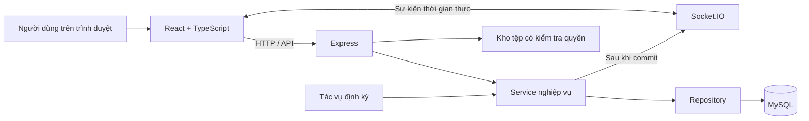
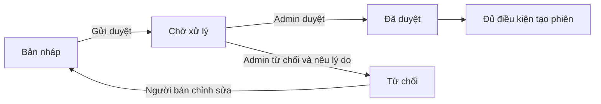
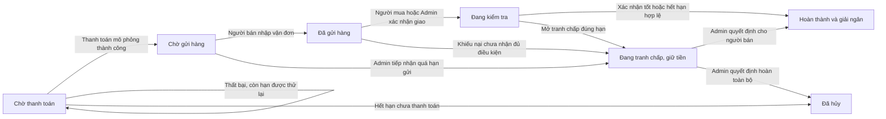
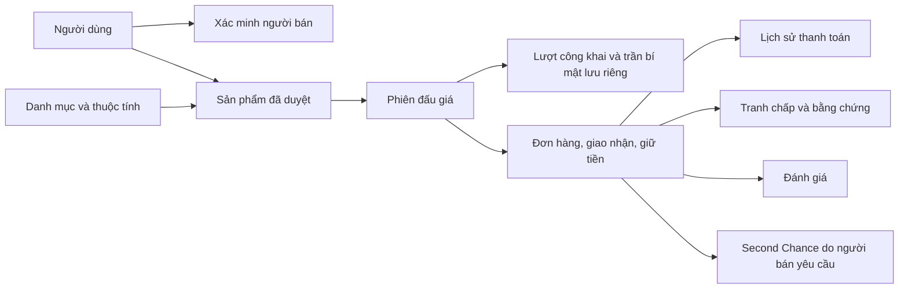

# ĐỒ ÁN 4 — XÂY DỰNG HỆ THỐNG ĐẤU GIÁ TRỰC TUYẾN

**Tài liệu đặc tả nghiệp vụ, công nghệ và phạm vi triển khai**

- **Phiên bản:** 2.2 — Phạm vi thu gọn, CSDL 19 bảng đã áp dụng
- **Ngày cập nhật:** 23/09/2026
- **Project:** `DOAN4_HeThonDauGia`
- **Cơ sở dữ liệu:** `doan4_daugia`

> Người dùng đã đồng ý thu gọn nghiệp vụ trong cuộc trao đổi ngày 23/09/2026. Bản này thay thế phạm vi mở rộng của bản 2.0: giữ luồng đấu giá đến hoàn tất giao dịch, giảm quy trình phụ. CSDL chính và backend đã chuyển sang cấu trúc 19 bảng. Tài liệu vẫn mô tả cả phần cần triển khai tiếp, gồm giao diện, báo cáo sản phẩm và đăng lại sau Second Chance.

**Sáu quyết định đã thống nhất:** thanh toán chỉ mô phỏng thành công/thất bại; vận chuyển cập nhật thủ công; tranh chấp do Admin quyết định hoàn toàn bộ hoặc giải ngân toàn bộ; vi phạm do Admin xét và quyết định cảnh cáo/khóa; thông báo chỉ trong website, chưa xây nhiều mốc nhắc; Second Chance do người bán chủ động yêu cầu từng lần, không tự gửi nối tiếp.

**Để sau:** hoàn tiền một phần, quy trình trả hàng nhiều giai đoạn, tính điểm/tăng mức phạt tự động, email/SMS, lịch nhắc nhiều mốc và tích hợp thanh toán/vận chuyển thật. Các nghiệp vụ quan trọng về bảo mật mức tối đa, thứ tự ưu tiên, bước giá, gia hạn và bảo toàn tiền vẫn giữ.

**CSDL đã chốt và áp dụng:** 19 bảng, 46 khóa ngoại, 6 trigger và 2 view. Đã chuyển dữ liệu cũ có sao lưu và đối chiếu. Xem [hướng dẫn CSDL](co-so-du-lieu/HUONG-DAN-CSDL.md) để tra phép gộp và cách tạo diagram theo nhóm.

## Mục lục

1. [Mục tiêu và phạm vi hệ thống](#1-mục-tiêu-và-phạm-vi-hệ-thống)
2. [Tình trạng project và các quyết định hiện tại](#2-tình-trạng-project-và-các-quyết-định-hiện-tại)
3. [Công nghệ sử dụng](#3-công-nghệ-sử-dụng)
4. [Kiến trúc và nguyên tắc tổ chức code](#4-kiến-trúc-và-nguyên-tắc-tổ-chức-code)
5. [Tác nhân và quyền hạn](#5-tác-nhân-và-quyền-hạn)
6. [Thuật ngữ nghiệp vụ](#6-thuật-ngữ-nghiệp-vụ)
7. [Tài khoản, đăng nhập và địa chỉ](#7-tài-khoản-đăng-nhập-và-địa-chỉ)
8. [Xác minh người bán](#8-xác-minh-người-bán)
9. [Danh mục, thuộc tính và sản phẩm](#9-danh-mục-thuộc-tính-và-sản-phẩm)
10. [Tạo và quản lý phiên đấu giá](#10-tạo-và-quản-lý-phiên-đấu-giá)
11. [Đặt giá và đấu giá tự động](#11-đặt-giá-và-đấu-giá-tự-động)
12. [Gia hạn phút chót và thời gian thực](#12-gia-hạn-phút-chót-và-thời-gian-thực)
13. [Mua ngay, kết thúc và hủy phiên](#13-mua-ngay-kết-thúc-và-hủy-phiên)
14. [Đơn hàng và thanh toán mô phỏng](#14-đơn-hàng-và-thanh-toán-mô-phỏng)
15. [Giữ tiền, vận chuyển và kiểm tra hàng](#15-giữ-tiền-vận-chuyển-và-kiểm-tra-hàng)
16. [Tranh chấp và hoàn tiền](#16-tranh-chấp-và-hoàn-tiền)
17. [Đề nghị mua tiếp theo — Second Chance](#17-đề-nghị-mua-tiếp-theo--second-chance)
18. [Đánh giá, vi phạm và thông báo](#18-đánh-giá-vi-phạm-và-thông-báo)
19. [Quản trị và cấu hình hệ thống](#19-quản-trị-và-cấu-hình-hệ-thống)
20. [Các màn hình cần hoàn thiện](#20-các-màn-hình-cần-hoàn-thiện)
21. [Thiết kế dữ liệu và phương án số bảng](#21-thiết-kế-dữ-liệu-và-phương-án-số-bảng)
22. [Giao tiếp API và Socket.IO](#22-giao-tiếp-api-và-socketio)
23. [Bảo mật, đồng thời và tính nhất quán](#23-bảo-mật-đồng-thời-và-tính-nhất-quán)
24. [Yêu cầu chất lượng và vận hành](#24-yêu-cầu-chất-lượng-và-vận-hành)
25. [Kịch bản kiểm thử và nghiệm thu](#25-kịch-bản-kiểm-thử-và-nghiệm-thu)
26. [Phạm vi bản đầu, phần nâng cao và việc cần duyệt](#26-phạm-vi-bản-đầu-phần-nâng-cao-và-việc-cần-duyệt)
27. [Thứ tự triển khai sau khi duyệt tài liệu](#27-thứ-tự-triển-khai-sau-khi-duyệt-tài-liệu)
28. [Căn cứ đối chiếu trong project](#28-căn-cứ-đối-chiếu-trong-project)

## 1. Mục tiêu và phạm vi hệ thống

### 1.1. Bài toán

Xây dựng website giúp người bán đưa sản phẩm lên đấu giá và người mua cạnh tranh bằng các mức giá hợp lệ trong một khoảng thời gian xác định. Hệ thống phải quản lý được toàn bộ quá trình từ xác minh người bán, duyệt sản phẩm, tổ chức đấu giá đến giao hàng, giải quyết tranh chấp và hoàn tất giao dịch.

Đây là website đấu giá **đa danh mục**, không chỉ dành cho đồ cổ hoặc hàng xa xỉ. Các nhóm sản phẩm có thể gồm điện thoại, máy tính, thiết bị điện tử, âm thanh, máy ảnh, đồng hồ, thời trang, xe máy, ô tô, đồ sưu tầm, nội thất và gia dụng. Danh mục cụ thể do Admin quản lý.

### 1.2. Mục tiêu chính

- Người dùng dễ tìm sản phẩm, theo dõi phiên và tham gia đấu giá.
- Người bán phải được xác minh trước khi có quyền đăng bán.
- Sản phẩm phải được duyệt trước khi được đưa vào phiên đấu giá.
- Thuật toán đấu giá tự động phải công bằng, giữ kín mức giá tối đa và xử lý được nhiều yêu cầu cùng lúc.
- Tiền thanh toán được giữ trung gian, chỉ xử lý theo kết quả giao nhận hoặc tranh chấp.
- Các bước quan trọng có trạng thái, thời hạn và dấu vết để kiểm tra.
- Giao diện tiếng Việt, rõ ràng trên máy tính và điện thoại, phù hợp trình diễn và bảo vệ đồ án.

### 1.3. Phạm vi bản đồ án

Bản đồ án sử dụng thanh toán mô phỏng, quản lý vận chuyển thủ công và một backend chính. Tiền trong hệ thống là dữ liệu mô phỏng, không thu tiền thật hoặc chuyển tiền ngân hàng thật.

Một phiên đấu giá bán một sản phẩm, giao hàng nội địa Việt Nam và ghi nhận một lượt giao đi. Bản đầu không xây dựng quy trình gửi trả trên website, giỏ hàng nhiều sản phẩm, chia nhiều kiện, đổi hàng, giao quốc tế, tự đến nhận hoặc bán nhiều số lượng trong cùng phiên. Tình huống cần trả hàng được Admin xem xét thủ công theo bằng chứng trong tranh chấp; xem NV-40.

Nền tảng không thu phí người mua, phí người bán hoặc phí đăng phiên trong bản đầu. Tổng thanh toán bằng giá sản phẩm cộng phí vận chuyển đã công bố. Dashboard dùng tên **giá trị giao dịch mô phỏng**, không gọi toàn bộ tiền đơn hàng là doanh thu nền tảng. Chính sách kiểm duyệt có thể giới hạn danh mục nào được giao dịch trong bản đầu; giao diện đa danh mục không có nghĩa mọi loại hàng đều mặc nhiên được phép bán.

Giao diện tham khảo tông đen–vàng do người dùng cung cấp. Tên hiển thị đang thử nghiệm là **Lạc Việt Auctions**; tên thương hiệu có thể đổi khi chốt giao diện và không làm thay đổi nghiệp vụ.

## 2. Tình trạng project và các quyết định hiện tại

### 2.1. Những gì đã kiểm tra

- Có hai phần `frontend` và `backend` trong cùng project.
- Frontend đã khởi tạo bằng React + TypeScript + Vite, đã cài các thư viện nêu ở mục 3.
- Đã bắt đầu soạn một số thành phần giao diện và lớp kết nối API. Các trang chưa được tích hợp và nghiệm thu thành một ứng dụng hoàn chỉnh; màn hình khởi động hiện vẫn thuộc bộ khung Vite.
- Backend đã có các module tài khoản, xác minh, sản phẩm, đấu giá, đơn hàng, thanh toán mô phỏng, tranh chấp, thông báo, quản trị và bộ kiểm thử. Backend không còn chỉ ở mức khởi tạo như mô tả ban đầu.
- Lần kiểm tra MySQL ngày 22/09/2026 ghi nhận **8.0.46**, database `doan4_daugia` có **27 bảng InnoDB, 49 khóa ngoại, 2 view và 2 trigger**. Đây là hiện trạng đã kiểm tra, không phải kết quả chuyển đổi schema theo tài liệu này.
- Chưa thực hiện thay đổi cấu trúc hoặc chuyển dữ liệu trên MySQL khi viết lại tài liệu.

### 2.2. Hướng cơ sở dữ liệu đã chọn

Ngày 23/09/2026, người dùng đã đồng ý thay SQL/CSDL và đồng bộ backend sang **19 bảng**. CSDL chính `doan4_daugia` đã chuyển xong; dữ liệu cũ được sao lưu và 11 nhóm gộp được đối chiếu. Số bảng được giảm bằng cách gộp các quan hệ một-một, dùng tệp/yêu cầu có phân loại và chuyển thuộc tính/cấu hình sang JSON; không bỏ lịch sử giá công khai hoặc trộn mức tối đa vào đầu ra công khai.

### 2.3. Cách hiểu tài liệu

- **Phạm vi 2.1 đã thống nhất:** chuẩn nghiệp vụ sau khi thu gọn; không cần duyệt lại sáu quyết định nêu ở đầu tài liệu.
- **Hiện trạng/khác biệt:** chức năng đang có và phần cần sửa, không phải tất cả yêu cầu đích đã được lập trình.
- **Ngoài bản đầu:** không nằm trong tiêu chí nghiệm thu, không dựng nút giả hoặc API như thể đã hỗ trợ.
- **Bước SQL riêng:** cần có thiết kế và phương án chuyển đổi cụ thể trước khi thay MySQL đang dùng; đồng ý phạm vi nghiệp vụ không phải đồng ý xóa dữ liệu.

Giữ mã NV-01 đến NV-42 để đối chiếu. NV-40 được chuyển sang phần mở rộng; các quy tắc khác được sửa đồng bộ với phạm vi mới. Thời hạn mặc định là lựa chọn cho đồ án, không phải chính sách của một sàn khác.

## 3. Công nghệ sử dụng

Các nhóm phiên bản dưới đây được đối chiếu từ `package.json` hiện có; chúng thể hiện nhánh phiên bản project đang khai báo, không phải cam kết sử dụng phiên bản mới nhất trên Internet.

### 3.1. Frontend

**React 19** xây dựng giao diện bằng component. Trang khám phá, thẻ phiên, biểu mẫu, bảng quản trị và chi tiết đơn hàng được chia thành những phần có thể tái sử dụng.

**TypeScript 6** khai báo kiểu dữ liệu cho người dùng, sản phẩm, phiên đấu giá, đơn hàng và phản hồi API; giúp phát hiện lỗi sử dụng dữ liệu khi build.

**Vite 8** chạy môi trường phát triển và đóng gói frontend. Cổng phát triển dự kiến là 5173. Khi phát triển, các yêu cầu `/api` và kết nối Socket.IO có thể đi qua proxy sang backend.

**Ant Design 6** cung cấp biểu mẫu, bảng dữ liệu, hộp thoại, thông báo, chọn ngày, trạng thái chờ và các thành phần tương tác. Giao diện sẽ tùy chỉnh màu sắc, khoảng cách và kiểu chữ theo mẫu đen–vàng.

**Axios 1** gửi yêu cầu HTTP, thêm token xác thực, xử lý lỗi kết nối, tải tệp và thống nhất cách đọc phản hồi backend.

**React Router 7** điều hướng giữa các trang, bảo vệ các màn hình cần đăng nhập và chia bố cục người mua, người bán, Admin. Quyền truy cập vẫn phải được kiểm tra tại backend.

**TanStack Query 5** quản lý dữ liệu lấy từ máy chủ: tải, lưu tạm, tải lại sau thao tác và đồng bộ giao diện sau sự kiện đấu giá. Không dùng cache để quyết định người thắng hoặc xác nhận thanh toán.

**Zustand 5** quản lý trạng thái giao diện và phiên đăng nhập ở phía trình duyệt. Không sao chép toàn bộ dữ liệu máy chủ vào store nếu TanStack Query đã quản lý dữ liệu đó.

**Socket.IO Client 4** nhận thay đổi giá, trạng thái phiên, thời gian kết thúc mới và thông báo riêng. Khi mất kết nối rồi kết nối lại, frontend phải gọi API để lấy trạng thái mới nhất.

**Day.js 1** phục vụ định dạng thời gian, thời hạn và dữ liệu chọn ngày. Đồng hồ đếm ngược chỉ hỗ trợ hiển thị; thời gian máy chủ quyết định việc nhận giá.

**React Hook Form 7 và Zod 4** đã được cài. Quy ước đích: dùng React Hook Form quản lý biểu mẫu nghiệp vụ và Zod kiểm tra dữ liệu, phối hợp với các ô nhập của Ant Design. Không để Ant Design Form đồng thời giữ một bộ giá trị/kiểm tra khác cho cùng biểu mẫu. Các biểu mẫu nháp hiện có chưa được xem là đã thống nhất quy ước này. Backend vẫn kiểm tra lại mọi dữ liệu, dù phía trình duyệt báo hợp lệ.

**Framer Motion 13** đã được cài để tạo chuyển động giao diện vừa phải, ví dụ chuyển trang hoặc mở nội dung. Không dùng hiệu ứng làm chậm thao tác đặt giá hoặc che khuất trạng thái giao dịch.

**ESLint và công cụ kiểm tra TypeScript** kiểm tra chất lượng code frontend. Việc cài thư viện không có nghĩa mọi thư viện đã được sử dụng đầy đủ trong các trang hiện tại.

### 3.2. Backend

**Node.js** chạy JavaScript phía máy chủ; project đã được kiểm thử trước đó với Node.js 24.13.0.

**Express.js 5** khai báo API, nhận yêu cầu, chạy middleware và trả phản hồi. Backend dùng **CommonJS** với `require` và `module.exports`.

**mysql2 3** kết nối MySQL thông qua pool, chạy truy vấn có tham số và xử lý transaction. Project dùng SQL trực tiếp trong repository, không sử dụng Prisma hoặc Sequelize.

**jsonwebtoken 9 / JWT** ký và xác minh token đăng nhập. Cấu hình hiện có đặt thời hạn token 8 giờ. Khóa ký chỉ nằm ở máy chủ, không đưa sang frontend.

**bcrypt 6** băm mật khẩu trước khi lưu và đối chiếu khi đăng nhập. Mật khẩu không được lưu dưới dạng có thể đọc lại.

**Socket.IO 4** phát sự kiện cho phòng phiên đấu giá và phòng riêng của từng người dùng đã xác thực.

**Multer 2** nhận ảnh sản phẩm, ảnh đại diện, giấy tờ xác minh và bằng chứng tranh chấp. Dữ liệu tải lên phải kiểm tra loại, dung lượng và quyền truy cập.

**dotenv 17** nạp cấu hình khi ứng dụng chạy. Tài liệu chỉ mô tả tên biến, không chứa giá trị bí mật hoặc nội dung `.env`.

**cors 2** cấu hình nguồn frontend được phép gọi API qua trình duyệt. CORS không thay thế xác thực hoặc phân quyền.

**nodemon 3** tự khởi động lại backend khi thay đổi code trong môi trường phát triển.

**Prettier 3** định dạng code để dễ đọc. **Bộ kiểm thử tích hợp sẵn của Node.js** (`node:test`, `node:assert`) kiểm tra thuật toán, API và các nghiệp vụ chạy với MySQL.

### 3.3. Cơ sở dữ liệu và lưu trữ

- **MySQL 8, InnoDB:** lưu dữ liệu quan hệ, hỗ trợ khóa ngoại, transaction và khóa bản ghi.
- **utf8mb4:** lưu tiếng Việt và các ký tự Unicode cần thiết.
- **DECIMAL(15,2):** lưu số tiền có độ chính xác cố định. Backend tính tiền bằng BigInt ở đơn vị 1/100, tránh sai số số thực.
- **DATETIME/TIMESTAMP:** lưu các mốc nghiệp vụ và dấu thời gian. Múi giờ mặc định backend là `+07:00`.
- **Tệp trên máy chủ:** ảnh và tài liệu hiện lưu trong thư mục upload của backend. Chưa sử dụng dịch vụ lưu trữ đám mây trong phạm vi hiện tại.
- **MySQL Workbench:** có thể dùng để kiểm tra cấu trúc, truy vấn và dựng sơ đồ. Workbench là công cụ phát triển, không phải thành phần chạy nghiệp vụ website.

### 3.4. Công cụ và dịch vụ ngoài phạm vi hiện tại

Postman được dùng để kiểm thử API; Git phục vụ quản lý thay đổi mã nguồn. Hiện không đưa Redis, hàng đợi phân tán, cổng thanh toán thật, API đơn vị vận chuyển, gửi SMS, đăng nhập Google/Facebook hoặc hệ thống microservice vào phạm vi bắt buộc.

## 4. Kiến trúc và nguyên tắc tổ chức code

### 4.1. Kiến trúc tổng thể

### 4.2. Phân lớp backend

Luồng xử lý chuẩn: **Route → Controller → Service → Repository → MySQL**.

- Route khai báo đường dẫn và middleware áp dụng.
- Middleware xác thực token, kiểm tra vai trò, giới hạn yêu cầu và xử lý lỗi chung.
- Controller nhận đầu vào, gọi service, trả phản hồi; không chứa thuật toán đấu giá.
- Service xử lý điều kiện nghiệp vụ, transaction, chuyển trạng thái và gọi thông báo.
- Repository chứa SQL, chỉ nhận tên bảng/cột được kiểm soát.
- Validator kiểm tra dữ liệu đầu vào.
- Socket và job dùng lại service; không tạo một thuật toán tính giá riêng.
- Tiện ích tiền, thời gian và lọc dữ liệu công khai được dùng thống nhất.

### 4.3. Nguyên tắc frontend

- Trang chỉ tổ chức giao diện và thao tác của người dùng.
- Lớp API tập trung cấu hình Axios và cách xử lý lỗi.
- Hook quản lý truy vấn, tải lại và dữ liệu hiển thị.
- Component dùng chung cho ảnh, trạng thái, biểu mẫu, bảng, phân trang và xác nhận thao tác.
- Không tính kết quả đấu giá, giá thanh toán hay quyền sở hữu chỉ dựa trên dữ liệu trình duyệt.
- Phải có trạng thái đang tải, không có dữ liệu, lỗi kết nối và thử lại.

### 4.4. Quy ước mã nguồn

- Tên file và định danh nghiệp vụ dùng tiếng Việt không dấu, ví dụ `don-hang.js`, `taoPhienDauGia`, `nguoiBanId`.
- Thông báo cho người dùng và chú thích giải thích nghiệp vụ dùng tiếng Việt có dấu.
- Giữ nguyên từ khóa JavaScript, API thư viện và các hợp đồng HTTP/Socket.IO đã sử dụng.
- Mỗi thao tác hoặc điều kiện quan trọng cần trình bày rõ ràng; không nén nhiều lệnh vào cùng một dòng.
- Ưu tiên hàm ngắn, chia theo trách nhiệm; tránh một file chứa toàn bộ nghiệp vụ hệ thống.
- Không đổi hàng loạt đường dẫn API chỉ để Việt hóa tên nếu chưa cập nhật đồng bộ tài liệu, frontend và kiểm thử.

## 5. Tác nhân và quyền hạn

### 5.1. Khách chưa đăng nhập

Được xem danh mục, các sản phẩm công khai, danh sách phiên, chi tiết phiên, giá công khai, lịch sử trả giá đã ẩn danh và hướng dẫn. Được đăng ký hoặc đăng nhập.

Không được đặt giá, Mua ngay, theo dõi phiên trong tài khoản, xem dữ liệu giao dịch riêng hoặc truy cập quản trị.

### 5.2. Người dùng — `NGUOI_DUNG`

Một tài khoản người dùng có thể mua. Khi được xác minh người bán, chính tài khoản đó có thêm quyền bán; không tách thành hai tài khoản Buyer và Seller.

Người dùng có tài khoản hoạt động được quản lý hồ sơ, địa chỉ, theo dõi phiên, đặt giá, Mua ngay, xử lý đơn mua, phản hồi đề nghị mua tiếp, mở tranh chấp đúng điều kiện và đánh giá giao dịch đã hoàn tất.

### 5.3. Người bán đã xác minh

Là `NGUOI_DUNG` có `trang_thai_nguoi_ban = DA_XAC_MINH` và tài khoản còn hoạt động.

Ngoài quyền người mua, được quản lý sản phẩm của mình, gửi sản phẩm để duyệt, tạo phiên, yêu cầu hủy phiên, quản lý đơn bán, khai báo vận chuyển, phản hồi tranh chấp và đề nghị mua tiếp theo khi đủ điều kiện.

Không được đấu giá hoặc Mua ngay sản phẩm do chính mình bán. Không được tự duyệt sản phẩm, tự xác minh mình hoặc tự giải quyết tranh chấp.

### 5.4. Quản trị viên — `QUAN_TRI`

Được quản lý danh mục, duyệt hồ sơ người bán, duyệt sản phẩm, xét yêu cầu hủy, tiếp nhận báo cáo, theo dõi đơn và tranh chấp, xử lý hoàn tiền mô phỏng, xem xét vi phạm, thay đổi trạng thái tài khoản, cấu hình nghiệp vụ và xem nhật ký. Các quyết định ảnh hưởng đến hàng hoặc tiền cần có lý do và dấu vết; không được thay bằng việc sửa trực tiếp dữ liệu trong MySQL.

Trong phạm vi hiện tại, Admin không tham gia đấu giá như người mua. API không cung cấp mức giá tối đa bí mật cho Admin. Việc người vận hành MySQL có quyền kỹ thuật đọc dữ liệu là vấn đề quản lý quyền máy chủ, không phải quyền của tài khoản Admin trên website.

### 5.5. Tác vụ hệ thống

Tự mở/kết thúc phiên đến hạn, tạo đơn, hủy đơn chưa thanh toán khi hết hạn, đánh dấu đề nghị hết hạn và hoàn tất đơn hết thời gian kiểm tra nếu đủ điều kiện. Quá hạn gửi hàng chỉ ghi nhận để Admin xét, không tự kết luận lỗi hoặc hoàn tiền.

Không tự tạo/chuyển tiếp Second Chance; không tự tăng mức phạt; không chạy quy trình trả hàng hoặc nhiều mốc nhắc. Các sự kiện thay đổi trạng thái vẫn tạo thông báo trong website.

## 6. Thuật ngữ nghiệp vụ

- **Sản phẩm:** thông tin về món đồ, ảnh, danh mục, tình trạng và kết quả duyệt.
- **Phiên đấu giá:** thời gian và điều kiện đưa một sản phẩm ra cạnh tranh giá.
- **Giá khởi điểm:** giá mở đầu của phiên.
- **Giá sàn:** mức tối thiểu người bán chấp nhận để phiên thành công; có thể không thiết lập.
- **Giá Mua ngay:** giá cho phép chốt mua ngay khi tính năng còn hiệu lực.
- **Giá hiện tại:** giá công khai người đang dẫn đầu sẽ phải thanh toán nếu phiên chốt tại thời điểm đó và đủ điều kiện.
- **Mức giá tối đa:** giới hạn bí mật người mua cam kết, dùng cho đấu giá tự động; không đồng nghĩa với giá hiện tại.
- **Bước giá:** mức tăng được hệ thống cấu hình theo khoảng giá.
- **Người dẫn đầu:** người đang có vị trí dẫn đầu; chưa chắc trở thành người thắng cho đến khi chốt phiên.
- **Lượt trả giá công khai:** giá được ghi vào lịch sử công khai, có thể là lượt trực tiếp hoặc phản hồi tự động.
- **Giữ tiền trung gian:** giữ số tiền mô phỏng trong hệ thống cho đến khi giao dịch đủ điều kiện giải ngân hoặc hoàn tiền.
- **Second Chance:** đề nghị mua cho người trả giá hợp lệ tiếp theo khi đơn trước bị hủy do không thanh toán.
- **Báo cáo sản phẩm:** phản ánh chưa được xác minh, cần được Admin kiểm tra; không đồng nghĩa một vi phạm đã được xác nhận.
- **Số tiền còn giữ:** phần tiền đã thu mô phỏng chưa được hoàn hoặc giải ngân; phải tính chính xác để ngăn xử lý vượt tiền.

## 7. Tài khoản, đăng nhập và địa chỉ

### NV-01. Đăng ký và đăng nhập

**Đầu vào đăng ký:** họ tên, email, mật khẩu; số điện thoại nếu cung cấp.

1. Kiểm tra định dạng và các trường bắt buộc.
2. Kiểm tra email và số điện thoại không trùng theo ràng buộc hiện có.
3. Băm mật khẩu rồi tạo tài khoản người dùng thường.
4. Tài khoản mới chưa có quyền bán.
5. Khi đăng nhập đúng và tài khoản hoạt động, trả token cùng thông tin hồ sơ được phép công khai cho chính người dùng.

Backend hiện yêu cầu mật khẩu đăng ký ít nhất 8 ký tự. Không trả mật khẩu hoặc mã băm ra API. Khi token hết hạn, frontend yêu cầu đăng nhập lại; không tiếp tục gửi thao tác nhạy cảm bằng phiên cũ.

Quên mật khẩu qua email, OTP và đăng nhập mạng xã hội chưa thuộc luồng hiện có. Giao diện không được hiển thị những chức năng này như thể đã hoạt động.

### NV-02. Hồ sơ và trạng thái tài khoản

Người dùng xem/cập nhật họ tên, số điện thoại và ảnh đại diện theo các trường API cho phép. Không tự cập nhật vai trò, kết quả xác minh hoặc trạng thái khóa tài khoản.

Trạng thái tài khoản gồm `HOAT_DONG`, `BI_KHOA`, `TAM_NGUNG`. Admin thay đổi trạng thái kèm lý do. Backend phải từ chối các yêu cầu không còn được phép, kể cả token đã được cấp trước khi khóa.

**Quy tắc bổ sung khi khóa giữa giao dịch:** chặn các giao dịch mới; lập danh sách đơn liên quan còn tiền giữ để Admin tiếp quản và đánh dấu cần xử lý. Không tự giải ngân, kết luận lỗi hoặc chuyển tiền chỉ vì tài khoản bị khóa. Đơn chưa thanh toán tiếp tục theo hạn thanh toán; đơn đã thanh toán được xem xét riêng. Admin có thể cập nhật mốc giao nhận dựa trên bằng chứng, mở vụ việc hỗ trợ và xử lý theo quyền, không đặt giá thay tài khoản bị khóa. Khi gỡ cờ cần xử lý phải ghi quyết định và thời hạn mới nếu cần, rồi mới cho các job thông thường tiếp tục. Backend hiện chưa có đầy đủ quy trình tiếp quản này.

### NV-03. Địa chỉ giao hàng

Mỗi người dùng được lưu nhiều địa chỉ: tên người nhận, số điện thoại, tỉnh/thành, quận/huyện, phường/xã và địa chỉ chi tiết. Có địa chỉ mặc định.

Trước khi đặt giá hoặc Mua ngay, người mua cần có địa chỉ nhận hàng. Khi tạo đơn, hệ thống lưu bản chụp địa chỉ vào đơn; thay đổi sổ địa chỉ sau đó không tự sửa địa chỉ của đơn cũ.

Không được sửa/xóa địa chỉ của người khác. Cách xử lý hiện có không cho xóa địa chỉ cuối cùng khi người dùng đang có cam kết đấu giá cần địa chỉ để tạo đơn. Đơn chưa thanh toán và còn hạn được chọn lại địa chỉ thuộc chính người mua.

## 8. Xác minh người bán

### NV-04. Nộp và xét duyệt hồ sơ

**Mục đích:** kiểm tra danh tính người bán trước khi cho phép đăng bán.

Hồ sơ gồm loại giấy tờ, số giấy tờ, ảnh giấy tờ, ảnh selfie và thông tin ngân hàng: tên ngân hàng, số tài khoản, chủ tài khoản. Với CCCD, cần các ảnh theo quy định của biểu mẫu, bao gồm hai mặt.

Luồng chính:

1. Người dùng đăng nhập, chọn đăng ký người bán.
2. Tải tệp hợp lệ và điền thông tin.
3. Gửi hồ sơ sang trạng thái chờ xử lý.
4. Admin xem hồ sơ và duyệt hoặc từ chối.
5. Nếu duyệt, tài khoản được xác minh người bán.
6. Nếu từ chối, lưu lý do để người dùng biết và nộp lại theo điều kiện API.

Trạng thái người bán: `CHUA_DANG_KY → CHO_XU_LY → DA_XAC_MINH` hoặc `TU_CHOI`.

Hồ sơ xác minh là dữ liệu riêng tư, chỉ chủ hồ sơ và Admin được phép xem. Không trả số giấy tờ, thông tin ngân hàng hoặc ảnh giấy tờ ở trang người bán công khai. Việc xác minh trong đồ án là xét duyệt thủ công, không tích hợp dịch vụ eKYC thật.

Dấu “Đã xác minh” chỉ nói rằng hồ sơ người bán đã được duyệt. Không diễn đạt thành chứng nhận hàng chính hãng, cam kết không gian lận hoặc bảo đảm tài chính.

## 9. Danh mục, thuộc tính và sản phẩm

### NV-05. Danh mục và thuộc tính động

Admin quản lý danh mục cha/con, tên, đường dẫn, mô tả, thứ tự và trạng thái hoạt động. Không được tạo chu trình trong cây danh mục.

Mỗi danh mục có thể có các thuộc tính phù hợp, ví dụ điện thoại có dung lượng/bộ nhớ, đồng hồ có loại máy, xe có năm sản xuất. Các kiểu thuộc tính gồm văn bản, số, lựa chọn, đúng/sai và ngày.

Thuộc tính có tên, khóa, kiểu nhập, đơn vị, danh sách lựa chọn nếu cần và cờ bắt buộc. Backend kiểm tra sản phẩm sử dụng đúng thuộc tính của danh mục. Cách xử lý hiện tại chưa tự kế thừa thuộc tính từ danh mục cha.

### NV-06. Tạo và duyệt sản phẩm

**Điều kiện:** người bán đã xác minh và tài khoản hoạt động.

Thông tin sản phẩm gồm danh mục, tiêu đề, mô tả, tình trạng, thương hiệu nếu có, danh sách ảnh và các giá trị thuộc tính.

Tình trạng sản phẩm hỗ trợ: mới, như mới, đã qua sử dụng tốt, đã qua sử dụng và lấy linh kiện.

Quy tắc:

- Chỉ chủ sản phẩm được sửa theo điều kiện trạng thái.
- Chỉ sửa sản phẩm nháp/bị từ chối và chưa có lịch sử phiên theo cách xử lý hiện có.
- Gửi duyệt cần ít nhất một ảnh và đủ thuộc tính bắt buộc.
- Giới hạn hiện có tối đa 12 ảnh một sản phẩm; có ảnh chính và thứ tự ảnh.
- Admin duyệt hoặc từ chối, lưu người duyệt, thời gian và lý do nếu từ chối.
- Sản phẩm không được duyệt không được đưa vào phiên công khai.
- Không tự sửa giá, mô tả hoặc các điều kiện giao dịch sau khi đã đưa sản phẩm vào phiên thông qua một đường cập nhật bỏ qua kiểm tra.

### NV-36. Hàng bị cấm/hạn chế và báo cáo sản phẩm

Admin duyệt dựa trên danh mục nội dung cho phép của đồ án. Các lý do kiểm duyệt gồm `HANG_CAM`, `NGHI_HANG_GIA`, `VI_PHAM_SO_HUU_TRI_TUE`, `HANG_NGUY_HIEM`, `THIEU_CHUNG_TU`, `KHAC`. Đây là mã xử lý nội bộ, không phải kết luận pháp lý hay chứng nhận chuyên môn.

Danh mục cần giấy tờ/xác thực bổ sung chỉ được mở bán khi quy trình kiểm tra tương ứng được thống nhất. Bản đầu không nhận các sản phẩm mà hệ thống chưa có khả năng kiểm tra điều kiện bán/giao nhận cần thiết. Nội dung chính sách do Admin quản lý theo phạm vi đã duyệt; không để mặc định “có danh mục là được bán mọi thứ trong danh mục”.

Luồng báo cáo:

1. Người đã đăng nhập, tài khoản hoạt động chọn sản phẩm/phiên, lý do và mô tả.
2. Mỗi người chỉ có một báo cáo đang mở cho cùng sản phẩm; các yêu cầu lặp không tạo nhiều bản ghi giống nhau. Có giới hạn tần suất.
3. Lưu người báo cáo, sản phẩm, phiên liên quan nếu có, thời gian và trạng thái `CHO_XU_LY`.
4. Admin tiếp nhận thành `DANG_XU_LY`, kiểm tra dữ liệu và kết luận `CO_CO_SO` hoặc `KHONG_CO_CO_SO`, kèm lý do và thời gian.
5. Báo cáo có cơ sở có thể dẫn đến ngừng đăng mới, hủy phiên còn mở hoặc tạo vụ việc xử lý đơn đã có; không tự xác nhận vi phạm hoặc khóa tài khoản chỉ vì có nhiều người báo cáo.

Bản đầu nhận mô tả văn bản và tham chiếu nội dung/ảnh đã có trên sản phẩm. Upload tài liệu bổ sung riêng cho báo cáo chưa nằm trong bản đầu; không lách quyền bằng cách dùng một tệp bằng chứng của tranh chấp khác.

Người báo cáo được xem kết quả của báo cáo mình gửi. Không công khai danh tính người báo cáo cho người bán. Người bán được nhận lý do kiểm duyệt và nội dung cần khắc phục, đã loại thông tin riêng không cần thiết.

Nếu Admin xác định có rủi ro cần dừng, phải khóa phiên/đơn liên quan trong transaction: phiên chưa kết thúc thì chặn đặt giá/Mua ngay và ghi lý do hủy; phiên đã có đơn thì xử lý tại đơn, giữ tiền nếu còn và mở vụ việc theo bằng chứng. Không xóa lịch sử trả giá hoặc hoàn tiền mặc định cho tất cả đơn chỉ bằng một thao tác trên báo cáo.

## 10. Tạo và quản lý phiên đấu giá

### NV-07. Tạo phiên

Người bán chọn sản phẩm đã được duyệt của mình và nhập giá khởi điểm, giá sàn nếu có, giá Mua ngay nếu có, thời gian bắt đầu/kết thúc và chính sách phí vận chuyển.

Điều kiện kiểm tra:

- Giá khởi điểm từ 1 VND trở lên; các giá đặt và phí của giao dịch mới là tiền nguyên VND, nằm trong giới hạn dữ liệu tiền. Không nhận giá âm, số lẻ VND hoặc làm tròn tự động một mức giá đã gửi.
- Giá sàn không thấp hơn giá khởi điểm.
- Giá Mua ngay không thấp hơn giá sàn nếu có sàn; nếu không có sàn, không thấp hơn giá khởi điểm.
- Thời gian kết thúc phải sau thời gian bắt đầu và còn trong tương lai.
- Đầu vào thời gian cần có múi giờ; không nhận thời gian mơ hồ từ trình duyệt.
- Không tạo thêm phiên có thể làm bán trùng sản phẩm đang có phiên chờ, đang hoạt động hoặc đã kết thúc thành công và còn liên quan đến xử lý giao dịch.

Khi tạo phiên, chụp cấu hình gia hạn đang áp dụng vào phiên. Admin sửa cấu hình sau này không tự thay điều kiện đã chụp của các phiên cũ.

Trạng thái phiên gồm `DA_LEN_LICH`, `HOAT_DONG`, `DA_KET_THUC`, `THAT_BAI`, `DA_HUY`.

Cách xử lý hiện có không cung cấp chỉnh sửa tùy ý giá/thời gian phiên sau khi tạo. Bản 2.1 giữ nguyên nguyên tắc khóa điều kiện phiên, bao gồm phí vận chuyển; muốn hủy phải qua luồng yêu cầu và xét duyệt. Hạ giá sàn trong phiên chưa thuộc bản đầu.

### NV-37. Phí vận chuyển và tổng chi phí

Bản đầu có hai lựa chọn: `MIEN_PHI` với phí bằng 0; `PHI_CO_DINH` với phí nguyên VND lớn hơn 0. Mức phí áp dụng cho phạm vi nội địa đã công bố trong điều kiện phiên; người bán chịu trách nhiệm báo mức phí trước khi tạo phiên.

Phí được khóa cùng điều kiện phiên từ khi tạo. Giao diện phải cho xem trước khi đặt giá/Mua ngay: giá hiện tại, phí vận chuyển và tổng tạm tính; trước khi xác nhận đặt trần cần làm rõ **trần chỉ áp dụng cho giá sản phẩm, phí vận chuyển tính riêng**.

Ví dụ người mua nhập trần sản phẩm 2.000.000 đ, phí vận chuyển 50.000 đ: cam kết tối đa cho giao dịch là 2.050.000 đ; nếu thắng ở 1.600.000 đ thì tổng đơn là 1.650.000 đ. Backend tính số tiền, không nhận tổng tự tính của client làm nguồn tin cậy.

Khi tạo đơn, chụp phí và phương thức từ phiên sang đơn. Second Chance của cùng phiên sử dụng chính sách phí đã công bố đó; người bán không được cộng thêm phí ở bước gửi đề nghị. Đổi địa chỉ trước thanh toán không được âm thầm làm thay phí cố định; địa chỉ ngoài phạm vi phục vụ bị từ chối rõ ràng.

Tự đến nhận, phí theo khoảng cách, phí thu hộ và thương lượng phí sau khi thắng để ngoài bản đầu. Nếu người bán nhập nhầm phí, phải xử lý theo yêu cầu hủy/đăng lại đúng điều kiện, không tăng phí khi người mua đã có cam kết.

## 11. Đặt giá và đấu giá tự động

### NV-08. Điều kiện được đặt giá

- Đã đăng nhập bằng tài khoản người dùng hoạt động.
- Có địa chỉ nhận hàng.
- Không phải người bán của sản phẩm.
- Phiên đã đến giờ bắt đầu và chưa hết giờ theo MySQL.
- Sản phẩm vẫn đáp ứng điều kiện tham gia phiên.
- Mức giá gửi lên hợp lệ theo giá hiện tại, bước giá và cam kết trước đó.

Người dùng nhập **mức tối đa sẵn sàng trả**. Hệ thống tự tính các lượt đáp trả công khai. Không yêu cầu người mua tự gửi mọi bước tăng giá qua nhiều request.

### NV-09. Giữ kín mức tối đa

Mức tối đa được lưu riêng tư tại `tham_gia_phien.gia_toi_da` và chỉ được backend đọc để tính đấu giá.

- Không có API đọc mức tối đa cho người khác, người bán hoặc Admin; hợp đồng hiện có cũng không có API đọc lại trần của chính mình.
- Không phát mức tối đa qua Socket.IO.
- Không ghi mức tối đa vào thông báo, nhật ký ứng dụng hoặc phản hồi lỗi.
- API công khai chỉ trả giá hiện tại, lịch sử công khai, trạng thái, người dẫn đầu đã ẩn danh và các trường cho phép.
- Sau khi gửi thành công, giao diện thông báo đã ghi nhận và có đang dẫn đầu hay không; không biến giá hiện tại thành nhãn “mức tối đa của đối thủ”.

Một lượt công khai đôi khi bằng mức tối đa đã dùng hết; điều đó khác với việc công bố trường dữ liệu bí mật hoặc phần cam kết chưa được sử dụng.

### NV-10. Nguyên tắc tính giá

1. Không có giá sàn và chưa có ai trả giá: người hợp lệ đầu tiên dẫn đầu tại giá khởi điểm. Bản 2.1 yêu cầu giá khởi điểm ít nhất 1 VND và sử dụng tiền nguyên VND. Backend hiện còn nhánh xử lý giá khởi điểm 0 thành 0,01; đây là khác biệt cần sửa cho giao dịch mới, không được lặng lẽ làm tròn dữ liệu cũ.
2. Người mới tham gia phải đáp ứng mức tối thiểu theo giá hiện tại và bước giá.
3. Nếu trần người mới cao hơn trần người đang dẫn đầu, người mới dẫn đầu với giá đủ để vượt đối thủ nhưng không quá trần của mình.
4. Nếu trần người mới thấp hơn, người dẫn đầu được tự động bảo vệ giá trong giới hạn đã cam kết.
5. Nếu hai mức tối đa bằng nhau, ưu tiên người đã được ghi nhận trước. Các yêu cầu cùng giây vẫn phải xử lý theo thứ tự khóa/ghi nhận trên máy chủ, không dựa vào đồng hồ phía khách.
6. Người đã đặt chỉ được tăng mức tối đa; không tự giảm hoặc rút cam kết.
7. Người đang dẫn đầu chỉ nâng trần không làm tăng giá công khai, trừ trường hợp cần tăng để đạt giá sàn theo chính sách hiện có.
8. Mỗi lượt giá công khai phải truy vết được phiên, người trả giá đã ẩn danh khi hiển thị, số tiền, loại lượt và thời gian.

### NV-11. Giá sàn

Theo cách xử lý backend hiện có, giá công khai có thể tăng đến giá sàn nhưng không vượt trần của người dẫn đầu. Khi chưa đủ trần để đạt sàn, phiên có thể có người dẫn đầu nhưng vẫn chưa đủ điều kiện bán thành công.

Giá sàn cụ thể không được xuất trong dữ liệu phiên công khai. Người mua được xem trạng thái **đã đạt/chưa đạt giá sàn**. Giữ nguyên việc lưu mức sàn để quyết định chốt phiên và kiểm tra điều kiện Second Chance.

### Ví dụ minh họa

Các số dưới đây là ví dụ nghiệp vụ, không phải cấu hình cố định cho mọi phiên. Giả sử giá khởi điểm 1.000.000 đ, không có giá sàn và bước giá 100.000 đ trong khoảng đang xét.

- A đặt tối đa 2.000.000 đ đầu tiên: giá công khai là 1.000.000 đ; A dẫn đầu.
- B đặt tối đa 1.500.000 đ: hệ thống ghi nhận cạnh tranh, A tiếp tục dẫn đầu ở 1.600.000 đ.
- C đặt tối đa 2.500.000 đ: C vượt trần của A và dẫn đầu ở 2.100.000 đ.
- Nếu một người khác đặt đúng 2.500.000 đ sau C: C vẫn dẫn đầu do được ghi nhận trước; giá công khai có thể lên 2.500.000 đ.
- Ở một phiên khác có giá sàn 1.800.000 đ, người đầu tiên đặt trần 2.000.000 đ: theo chính sách hiện có, giá có thể lên 1.800.000 đ để đạt sàn.

Những trần trong ví dụ chỉ xuất hiện ở phần giải thích thuật toán; không hiển thị chúng trong lịch sử công khai của website.

## 12. Gia hạn phút chót và thời gian thực

### NV-12. Chống đặt giá phút chót

Quy tắc mặc định: nếu có **lượt giá công khai hợp lệ khi còn trên 0 đến 60 giây**, cộng **90 giây vào thời gian kết thúc hiện tại**.

Ví dụ phiên kết thúc lúc 20:00:00, có giá hợp lệ lúc 19:59:30 thì giờ kết thúc mới là 20:01:30, không phải 20:01:00.

- Một request tạo nhiều lượt đáp trả tự động chỉ gia hạn một lần.
- Request sai, request bị từ chối hoặc chỉ nâng trần riêng mà không có lượt công khai mới không được tạo gia hạn giả.
- Có thể gia hạn tiếp khi lại có giá hợp lệ trong cửa sổ phút chót; hiện chưa đặt số lần gia hạn tối đa.
- Lưu giờ kết thúc cũ/mới, số giây thêm và lượt kích hoạt trong lịch sử gia hạn.
- Request đến lúc đã hết hạn bị từ chối, kể cả màn hình người dùng còn hiển thị thời gian do độ trễ.

### NV-13. Cập nhật thời gian thực

Người đang xem phiên được cập nhật giá, lượt trả, trạng thái và giờ kết thúc mới. Người dùng nhận thông báo riêng khi có sự kiện liên quan.

Chỉ phát sự kiện sau khi giao dịch MySQL commit thành công. Khi kết nối lại, giao diện tải lại dữ liệu từ API; không suy đoán trạng thái cuối chỉ từ những sự kiện đã nhận trước khi mất mạng.

## 13. Mua ngay, kết thúc và hủy phiên

### NV-14. Mua ngay

Mua ngay là hành động chốt phiên ở giá cố định còn hiệu lực. Điều kiện đăng nhập, hoạt động tài khoản, địa chỉ và cấm tự mua áp dụng như đặt giá.

Chính sách hiện có:

- Phiên không có giá sàn: Mua ngay tắt sau lượt giá công khai hợp lệ đầu tiên.
- Phiên có giá sàn: Mua ngay còn hiệu lực khi chưa đạt sàn và tắt khi đạt sàn.
- Phiên đã chốt/hết hạn/hủy không nhận Mua ngay.
- Giá thanh toán lấy từ giá Mua ngay trong database, không từ số tiền do frontend tự gửi.

Mua ngay và đặt giá phải khóa cùng bản ghi phiên để không có hai kết quả thắng đồng thời. Giao diện cần hiển thị giá và yêu cầu xác nhận trước khi chốt mua.

### NV-15. Chốt phiên

Khi đến hạn:

- Không có lượt trả hợp lệ: phiên thất bại do không có trả giá.
- Có trả giá nhưng chưa đạt sàn: phiên thất bại do chưa đạt sàn.
- Có người dẫn đầu và đạt điều kiện: phiên kết thúc thành công, tạo một đơn đang xử lý.

Giá của đơn trúng đấu giá lấy từ giá công khai cuối cùng đã chốt. Không lấy mức tối đa bí mật.

Cách lưu hiện tại dùng `nguon_don = THANG_DAU_GIA` cho cả đấu giá thắng và Mua ngay; trường `ly_do_ket_thuc = MUA_NGAY` trên phiên giúp phân biệt. Nếu cần đổi cách lưu phải cập nhật đồng bộ, không tự thêm một trạng thái vào frontend.

### NV-16. Yêu cầu hủy phiên

Người bán gửi lý do khi phiên còn trong trạng thái và thời hạn cho phép. Mỗi phiên không được có nhiều yêu cầu hủy đang chờ cùng lúc.

Admin duyệt hoặc từ chối kèm ghi chú. Nếu được duyệt, phiên chuyển đã hủy, ngừng nhận giá và thông báo cho các bên liên quan. Không dùng xóa bản ghi để thay cho hủy; lịch sử cần được giữ lại.

Việc hủy phiên đã kết thúc, đã thanh toán hoặc đã giao dịch phải đi qua quy trình tương ứng của đơn hàng/tranh chấp, không được sửa trực tiếp trạng thái phiên để bỏ qua các bước đó.

## 14. Đơn hàng và thanh toán mô phỏng

### NV-17. Tạo đơn

Đơn được tạo khi thắng đấu giá, Mua ngay hoặc chấp nhận Second Chance. Lưu mã đơn, phiên, người mua/người bán, nguồn đơn, giá sản phẩm, phí vận chuyển đã công bố, tổng tiền, bản chụp địa chỉ và các thời hạn.

Mỗi phiên chỉ có tối đa một đơn đang xử lý. Nhiều đơn lịch sử được giữ nếu đơn trước đã hủy và có Second Chance hợp lệ. Luồng dưới đây là thiết kế đích, không phải mọi nhánh đều đã có trong backend:

Khi có tranh chấp hoặc vụ việc cần Admin xử lý, không chạy nhánh hoàn tất tự động. Không thêm trạng thái trả hàng nhiều bước hoặc nhánh hoàn một phần cho giao dịch mới.

### NV-18. Thanh toán

1. Người mua mở đơn còn hạn, xem tổng tiền và địa chỉ nhận.
2. Giao diện ghi rõ **thanh toán mô phỏng**, cho phép thử kết quả thành công hoặc thất bại để trình diễn; không nhập thông tin thẻ/ngân hàng thật.
3. Backend kiểm tra người mua, trạng thái và thời hạn; lấy tổng tiền từ đơn đã khóa, không từ client.
4. Thành công: ghi nhận lần thu mô phỏng, giữ toàn bộ giá sản phẩm cộng phí vận chuyển, chuyển đơn sang chờ gửi và chụp hạn gửi.
5. Thất bại: lưu lần thử thất bại, không thu/giữ tiền, đơn tiếp tục chờ thanh toán và được thử lại nếu còn hạn. Lần thử lại không kéo dài hạn.

Gửi lại một thao tác đã xử lý không tạo trùng lần thu/giữ tiền; các lần thử thực sự khác nhau có lịch sử riêng. Giao diện không thể gửi kết quả thất bại để đảo một lần thanh toán đã thành công. Quy tắc khóa/chống trùng và định danh thao tác được chốt trong hợp đồng API khi triển khai.

Hạn mặc định là **48 giờ** từ lúc tạo đơn; cấu hình hợp lệ trong MySQL được ưu tiên. Không có cổng thanh toán, ví, rút tiền hoặc tiền thật. Hành vi mô phỏng thất bại là yêu cầu đích, cần đối chiếu/bổ sung API hiện tại.

### NV-19. Quá hạn thanh toán

Đơn chưa thanh toán khi hết hạn bị hủy với lý do không thanh toán; ghi nhận vi phạm chờ xét một lần và thông báo cho hai bên. **Không tự tạo Second Chance.** Người bán có thể chủ động yêu cầu theo mục 17.

API phải từ chối thanh toán quá hạn dù job chưa quét. Thanh toán và hủy quá hạn dùng cùng khóa để chỉ có một kết quả hợp lệ.

**Khác biệt hiện tại:** backend còn tự tạo Second Chance sau hủy vì không thanh toán và tạo đơn mới với phí vận chuyển bằng 0. Cần sửa theo phạm vi mới và NV-37. Số tiền của dữ liệu cũ được giữ nguyên, không tính lại theo cấu hình mới.

## 15. Giữ tiền, vận chuyển và kiểm tra hàng

### NV-20. Giữ tiền trung gian

Thanh toán thành công chưa giao tiền ngay cho người bán. Tiền được giữ cho đến khi người mua xác nhận hàng tốt, hết thời gian kiểm tra hợp lệ hoặc Admin ra quyết định tranh chấp.

Giao dịch mới chỉ dùng các trạng thái nghiệp vụ: chờ giữ, đang giữ, đã giải ngân, đã hoàn toàn bộ. Chỉ có **một lần quyết toán cuối: hoàn toàn bộ hoặc giải ngân toàn bộ**. Không hỗ trợ hoàn một phần, nhiều đợt hoàn hoặc xử lý vượt số tiền đã thu.

Quy tắc đối soát: **tổng đã thu = tiền còn giữ + tổng đã hoàn + tổng đã giải ngân**; các khoản đều không âm. Thao tác lặp không làm thay đổi tổng tiền sau quyết toán.

Thông tin giữ tiền có thể gộp vào đơn theo bản SQL sẽ chốt; lịch sử thanh toán vẫn giữ riêng. Số tiền hoàn/giải ngân phải lưu bằng trường tiền rõ ràng, không chỉ bằng ghi chú. Dữ liệu cũ có hoàn một phần vẫn phải đọc/đối soát được; không xóa hoặc đổi lịch sử chỉ vì phạm vi mới đã bỏ thao tác này.

### NV-21. Gửi và giao hàng

- Người bán của đơn nhập đơn vị vận chuyển và mã vận đơn sau khi đã thanh toán, tiền đang giữ; thời điểm khai báo do máy chủ ghi.
- Hạn gửi mặc định 3 ngày từ thanh toán thành công. Quá hạn mà chưa ghi nhận gửi chuyển theo NV-38; không cho khai báo muộn để tự vượt vụ việc đang chờ Admin.
- Người mua bấm **Đã nhận hàng** để bắt đầu thời gian kiểm tra. Đây chưa phải xác nhận hàng tốt và chưa giải ngân.
- Admin chỉ xác nhận giao thay khi có bằng chứng và lý do. Thời hạn kiểm tra tính từ lần xác nhận hợp lệ trên hệ thống, không hồi tố khiến người mua mất thời gian phản hồi.
- Người bán không được tự xác nhận người mua đã nhận. Mã vận đơn không chứng minh đã gửi/đã giao.

Không tích hợp API theo dõi vận chuyển, không nhập nhiều mốc hành trình, không bắt buộc người bán cập nhật ngày giao dự kiến. Website chỉ quản lý thông tin khai báo và xác nhận thủ công.

### NV-38. Người bán không gửi hàng đúng hạn

Khi quá hạn gửi mà chưa ghi nhận gửi, hệ thống ghi nhận chậm gửi một lần để Admin xét và thông báo trong website. Tiền tiếp tục được giữ; **không tự hủy/hoàn tiền hoặc khóa người bán** chỉ vì thiếu thao tác khai báo.

Admin kiểm tra phản hồi và bằng chứng, sau đó:

- Ghi nhận đã gửi nếu có căn cứ; hoặc cho thêm hạn kèm lý do, lưu mốc cũ/mới.
- Mở vụ việc tranh chấp với đúng người khởi tạo là Admin, rồi quyết định hoàn toàn bộ hoặc giải ngân theo điều kiện tại NV-24. Không giả người mua gửi yêu cầu.

Khai báo gửi sau hạn qua API thông thường bị từ chối; Admin xử lý ngoại lệ qua thao tác có nhật ký. Quyết định và khai báo gửi dùng cùng khóa phiên/đơn. Không tạo Second Chance cho đơn hủy do lỗi giao hàng. Danh sách đơn quá hạn nằm trong quản lý đơn, không cần một module nhắc việc nhiều bước.

### NV-39. Chưa nhận hàng sau thời gian chờ

Bản thu gọn không yêu cầu ngày giao dự kiến. Dùng một mốc đơn giản: **sau 7 ngày kể từ thời điểm ghi nhận gửi**, nếu chưa xác nhận nhận hàng và tiền vẫn giữ, người mua được mở tranh chấp chưa nhận hàng. Mốc này là mặc định đề xuất cho đồ án và được lưu khi khai báo gửi.

Không bắt người mua bấm đã nhận rồi mới được khiếu nại. Admin có thể tiếp nhận sớm hơn nếu có bằng chứng rủi ro rõ ràng. Khi một bên không hợp tác hoặc tài khoản bị khóa, Admin xử lý từ danh sách đơn; không tự xác nhận giao hoặc giải ngân vì người mua im lặng.

Không có job tự hoàn tiền do quá 7 ngày. Người mua gửi yêu cầu; Admin kiểm tra và quyết định theo mục 16. Backend hiện chỉ nhận tranh chấp ở giai đoạn kiểm tra hàng, nên nhánh trước xác nhận giao còn phải bổ sung.

### NV-22. Kiểm tra và hoàn tất

Thời gian kiểm tra mặc định **3 ngày** từ xác nhận đã giao hợp lệ. Giao diện hiển thị hạn; người mua có thể bấm **Hàng phù hợp / Hoàn tất** để giải ngân sớm hoặc mở tranh chấp khi còn hạn.

Hết hạn kiểm tra, job chỉ hoàn thành/giải ngân nếu đơn và tiền đúng trạng thái, không có tranh chấp hoặc cờ cần Admin xử lý, và các tài khoản không có tình trạng khóa cần tiếp quản. Không lấy thời gian gửi hàng làm thời gian bắt đầu kiểm tra.

Mở tranh chấp khóa đơn, giữ tiền và ngăn giải ngân tự động theo hạn cũ. Sau tranh chấp đi theo quyết định cuối của Admin. Cấu hình mới không sửa hồi tố hạn đã lưu.

## 16. Tranh chấp và hoàn tiền

### NV-23. Mở và xử lý tranh chấp

Một đơn chỉ có một tranh chấp đang mở tại một thời điểm. Chỉ xử lý tiền khi còn đang giữ. Người mua được mở:

- Trước xác nhận giao: chưa nhận hàng theo điều kiện NV-39.
- Sau xác nhận giao: còn thời gian kiểm tra và có lý do như không đúng mô tả, hư hỏng hoặc chưa nhận thực tế.

Admin được mở vụ việc khi quá hạn gửi, có bằng chứng cần can thiệp hoặc tài khoản liên quan bị khóa; phải ghi đúng người khởi tạo và lý do.

Luồng đơn giản:

1. Người mua gửi lý do, mô tả và bằng chứng; hoặc Admin tiếp nhận có căn cứ.
2. Đơn chuyển đang tranh chấp, tiền tiếp tục giữ, dừng hoàn tất tự động.
3. Người bán phản hồi; các bên bổ sung bằng chứng theo quyền.
4. Admin xem xét và chọn **hoàn toàn bộ cho người mua** hoặc **giải ngân toàn bộ cho người bán**, kèm lý do.
5. Backend kiểm tra điều kiện và cập nhật tranh chấp, thanh toán, tiền giữ, đơn trong một transaction; lưu nhật ký và thông báo sau commit.

Trạng thái nghiệp vụ chỉ cần chờ xử lý, đang xử lý, đã giải quyết; không tạo chuỗi trạng thái gửi trả. Admin có thể giữ vụ việc đang xử lý để chờ bằng chứng, không tự xử thắng/thua vì một bên chưa trả lời. Giới hạn hiện có tối đa 30 bằng chứng; chỉ hai bên có quyền và Admin được xem.

Backend hiện có luồng tranh chấp sau giao; quyền tiếp nhận của Admin và nhánh chưa nhận cần bổ sung. Quyết định đã quyết toán không được sửa để thu/hoàn/giải ngân lần nữa.

### NV-24. Các kết quả xử lý tiền

**Giải ngân toàn bộ cho người bán:** Admin xác định người bán đã đáp ứng nghĩa vụ dựa trên bằng chứng; tiền hoàn bằng 0, chuyển toàn bộ tiền còn giữ cho người bán mô phỏng và hoàn thành đơn.

**Hoàn toàn bộ cho người mua:** hoàn toàn bộ giá sản phẩm và phí vận chuyển đã thu, đơn chuyển đã hủy, tiền giữ và giao dịch thanh toán thành công liên quan được ghi nhận đã hoàn. Các lần thanh toán thất bại vẫn giữ trạng thái lịch sử thất bại.

Backend tự lấy số tiền từ đơn/thanh toán đã khóa, không cho người dùng thường hoặc Admin tùy ý nhập một khoản hoàn một phần cho giao dịch mới. Không dùng một mã vận đơn hoặc lời khai chưa được kiểm tra làm điều kiện tự quyết toán.

Nếu cần xử lý hàng đã nhận, Admin xem xét bằng chứng và việc trả hàng thủ công theo NV-40 trước khi quyết định cuối. Không tự coi việc người mua chọn lý do là căn cứ hoàn tiền. Đây là mô phỏng phục vụ đồ án, không phải hệ thống xử lý tiền/giao nhận thật hoàn chỉnh.

**Khác biệt hiện tại:** backend còn hỗ trợ hoàn một phần. Khi triển khai phải chặn thao tác này cả API lẫn giao diện; vẫn bảo toàn và hiển thị đúng lịch sử cũ.

### NV-40. Trả hàng sau tranh chấp

**Để sau, không thuộc tiêu chí nghiệm thu bản đầu.** Không làm màn hình hướng dẫn trả, vận đơn trả, nhận hàng trả, kiểm tra hàng trả hoặc các job/thời hạn riêng cho từng bước. Không hỗ trợ hoàn tiền một phần.

Nếu một tình huống trình diễn cần trả hàng trước khi hoàn tiền, Admin ghi nhận cách xử lý và bằng chứng trong tranh chấp hiện có; quá trình giao nhận trả được xử lý thủ công ngoài workflow của website. Vụ việc và tiền vẫn giữ đến khi Admin có đủ căn cứ ra quyết định cuối. Đây là giới hạn đã biết, không quảng bá thành dịch vụ trả hàng tự động.

Chỉ xây quy trình trả hàng nhiều bước khi bổ sung phạm vi sau này. Không thêm các cột/trạng thái trả hàng vào SQL chỉ để phục vụ yêu cầu đã được hoãn.

## 17. Đề nghị mua tiếp theo — Second Chance

### NV-25. Điều kiện tạo đề nghị

Chỉ áp dụng khi phiên đã kết thúc thành công nhưng đơn trước bị hủy do không thanh toán. Không dùng khi chưa đạt sàn, lỗi người bán hoặc hoàn tiền tranh chấp.

**Người bán chủ động bấm yêu cầu gửi đề nghị mỗi lần.** Hệ thống kiểm tra và tự chọn ứng viên/giá hợp lệ theo NV-26; người bán không tự chỉ định người quen hoặc nhập giá khác. Admin không tự gửi thay trong luồng thông thường của bản đầu.

Không tạo khi có đơn đang xử lý hoặc đề nghị đang chờ; người bán phải hoạt động và đủ điều kiện bán. Hủy đơn vì không thanh toán chỉ làm xuất hiện lựa chọn yêu cầu, không tự gửi đề nghị.

### NV-26. Chọn ứng viên và xác định giá

1. Lấy **lượt trả giá công khai hợp lệ cuối cùng của từng người** trong thời gian phiên.
2. Loại người bán, tài khoản không hoạt động và người đã từng có đơn/đề nghị trong phiên theo chính sách hiện có.
3. Nếu có giá sàn, ứng viên cần có giá công khai đáp ứng sàn.
4. Sắp giá công khai giảm dần; bằng giá thì ưu tiên thời gian và ID lượt sớm hơn.
5. Chọn một ứng viên phù hợp và tạo đề nghị có thời hạn.

**Giá Second Chance chính là giá trả công khai hợp lệ của ứng viên được chọn. Không đọc hoặc sao chép `gia_toi_da` để tạo giá đề nghị.**

Ví dụ: sau khi người thắng không thanh toán, B có giá công khai hợp lệ cuối là 1.800.000 đ, C là 1.700.000 đ. Nếu B đủ điều kiện, đề nghị cho B có giá 1.800.000 đ. Hệ thống không được dùng một trần bí mật khác của B để tăng giá đề nghị.

### NV-27. Phản hồi và hết hạn

Chỉ người nhận được chấp nhận hoặc từ chối. Backend kiểm tra lại thời hạn, giá công khai, tài khoản, địa chỉ và khả năng tạo đơn trước khi chấp nhận.

Chấp nhận tạo đúng một đơn tại giá đề nghị cộng phí vận chuyển đã công bố. Chấp nhận lặp không tạo trùng. Hạn phản hồi mặc định 24 giờ; các trạng thái gồm chờ xử lý, đã chấp nhận, từ chối, hết hạn.

**Từ chối/hết hạn chỉ kết thúc đề nghị hiện tại, không tự tạo đề nghị mới.** Nếu còn ứng viên, người bán phải bấm yêu cầu thêm lần nữa. Nếu đơn từ đề nghị cũng không thanh toán, vẫn cần thao tác chủ động mới của người bán. Không ép người bán gửi hết danh sách ứng viên.

Job chỉ đánh dấu hết hạn và thông báo. API chấp nhận phải từ chối khi quá hạn dù job chưa quét. Tạo đề nghị/chấp nhận dùng khóa chống hai đơn hoặc hai đề nghị chờ cùng lúc.

Backend hiện tự chuyển tiếp sau từ chối/hết hạn và sau quá hạn thanh toán; cần bỏ cả ba điểm tự tạo này khi triển khai. Giữ lịch sử đề nghị cũ và không đọc mức tối đa để chọn giá.

### NV-41. Đăng lại sản phẩm

Tạo phiên mới có ID mới, không đổi ngày để mở lại phiên cũ và không sao chép lượt trả, trần bí mật hoặc đề nghị. Người bán thao tác chủ động, không tự đăng lại khi đề nghị hết hạn.

Điều kiện: người bán hoạt động/đã xác minh, sản phẩm còn được duyệt, không bị chặn; không có phiên chờ/hoạt động khác, đơn đang xử lý, tiền còn giữ, tranh chấp hoặc đề nghị chờ phản hồi. Phiên trước phải thất bại/hủy hợp lệ, hoặc mọi đơn đều hủy do không thanh toán. Đơn đã bán thành công hoặc hủy sau giao hàng/tranh chấp không thuộc luồng đăng lại đơn giản này.

Người bán có thể dừng gửi Second Chance rồi chọn đăng lại khi không còn đề nghị/đơn đang xử lý, dù còn ứng viên chưa được mời. Khi đã tạo phiên mới, chặn tạo Second Chance cho phiên cũ của cùng sản phẩm; hai thao tác phải dùng khóa chung để không bán trùng.

Sửa thông tin quan trọng cần bản nháp và duyệt lại, không viết đè mô tả lịch sử hoặc né lệnh chặn. Backend hiện chặn rộng sản phẩm từng có phiên thành công; việc cho đăng lại có điều kiện cần được bổ sung, không chỉ bỏ kiểm tra đang có.

## 18. Đánh giá, vi phạm và thông báo

### NV-28. Đánh giá giao dịch

Chỉ các bên của đơn đã hoàn thành được đánh giá bên còn lại. Mỗi bên đánh giá một lần cho một đơn, từ 1 đến 5 sao và nhận xét nếu có.

Không cho người ngoài đánh giá, tự đánh giá mình hoặc tạo nhiều đánh giá cho cùng vai trò trong đơn. Trang công khai chỉ hiển thị dữ liệu đánh giá được phép công khai.

### NV-42. Hồ sơ uy tín người bán

Trang công khai của người bán hiển thị tên/ảnh đại diện phù hợp, ngày tham gia, trạng thái đã xác minh hiện tại, số đơn bán hoàn thành, số đánh giá của người mua, điểm sao trung bình và đánh giá gần đây. Kèm danh sách sản phẩm/phiên công khai còn hợp lệ.

Chỉ lấy các đánh giá gắn với đơn mà tài khoản này là **người bán** và người đánh giá là **người mua của đơn**. Không cộng đánh giá họ nhận khi đi mua hàng vào uy tín bán hàng. Số đơn bán hoàn thành được đếm từ đơn, không đếm bằng số đánh giá hoặc nhân lên do join nhiều bảng.

Chưa có đánh giá thì hiển thị “Chưa có đánh giá”, không mặc định 5 sao. Nếu hiển thị điểm trung bình phải kèm số lượt và quy tắc làm tròn. Bản đầu dùng thang 1–5 sao, chưa tạo tỷ lệ tích cực hoặc các điểm giao tiếp/vận chuyển không có dữ liệu riêng.

Không công khai email đăng nhập, địa chỉ riêng, số điện thoại nhận hàng, giấy tờ, số tài khoản ngân hàng hoặc danh tính người báo cáo. Không thêm bảng tổng hợp chỉ để dựng hồ sơ; trước hết truy vấn từ `nguoi_dung`, `don_hang`, `danh_gia` và đo hiệu năng.

### NV-29. Vi phạm

Ghi nhận hành vi như không thanh toán, chậm/không giao hàng, gian lận, lạm dụng; lưu người liên quan, phiên/đơn nếu có, mô tả, trạng thái và quyết định xử lý.

Quá hạn thanh toán/gửi hàng có thể tự tạo bản ghi **chờ xét** một lần. Admin kiểm tra, xác nhận hoặc bác bỏ; nếu xác nhận thì quyết định cảnh cáo, tạm ngưng hoặc khóa tài khoản kèm lý do. Một báo cáo sản phẩm chưa xác minh không tự trở thành vi phạm.

**Không xây tính điểm và tự tăng mức phạt trong bản đầu.** Backend đang có điểm và ngưỡng gợi ý xem xét khóa nhưng không tự khóa. Khi điều chỉnh giữ dữ liệu lịch sử, ngừng dùng tổng điểm làm điều kiện quyết định mới; giao diện tập trung sự việc và kết quả Admin xét. Khóa tài khoản còn giao dịch phải tuân thủ NV-02.

### NV-30. Theo dõi phiên

Người dùng thêm/bỏ theo dõi một phiên và xem danh sách trong tài khoản. Theo dõi không đồng nghĩa đã đặt giá, không giữ chỗ và không tạo nghĩa vụ thanh toán.

### NV-31. Thông báo

Chỉ dùng thông báo trong website và Socket.IO vào phòng riêng. Gửi khi có kết quả duyệt, bị vượt giá/kết quả phiên, đơn cần thanh toán, kết quả thanh toán, ghi nhận gửi/nhận hàng, tranh chấp/quyết định, đề nghị mua tiếp hoặc đối tượng thực sự chuyển quá hạn.

Người dùng chỉ xem và đánh dấu thông báo của mình; có số chưa đọc. Liên kết dẫn đến màn hình có thật và vẫn kiểm tra quyền.

**Không xây lịch nhắc nhiều mốc trước hạn, email hoặc SMS.** Hạn thanh toán, gửi hàng, kiểm tra và đề nghị vẫn hiển thị rõ trên màn hình. Tác vụ xử lý hết hạn vẫn hoạt động; bỏ nhắc trước hạn không có nghĩa bỏ kiểm tra thời gian.

Một sự kiện nghiệp vụ cho một người nhận chỉ tạo một thông báo; bảo vệ chống trùng bằng dữ liệu/transaction, không chỉ bộ nhớ. Kết nối lại hoặc chạy lại job không tạo lại bản ghi hay xử lý lại tiền.

Backend đã có một số nhắc sắp kết thúc phiên/sắp hết hạn trả tiền. Chúng không còn là phần bắt buộc; khi chuẩn hóa luồng bản đầu cần tắt lịch nhắc trước hạn để thống nhất phạm vi.

## 19. Quản trị và cấu hình hệ thống

### NV-32. Khu vực Admin

Admin cần có các màn hình:

- Tổng quan: số người dùng, sản phẩm, phiên, đơn, giao dịch mô phỏng, tiền đang giữ và tranh chấp theo trạng thái.
- Người dùng: tìm kiếm, xem thông tin được phép, khóa/tạm ngưng/khôi phục hoạt động kèm lý do.
- Xác minh người bán: danh sách hồ sơ chờ, xem tệp riêng tư, duyệt hoặc từ chối.
- Sản phẩm: kiểm tra mô tả, ảnh, thuộc tính, điều kiện mặt hàng và xét duyệt; tiếp nhận báo cáo trong hàng đợi riêng.
- Phiên: xem hoạt động, lịch sử công khai và xử lý yêu cầu hủy.
- Danh mục và thuộc tính: tạo/cập nhật dữ liệu cấu hình sản phẩm.
- Đơn hàng, tranh chấp và vi phạm: theo dõi thời hạn, bằng chứng, tiền còn giữ và xử lý đúng quyền; có danh sách vụ việc chậm xử lý và các đơn có tài khoản bị khóa.
- Cấu hình, nhật ký và tình trạng tác vụ tự động.

Thống kê phải tách: tổng giá trị đơn tạo, tổng đã thu mô phỏng, đang giữ, đã hoàn và đã giải ngân. Chỉ tính trạng thái phù hợp, không cộng một lần thanh toán hai lần vì gửi lặp hoặc vì join nhiều bằng chứng/ảnh.

Nhãn **giá trị giao dịch hoàn thành** cần nêu rõ quy ước là tổng của các đơn hoàn thành sau khi trừ phần đã hoàn cho người mua. Nền tảng không thu phí trong bản đầu nên không có biểu đồ “doanh thu nền tảng” mang số tiền hàng của người bán. Mọi số tiền đều có nhãn mô phỏng.

### NV-33. Cấu hình thời hạn

Các mặc định của bản đầu, phần lớn đã có trong backend:

- `PAYMENT_DEADLINE_HOURS`: 48 giờ thanh toán.
- `SELLER_SHIP_DEADLINE_DAYS`: 3 ngày gửi hàng.
- `BUYER_INSPECTION_DAYS`: 3 ngày kiểm tra từ xác nhận nhận hàng hợp lệ.
- `ANTI_SNIPE_THRESHOLD_SECONDS`: 60 giây cuối.
- `ANTI_SNIPE_EXTENSION_SECONDS`: thêm 90 giây từ giờ kết thúc cũ.
- `SECOND_CHANCE_EXPIRE_HOURS`: 24 giờ phản hồi đề nghị.
- `BUYER_NON_RECEIPT_DAYS`: đã triển khai, 7 ngày từ khai báo gửi để người mua được mở tranh chấp chưa nhận.

Không bổ sung bộ cấu hình ngày giao dự kiến, các giai đoạn trả hàng và lịch nhắc nhiều mốc của bản 2.0. Khóa điểm vi phạm `MAX_CONFIRMED_VIOLATION_POINTS` hiện có không dùng để quyết định xử phạt trong phạm vi đích; không tự xóa dữ liệu cấu hình cũ khi chỉ sửa tài liệu.

Một ngày là 24 giờ liên tục. Nếu MySQL có cấu hình hợp lệ thì sử dụng giá trị đó; không nhận số âm/khóa tùy ý. Chụp hạn khi bắt đầu bước; sửa cấu hình không thay hạn cũ. Admin gia hạn một vụ việc cần lý do, lưu mốc cũ/mới và thông báo. Mốc 7 ngày là lựa chọn riêng cho đồ án, không phải cam kết của đơn vị vận chuyển.

### NV-34. Bước giá

Admin cấu hình các khoảng giá và mức tăng tương ứng. Các khoảng phải phủ liên tục từ 0, không trùng nhau; khoảng cuối bao phủ phần giá còn lại. Mức tăng phải dương.

Không hard-code một bước giá duy nhất cho mọi sản phẩm. Backend đọc cấu hình và trả lỗi rõ khi gặp khoảng thiếu hoặc chồng lấn. Mức tăng của giao dịch mới là số nguyên VND dương; các biên khoảng lưu bằng DECIMAL cần được kiểm tra phủ liên tục theo độ chính xác dữ liệu.

**Chính sách bản đầu:** chưa làm phiên bản bộ bước giá theo từng phiên; chỉ cho đổi bộ bước giá chung khi không có phiên chờ hoặc đang hoạt động. Điều kiện phải kiểm tra cùng cơ chế khóa với việc tạo phiên, tránh hai thao tác cùng vượt kiểm tra. Backend hiện đọc bộ bước giá chung nhưng chưa có đầy đủ hạn chế thay đổi này. Cấu hình chống phút chót tiếp tục được chụp khi tạo phiên.

### NV-35. Nhật ký

Ghi các hành động duyệt hồ sơ/sản phẩm, xử lý báo cáo, tạo/chốt/hủy/đăng lại phiên, người bán yêu cầu Second Chance, thanh toán, hoàn toàn bộ/giải ngân, xử lý tranh chấp/vi phạm, đổi trạng thái tài khoản và cấu hình.

Lưu người thực hiện, đối tượng, hành động, thời gian và lý do khi cần. Phân biệt người bán chủ động yêu cầu với job hệ thống; không ghi Admin/người mua là tác giả của hành động họ không làm. Không ghi mật khẩu, token, khóa JWT hoặc mức tối đa bí mật.

## 20. Các màn hình cần hoàn thiện

### 20.1. Khu vực công khai

- **Trang chủ:** ảnh giới thiệu, phiên từ dữ liệu thật, danh mục, hướng dẫn ngắn và lời mời trở thành người bán.
- **Khám phá phiên:** tìm tên sản phẩm, lọc danh mục/trạng thái, phân trang; sắp xếp khi backend hỗ trợ tương ứng.
- **Chi tiết phiên:** ảnh, thông tin sản phẩm, tình trạng, liên kết hồ sơ người bán, giá và phí vận chuyển, tổng tạm tính, giờ bắt đầu/kết thúc, đếm ngược, trạng thái giá sàn, lịch sử công khai, theo dõi, báo cáo, đặt trần và Mua ngay khi hợp lệ.
- **Hồ sơ người bán:** xác minh, điểm/số đánh giá đúng vai trò, số đơn bán hoàn thành, ngày tham gia và các phiên công khai.
- **Đăng nhập/đăng ký:** kiểm tra đầu vào, thông báo lỗi và chuyển đúng trang sau đăng nhập.
- **Hướng dẫn:** quy tắc đấu giá, giới hạn bí mật, nghĩa vụ khi thắng, giữ tiền, giao hàng và tranh chấp.

### 20.2. Khu vực tài khoản

Hồ sơ, ảnh đại diện, sổ địa chỉ, danh sách theo dõi, phiên đã tham gia, đơn mua, chi tiết đơn, đề nghị mua tiếp, thông báo, tranh chấp và bằng chứng, báo cáo đã gửi, vi phạm và đăng ký xác minh người bán. Chi tiết đơn phải hiển thị từng hạn và khoản tiền; không chỉ có một nhãn “đang xử lý” cho cả quá trình.

### 20.3. Khu vực người bán

Danh sách sản phẩm, tạo/sửa nháp, ảnh và thuộc tính, gửi duyệt, xem lý do từ chối, tạo phiên/phí vận chuyển, theo dõi phiên, yêu cầu hủy, đăng lại đủ điều kiện, đơn bán, nhập đơn vị vận chuyển/mã vận đơn và phản hồi tranh chấp.

Có nút **Gửi đề nghị cho người đủ điều kiện tiếp theo** sau đơn không thanh toán; không cho nhập giá hoặc chọn ứng viên tùy ý. Không có màn hình nhận hàng trả hoặc thiết lập tự động gửi Second Chance nối tiếp.

### 20.4. Khu vực quản trị

Các màn hình nêu tại mục 19; có kiểm soát quyền trên đường dẫn và API. Không để người dùng thường nhìn thấy dữ liệu riêng bằng cách tự nhập URL.

### 20.5. Nguyên tắc trải nghiệm

- Thông tin tiếng Việt có dấu; code nghiệp vụ tiếng Việt không dấu.
- Tông đen–vàng dựa trên mẫu tham khảo, chữ rõ, độ tương phản phù hợp.
- Số tiền và thời gian dễ đọc; trạng thái không chỉ phân biệt bằng màu.
- Các nút tạo cam kết, Mua ngay, thanh toán, xác nhận hàng tốt và quyết định tranh chấp cần thông tin xác nhận đủ rõ.
- Không hiển thị số người đấu giá, doanh số, ảnh sản phẩm hoặc đánh giá giả như dữ liệu thật.
- Ảnh giới thiệu mang tính trang trí; sản phẩm chưa có ảnh hợp lệ dùng thông báo/ảnh thay thế trung tính, không gán ảnh món đồ khác.
- Khi backend lỗi, hiển thị lỗi và cách thử lại; không âm thầm thay bằng dữ liệu mẫu.
- Bảng quản trị có cách xem trên màn hình nhỏ; menu và biểu mẫu dùng được bằng bàn phím.

## 21. Thiết kế dữ liệu và phương án số bảng

### 21.1. Hiện trạng và hướng thiết kế

Thiết kế hiện hành gồm **19 bảng InnoDB, 46 khóa ngoại, 6 trigger, 2 view**. File SQL gốc đã thay bằng bản khởi tạo an toàn; CSDL chính đã chuyển dữ liệu và backend đã đồng bộ.

- Giữ tiền và vận chuyển vào `don_hang`.
- Cam kết tối đa và theo dõi vào `tham_gia_phien`; bảo vệ mức tối đa và giữ cam kết khi bỏ theo dõi.
- Ảnh và bằng chứng vào `tep_dinh_kem`, phân loại, khóa ngoại riêng và kiểm tra quyền.
- Hủy phiên và cấu trúc hỗ trợ báo cáo vào `yeu_cau_xu_ly`; API báo cáo sẽ làm tiếp.
- Thuộc tính danh mục/sản phẩm dùng JSON có kiểm tra tại backend.
- Bước giá dùng khóa `BUOC_GIA` trong cấu hình; lịch sử gia hạn vào nhật ký có khóa ngoại và dữ liệu cũ/mới.

Mọi bản ghi lịch sử còn sử dụng đều được giữ; bản sao 27 bảng được lưu trước chuyển đổi. Chi tiết: [hướng dẫn CSDL](co-so-du-lieu/HUONG-DAN-CSDL.md).

### 21.2. Các nhóm dữ liệu phải giữ

- **Tài khoản:** người dùng, hồ sơ xác minh, nhiều địa chỉ; giấy tờ riêng tư và lịch sử xét duyệt.
- **Sản phẩm:** danh mục/thuộc tính, sản phẩm, nhiều ảnh và giá trị thuộc tính; kết quả duyệt/báo cáo cần xác minh.
- **Đấu giá:** phiên, cấu hình bước giá, mức tối đa riêng tư, lượt giá công khai, từng lần gia hạn và yêu cầu hủy.
- **Giao dịch:** đơn, lịch sử thanh toán thành công/thất bại, giữ tiền, giao nhận và đề nghị mua tiếp.
- **Hậu mãi:** tranh chấp, bằng chứng, đánh giá và từng vi phạm/kết quả Admin xử lý.
- **Hỗ trợ:** theo dõi phiên, thông báo, cấu hình và nhật ký.

Danh sách này mô tả dữ liệu cần bảo toàn, không yêu cầu mỗi mục phải là một bảng riêng. Tên bảng chính xác đã có trong SQL 19 bảng.

### 21.3. Những dữ liệu có thể gộp vào đơn

Giữ tiền: số tiền thu/đang giữ/đã hoàn/đã giải ngân, trạng thái, các mốc thời gian và ghi chú. Vận chuyển: đơn vị, mã vận đơn, trạng thái, thời điểm khai báo gửi/xác nhận nhận và nguồn xác nhận. Chỉ một lượt giao đi của một sản phẩm trong phạm vi này.

Giữ ID nguồn để đối chiếu trong quá trình chuyển; phân biệt chưa có thông tin bằng NULL phù hợp, không tạo ngày giả hoặc ghi đè hai mốc khác nghĩa. Phí và địa chỉ chụp vào đơn không bị cấu hình hoặc sổ địa chỉ mới sửa hồi tố.

Không thêm nhóm cột trả hàng nhiều giai đoạn. Tranh chấp chỉ cần nội dung, phản hồi/bằng chứng, người xử lý, kết quả cuối, số tiền và các mốc xử lý. Vi phạm mới tập trung kết luận/hình thức xử lý, không yêu cầu tính điểm tự động.

### 21.4. Các dữ liệu không được cắt bỏ vì thu gọn

- Mức tối đa không nhập chung với lịch sử giá công khai. API/Socket/nhật ký không lộ trần.
- Lịch sử các lần thanh toán không bị thay bằng một cờ đã thanh toán trên đơn.
- Hồ sơ xác minh không trộn vào dữ liệu người dùng công khai.
- Nhiều ảnh/địa chỉ/bằng chứng không biến thành cột cố định ảnh 1, ảnh 2, ảnh 3.
- Giữ lịch sử gia hạn, đề nghị, yêu cầu hủy, vi phạm và kết quả tranh chấp.
- Bản ghi hoàn một phần/điểm vi phạm cũ vẫn đối chiếu được; bỏ thao tác mới không phải xóa dữ liệu cũ.

### 21.5. Trình bày diagram

Một sơ đồ tổng quan và các ERD nhỏ theo tài khoản, sản phẩm, đấu giá, giao dịch và hậu mãi. Bảng tham chiếu có thể xuất hiện ở nhiều hình mà không tạo thêm bảng vật lý.

### 21.6. Điều kiện chuyển đổi sau này

1. Có thiết kế SQL, chỉ mục/ràng buộc, kế hoạch chuyển dữ liệu và phục hồi cụ thể được thống nhất.
2. Sao lưu, thử trên bản sao và đối chiếu dữ liệu từng trường trước/sau, không chỉ đếm bảng/dòng.
3. Cập nhật đồng bộ repository/service/API/tests; khi chuyển chính thức phải kiểm soát tác vụ và lượt ghi đang chạy.
4. Giữ số tiền, ID đối chiếu, thời gian và trạng thái lịch sử. Dữ liệu thiếu mốc mới không tự bị job quyết toán; cần quy tắc tiếp nhận dữ liệu cũ.
5. Kiểm tra trần bí mật, giá công khai, thanh toán lặp, hoàn/giải ngân, tranh chấp đồng thời và Second Chance chủ động.
6. Chỉ loại bảng nguồn khỏi cấu trúc hoạt động khi chuyển đổi đã đạt và có đường phục hồi; không xóa database hoặc chạy lại SQL khởi tạo lên dữ liệu đang dùng.

Tệp SQL gốc có lệnh tạo lại database. Tài liệu này không thực thi hoặc chỉnh tệp đó; bản SQL an toàn sẽ là công việc tiếp theo sau khi chốt cấu trúc.

## 22. Giao tiếp API và Socket.IO

### 22.1. HTTP API

Backend hiện dùng tiền tố `/api`, cổng mặc định 5000. Phản hồi thành công có `success`, `message`, `data`; lỗi có mã HTTP và thông báo có thể đọc được.

Các nhóm API chính hiện có:

- `/api/auth`, `/api/users`: tài khoản, hồ sơ, địa chỉ và đánh giá.
- `/api/seller-verifications`: hồ sơ xác minh.
- `/api/categories`, `/api/products`: danh mục, thuộc tính, sản phẩm và ảnh.
- `/api/auctions`, `/api/bid-increments`, `/api/watchlist`: phiên, đặt giá, Mua ngay và theo dõi.
- `/api/orders`, `/api/second-chances`: đơn, thanh toán mô phỏng, giao nhận và đề nghị mua tiếp.
- `/api/disputes`, `/api/violations`, `/api/notifications`: hậu mãi và tương tác.
- `/api/admin/...`: các chức năng quản trị tương ứng.
- `/api/uploads/...`: tải/đọc tệp theo quyền.
- `/api/health`: kiểm tra ứng dụng và kết nối cơ sở dữ liệu.

Mã phản hồi cần sử dụng thống nhất: 400 cho đầu vào không hợp lệ, 401 khi cần đăng nhập, 403 khi không đủ quyền, 404 khi đối tượng không được tìm thấy/không được phép công khai, 409 khi xung đột trạng thái và 429 khi quá giới hạn yêu cầu.

Danh sách dùng phân trang. Hợp đồng hiện tại thường trả mảng với `page`, `limit` ở tham số, chưa trả tổng số bản ghi; frontend không được tự tạo một tổng giả để hiển thị phân trang.

Chi tiết đường dẫn và JSON được duy trì trong `backend/docs/danh-sach-api.md`; tài liệu nghiệp vụ không thay thế đặc tả từng endpoint.

**API cần bổ sung/cập nhật cho bản 2.1:** phí phiên/tổng đơn; mô phỏng thanh toán thất bại; tranh chấp chưa nhận/tiếp nhận bởi Admin; chỉ hoàn toàn bộ hoặc giải ngân; Second Chance do người bán yêu cầu từng lần; vi phạm do Admin quyết định; thông báo theo sự kiện. Giữ yêu cầu hồ sơ uy tín, báo cáo sản phẩm và đăng lại có điều kiện đã mô tả. Không bổ sung API quy trình trả hàng, hoàn một phần hoặc lịch nhắc nhiều mốc. Đường dẫn/JSON sẽ chốt khi triển khai, không coi endpoint mới đã tồn tại.

Không nhận các trường quản trị như trạng thái quyết toán, người xử lý, tổng tiền hoàn hoặc ngày xác nhận của máy chủ qua API thông thường của người mua/người bán. Trường nào chỉ được đọc phải loại khỏi danh sách đầu vào được phép ghi.

### 22.2. Socket.IO

Client vào/rời phòng bằng `auction:join`, `auction:leave` với ID phiên. Server tự cấp phòng riêng theo tài khoản đã xác thực; người dùng không tự chọn phòng của tài khoản khác.

Sự kiện đang có gồm `auction:started`, `auction:bid-updated`, `auction:ended`, `notification:new`.

Thao tác tạo cam kết vẫn gửi qua HTTP có xác thực. Socket giúp cập nhật màn hình, không được dùng để bỏ qua validator hoặc khóa transaction.

## 23. Bảo mật, đồng thời và tính nhất quán

### 23.1. Phân quyền và bảo vệ dữ liệu

- Xác thực tại backend cho mọi thao tác cần tài khoản.
- Kiểm tra cả vai trò, chủ sở hữu và trạng thái nghiệp vụ; chỉ kiểm tra “đã đăng nhập” là chưa đủ.
- Chỉ chủ giao dịch và Admin được xem đơn, địa chỉ nhận hàng và tranh chấp.
- Giấy tờ xác minh không được phục vụ như ảnh sản phẩm công khai.
- Không trả `mat_khau_bam`, mật khẩu, khóa bí mật hoặc `gia_toi_da` trong kết quả API/Socket.
- Không ghép chuỗi dữ liệu người dùng thành SQL; dùng tham số và danh sách cho phép khi cần chọn trường/sắp xếp.
- Đường dẫn upload phải được kiểm tra quyền sở hữu và loại tệp, không nhận đường dẫn tùy ý để đọc tệp trên máy chủ.
- Quyền xem bằng chứng theo đúng tranh chấp của đơn; không mở công khai chỉ vì cả hai đều là ảnh vận đơn.
- Báo cáo sản phẩm không công khai người báo cáo và không thể dùng để khóa/hoàn tiền tự động khi chưa xét.

### 23.2. Tải tệp

Ảnh đại diện, sản phẩm và xác minh dùng các định dạng ảnh được hỗ trợ như JPEG/PNG/WebP, giới hạn hiện có 5 MB mỗi tệp. Bằng chứng hỗ trợ ảnh/PDF với giới hạn 10 MB mỗi tệp.

Không đưa token vào URL công khai để tải giấy tờ. Tệp riêng được đọc bằng yêu cầu có xác thực và quyền phù hợp. Cần có thông báo khi tệp mẫu trong database không tồn tại trên máy chủ.

### 23.3. Transaction và cạnh tranh đồng thời

Đặt giá phải khóa bản ghi phiên trước khi tính và ghi. Các bước cập nhật người dẫn đầu, mức cam kết, lịch sử công khai, thời gian gia hạn và trạng thái phải cùng transaction.

Thanh toán, chốt đơn, giải ngân, mở/xử lý tranh chấp và Second Chance phải tuân thủ cùng thứ tự khóa để hạn chế deadlock. Không được có tình huống hai người cùng Mua ngay thành công, hai đơn đang xử lý cho cùng phiên hoặc tiền được xử lý hai lần.

Các nhánh cùng tuân thủ khóa nhất quán: thanh toán cạnh tranh với hủy quá hạn; khai báo gửi cạnh tranh với Admin xử lý; mở tranh chấp cạnh tranh với hoàn tất/giải ngân; đăng lại cạnh tranh với tạo đề nghị chủ động; duyệt hủy cạnh tranh với đặt giá/Mua ngay; khóa tài khoản cạnh tranh với job giải ngân. Thứ tự khóa phải được thiết kế và kiểm thử chung. Thu gọn nghiệp vụ không bỏ xử lý đồng thời.

Backend hiện thử lại toàn bộ transaction tối đa 3 lần khi gặp deadlock/lock timeout; nếu vẫn thất bại thì trả lỗi xung đột để khách thử lại. Rollback không phát các sự kiện chưa được lưu.

### 23.4. Tiền và thời gian

Không dùng số thực JavaScript để tính tiền. JSON có thể tiếp tục trả tiền dạng chuỗi thập phân `.00` theo hợp đồng hiện có; giao dịch mới chỉ nhận số nguyên VND. Frontend định dạng để hiển thị, không làm nguồn xác định tổng thanh toán. Những bản ghi cũ có phần lẻ cần được đối chiếu và hiển thị đủ chính xác, không tự làm tròn khi chuyển dữ liệu.

Thời gian xét hạn lấy từ MySQL. Đầu vào có múi giờ và dữ liệu lưu được hiểu thống nhất theo cấu hình. Khi máy chủ cập nhật gia hạn, mọi đồng hồ phía khách phải đổi theo giờ kết thúc mới.

## 24. Yêu cầu chất lượng và vận hành

### 24.1. Độ tin cậy

- Thao tác lặp không tạo thanh toán/đơn/hoàn tiền trùng.
- Lỗi ở giữa transaction không để dữ liệu nửa hoàn thành.
- API trả lỗi có ý nghĩa, không xuất chi tiết SQL, đường dẫn nhạy cảm hoặc cấu hình bí mật.
- Sự kiện realtime chậm không làm thay đổi tính đúng của kết quả trong database.

### 24.2. Tác vụ định kỳ

Giữ bộ lập lịch trong một backend, hiện mỗi 60 giây và tối đa 100 bản ghi mỗi nhóm. Phạm vi đích chỉ gồm:

- Mở/chốt phiên đến hạn và tạo đơn đủ điều kiện.
- Hủy đơn hết hạn chưa thanh toán, ghi vi phạm chờ xét và thông báo.
- Ghi nhận chậm gửi một lần để Admin xét, không tự hoàn tiền.
- Đánh dấu đề nghị hết hạn; **không tạo đề nghị kế tiếp**.
- Hoàn tất/giải ngân đơn hết thời gian kiểm tra và đủ mọi điều kiện.

Không thêm job trả hàng, hoàn một phần, nhắc trước hạn nhiều mốc hoặc tự tăng mức phạt. API vẫn tự kiểm tra hạn theo MySQL, không phụ thuộc job đã quét hay chưa.

Job phải kiểm tra trạng thái, tranh chấp và cờ cần xử lý/tài khoản bị khóa trước khi quyết toán. Lỗi một bản ghi được ghi nhận, các bản khác vẫn được xử lý. Chạy lại/khởi động lại không tạo trùng thông báo hoặc tiền.

Backend dừng thì lịch trong tiến trình cũng dừng. Chưa có hàng đợi độc lập/máy chủ phân tán. Màn hình Admin hiển thị lần chạy và lỗi để nhận biết việc chưa xử lý; không cam kết chốt thông báo chính xác từng mili giây.

### 24.3. Hiệu năng

Phân trang các danh sách lớn; chỉ lấy trường cần thiết; giới hạn ảnh và kích thước tải lên; hạn chế gọi lại dữ liệu quá thường xuyên. Tối ưu chỉ mục dựa trên truy vấn thực tế sau khi đo.

Chưa đặt chỉ tiêu số người dùng đồng thời hoặc thời gian đáp ứng như một kết quả đã đạt. Kiểm thử tải cần là công việc riêng khi môi trường và mức tải nghiệm thu được thống nhất.

### 24.4. Cấu hình vận hành

Các tên biến môi trường backend đang sử dụng gồm `DB_HOST`, `DB_PORT`, `DB_USER`, `DB_PASSWORD`, `DB_NAME`, `JWT_SECRET`, `PORT`, `FRONTEND_URL`, `DB_TIMEZONE`, `JOBS_ENABLED`.

Chỉ cấu hình giá trị bí mật trên máy chủ/máy phát triển phù hợp; không ghi vào tài liệu, frontend hoặc đưa lên kho mã công khai. Nếu triển khai thật, cần thiết kế HTTPS, sao lưu, quyền MySQL tối thiểu và quản lý bí mật phù hợp môi trường.

## 25. Kịch bản kiểm thử và nghiệm thu

Các tiêu chí sau dùng cho bản 2.1 sau triển khai; chưa được coi là kết quả đã chạy.

### 25.1. Tài khoản, quyền và sản phẩm

- Đăng ký/đăng nhập hợp lệ; chặn email trùng, đầu vào sai, token hết hạn và tài khoản bị khóa.
- Người chưa xác minh không bán; sản phẩm chưa duyệt/thiếu dữ liệu không được tạo phiên.
- Chỉ chủ sở hữu được sửa đúng trạng thái; Admin duyệt/từ chối có lý do.
- Người ngoài không đọc giấy tờ, đơn hoặc bằng chứng; khóa tài khoản có tiền giữ không làm tự giải ngân.
- Báo cáo sản phẩm chống trùng, giữ kín người gửi; chưa xác minh không tự gây phạt/hủy.
- Hồ sơ uy tín chỉ tính đánh giá khi tài khoản đóng vai người bán; không tạo điểm giả hoặc nhân số đơn qua join.

### 25.2. Đấu giá và Mua ngay

- Chặn người bán tự đấu giá/Mua ngay, giá sai, phiên hết hạn hoặc sản phẩm không hợp lệ.
- Giá khởi điểm, bước giá, giá sàn, thứ tự khi trần bằng nhau và phản hồi tự động cho kết quả đúng.
- Người dẫn đầu chỉ tăng trần không tạo giá/gia hạn giả; giá công khai không vượt cam kết.
- API công khai/quản trị, lỗi, thông báo và Socket không lộ mức tối đa.
- Có giá hợp lệ trong 60 giây cuối cộng đúng 90 giây từ giờ kết thúc cũ; một request chỉ gia hạn một lần.
- Đặt giá/Mua ngay/chốt/hủy đồng thời không tạo hai người thắng hoặc đơn trùng.
- Không đổi bước giá dùng chung khi có phiên chờ/hoạt động, kể cả thao tác tạo phiên đồng thời.
- Tiền mới là VND nguyên, từ chối giá khởi điểm 0; không làm tròn tiền lịch sử.
- Mất/kết nối lại Socket phải tải lại trạng thái chuẩn từ API.

### 25.3. Thanh toán, vận chuyển và giữ tiền

- Đơn lấy đúng giá công khai/Mua ngay/Second Chance cộng phí đã công bố; client sửa tổng không đổi số phải trả.
- Mô phỏng thất bại không thu/giữ tiền, được thử lại trong hạn; thành công chỉ giữ tiền một lần.
- Thử lại không kéo dài hạn; không thể dùng kết quả thất bại để đảo lần thu thành công.
- Thanh toán cạnh tranh với hủy quá hạn chỉ có một kết quả hợp lệ; hết hạn không thanh toán được dù job chưa chạy.
- Người bán chỉ nhập vận đơn của đơn được phép, không tự xác nhận người mua đã nhận.
- Quá hạn gửi chỉ ghi nhận chờ Admin xét, không tự hoàn/khóa; khai báo muộn không vượt quyền xét.
- Nút đã nhận bắt đầu 3 ngày kiểm tra, chưa giải ngân; nút hàng phù hợp mới hoàn tất sớm.
- Quá hạn kiểm tra chỉ giải ngân khi không có tranh chấp/cờ cần xử lý; im lặng trước xác nhận nhận hàng không tự giải ngân.

### 25.4. Tranh chấp, đánh giá và vi phạm

- Chưa nhận được mở sau mốc 7 ngày từ khai báo gửi; không cần giả xác nhận đã nhận. Admin can thiệp sớm cần căn cứ.
- Sau xác nhận giao chỉ mở trong thời hạn kiểm tra; mở tranh chấp đồng thời với hoàn tất không được vừa giữ vừa giải ngân.
- Admin quyết định hoàn toàn bộ hoặc giải ngân toàn bộ; API từ chối hoàn một phần cho giao dịch mới.
- Hoàn toàn bộ bao gồm phí đã thu; giữ lịch sử các lần thử thanh toán thất bại.
- Quyết toán lặp chỉ thực hiện một lần; tổng đã thu luôn bằng còn giữ + đã hoàn + đã giải ngân.
- Đơn đã quyết toán không mở lại để xử lý tiền lần nữa. Bằng chứng và nhật ký ghi đúng tác giả.
- Chỉ các bên của đơn hoàn thành được đánh giá, mỗi bên một lần.
- Vi phạm chờ xét không tự khóa tài khoản; Admin xác nhận/bác bỏ, cảnh cáo/khóa có lý do; không tự tăng mức phạt theo điểm.
- Không có nút/luồng bắt buộc gửi trả, nhận trả, hoàn một phần hoặc lịch nhắc nhiều mốc.

### 25.5. Second Chance và đăng lại

- Đơn không thanh toán không tự tạo đề nghị; người bán phải chủ động yêu cầu.
- Chọn ứng viên và giá từ lượt công khai hợp lệ, không đọc trần; người bán không tùy chọn người nhận/giá.
- Chỉ một đề nghị chờ hoặc một đơn đang xử lý; người ngoài không phản hồi thay.
- Chấp nhận lặp tạo một đơn; từ chối/hết hạn chỉ kết thúc đề nghị, không tự gửi tiếp.
- Muốn mời tiếp phải có yêu cầu mới; hết ứng viên trả kết quả rõ, không tạo giá giả.
- Không áp dụng cho phiên chưa đạt sàn, lỗi người bán hoặc hoàn tiền tranh chấp.
- Đăng lại tạo ID mới, không sao chép cam kết, chỉ khi hết nghĩa vụ; không bắt buộc mời hết ứng viên.
- Đăng lại và gửi đề nghị đồng thời không bán trùng; đã đăng lại thì không gửi Second Chance phiên cũ.

### 25.6. Giao diện, thông báo và dữ liệu

- Hoàn thành luồng người mua/người bán/Admin trên trình duyệt, dùng được ở màn hình nhỏ/lớn.
- Biểu mẫu có lỗi rõ, chống gửi lặp; xử lý dữ liệu rỗng, ảnh thiếu, API lỗi và token hết hạn.
- Hiển thị phí/tổng cam kết trước đặt giá; có nhãn mô phỏng, không gọi toàn bộ tiền hàng là doanh thu nền tảng.
- Thông báo theo sự kiện đúng người nhận, không trùng sau chạy lại job/kết nối lại; không gửi nhiều mốc nhắc trước hạn.
- Không có nút giả hoặc dữ liệu mẫu giả làm giao dịch thật; build/kiểm tra frontend đạt.
- Nếu chuyển schema: đối chiếu từng trường, tiền, ID, NULL, thời gian, view/trigger; không xóa lịch sử cũ dù tính năng bị thu gọn.
- Dữ liệu cũ thiếu mốc mới không tự bị quyết toán; bản ghi hoàn một phần cũ vẫn đọc/đối soát đúng.

### 25.7. Kịch bản trình diễn tối thiểu

1. Xác minh người bán → tạo sản phẩm → Admin duyệt → tạo phiên.
2. Hai người mua đấu giá tự động → thử trần bằng nhau và gia hạn → chốt đúng người/giá.
3. Thanh toán thất bại rồi thành công → nhập vận đơn → xác nhận nhận → kiểm tra/hoàn tất → đánh giá.
4. Một đơn khác mở tranh chấp → giữ tiền → Admin hoàn toàn bộ; thử xử lý lặp không hoàn hai lần.
5. Một đơn quá hạn thanh toán → người bán chủ động gửi Second Chance → người tiếp theo chấp nhận hoặc từ chối; không tự mời thêm.
6. Ghi nhận vi phạm → Admin xét; thử truy cập chéo tài khoản và kiểm tra API/Socket không lộ trần.

Dùng dữ liệu kiểm thử riêng và thời hạn kiểm thử có kiểm soát; không đổi lịch sử/tiền hoặc reset database đang dùng để dựng kết quả trình diễn.

### 25.8. Bằng chứng kiểm thử ngày 23/09/2026

Đã đạt 17 kiểm thử đơn vị/HTTP, 30 kiểm thử tích hợp trên CSDL 19 bảng riêng; bộ API gồm 155 yêu cầu với trường hợp thành công cho 86 API và 28 phản hồi lỗi đúng mã. Đã kiểm tra bỏ theo dõi giữ cam kết, ưu tiên khi theo dõi trước, thanh toán thất bại/thử lại, hoàn cả phí vận chuyển, khiếu nại chưa nhận và tài khoản bị khóa không tự giải ngân.

Có thêm 29 ca kiểm tra ràng buộc SQL và đối chiếu 11 nhóm dữ liệu gộp. Đây là kiểm thử backend/CSDL, chưa thay cho nghiệm thu giao diện hoặc kiểm thử tải.

## 26. Phạm vi bản đầu, phần nâng cao và việc cần duyệt

### 26.1. Giữ trong bản đầu

- Tài khoản, phân quyền, địa chỉ, xác minh người bán, danh mục/thuộc tính, duyệt sản phẩm.
- Giá khởi điểm/sàn/Mua ngay, bước giá, đấu giá tự động, trần bí mật, ưu tiên người đặt trước và gia hạn 60/90 giây.
- Chốt phiên, tạo đơn, phí công bố trước, hạn thanh toán, mô phỏng thành công/thất bại và giữ tiền.
- Nhập vận đơn thủ công, xác nhận nhận và thời gian kiểm tra; tranh chấp kèm bằng chứng, Admin hoàn toàn bộ hoặc giải ngân toàn bộ.
- Theo dõi, thông báo trong website, đánh giá/hồ sơ uy tín, báo cáo cần xét, vi phạm do Admin quyết định.
- Second Chance chủ động từng lần từ người bán, giá công khai hợp lệ; đăng lại có điều kiện và nhật ký.

### 26.2. Để sau, không phải yêu cầu nghiệm thu

- Quy trình trả hàng nhiều giai đoạn, phí gửi trả, đổi hàng và nhiều kiện/lượt giao.
- Hoàn tiền một phần, nhiều lần quyết toán, ví tiền/rút tiền/phí nền tảng thật.
- Tự tăng mức phạt theo điểm; tự mời nối tiếp nhiều ứng viên Second Chance.
- Nhắc trước hạn nhiều mốc, email/SMS, lịch nhắc việc quản trị riêng.
- Thanh toán/vận chuyển thật, eKYC, OAuth/OTP và khôi phục mật khẩu qua email.
- Rút cam kết giá, đặt cọc, thay giá sàn trong phiên, Second Chance dưới sàn, nhiều món/tiền tệ.
- Chat, ứng dụng di động riêng, Redis/hàng đợi phân tán và nhiều backend.

Không triển khai thêm các phần này chỉ vì schema hoặc code cũ còn trường hỗ trợ. Dữ liệu lịch sử vẫn được giữ và đọc đúng.

### 26.3. Những quyết định đã thống nhất và còn cần thiết kế

Sáu hướng thu gọn đã được người dùng đồng ý; không yêu cầu duyệt lại. Các quy tắc lõi vẫn giữ như tài liệu. Các mặc định 48 giờ thanh toán, 3 ngày gửi, 3 ngày kiểm tra, 24 giờ đề nghị tiếp tục được dùng; mốc chưa nhận 7 ngày là mặc định thiết kế mới tại NV-39.

Bước kế tiếp cần bản SQL cụ thể với số bảng, ràng buộc và cách bảo toàn dữ liệu; chưa thay cấu trúc MySQL trong bước tài liệu. Tên thương hiệu/nội dung ảnh có thể hoàn thiện khi làm giao diện, không ảnh hưởng quy tắc tiền/quyền.

### 26.4. Khoảng cách với code đang có

**Giữ và kiểm thử lại:** đăng nhập/phân quyền, xác minh, duyệt sản phẩm, thuật toán giá, trần bí mật, gia hạn, Mua ngay, chốt phiên, giữ tiền và chọn giá Second Chance từ lịch sử công khai.

**Sửa để thu gọn:** bỏ tự tạo Second Chance khi đơn không thanh toán, đề nghị bị từ chối hoặc hết hạn; hạn chế thao tác tạo theo người bán chủ động; chặn hoàn một phần mới; bỏ quyết định/gợi ý dựa điểm trong luồng mới; tắt nhắc trước hạn nhiều mốc. Giữ lịch sử cũ.

**Bổ sung để khép kín luồng:** thanh toán mô phỏng thất bại; phí được công bố/chụp; tranh chấp chưa nhận và Admin tiếp nhận quá hạn gửi/đơn bị khóa; tiền nguyên VND; bảo vệ thay bước giá; hồ sơ uy tín, báo cáo và đăng lại đã mô tả.

**Chưa nghiệm thu:** giao diện hoàn chỉnh, schema đích/migration, hợp đồng API đã cập nhật và kiểm thử đầu cuối bản 2.1. Việc đồng ý phạm vi và việc viết tài liệu không chứng minh code đã hoàn thành.

## 27. Thứ tự triển khai sau khi duyệt tài liệu

### Giai đoạn 1 — Hoàn tất tài liệu phạm vi

Đã thống nhất hướng thu gọn; tài liệu 2.1 là chuẩn công việc tiếp theo. Giữ một đặc tả chính, không để yêu cầu trả hàng nhiều bước/hoàn một phần của bản cũ trở thành việc bắt buộc.

### Giai đoạn 2 — Thiết kế SQL và sơ đồ

Chốt số bảng theo mức thay đổi thực tế, lập từ điển dữ liệu, khóa/ràng buộc, chỉ mục, script chuyển đổi và phương án phục hồi. Chia diagram theo nghiệp vụ. Chưa áp dụng migration vào MySQL trước khi bản chuyển đổi cụ thể được thống nhất.

### Giai đoạn 3 — Chuẩn hóa backend và kiểm thử

Ưu tiên luồng chính: tài khoản/sản phẩm/phiên → thanh toán thất bại/thành công → giao nhận/giữ tiền → tranh chấp hai kết quả. Điều chỉnh Second Chance chủ động, vi phạm và thông báo. Các API cho thao tác đã bỏ phải từ chối, không chỉ ẩn nút giao diện.

Giữ thuật toán đấu giá và kiểm thử đồng thời/bảo mật. Chuyển schema nếu có trên bản sao trước, đối chiếu lịch sử, rồi mới chuyển chính thức có kiểm soát. Không reset dữ liệu mẫu.

### Giai đoạn 4 — Hoàn thiện giao diện

Làm công khai/đăng nhập/khám phá/chi tiết phiên và realtime trước; tiếp đến đơn mua, thanh toán mô phỏng, nhận/kiểm tra hàng, tranh chấp, Second Chance và đánh giá. Sau đó hoàn thiện sản phẩm/phiên/đơn bán và khu vực Admin. Tích hợp hồ sơ uy tín, báo cáo, theo dõi/thông báo theo API thật; không dựng màn hình cho phần đã hoãn.

### Giai đoạn 5 — Nghiệm thu và bảo vệ

Chạy các kịch bản mục 25 trên trình duyệt, kiểm tra quyền, tiền, thời gian, desktop/mobile và bản dựng. Hoàn thiện hướng dẫn chạy, bộ API, sơ đồ, dữ liệu trình diễn và giới hạn đã biết.

Lần cập nhật tài liệu này chỉ sửa đặc tả; chưa sửa code hoặc áp dụng SQL. Kết quả kiểm thử triển khai sẽ được ghi khi thực sự chạy, không dùng kết quả cũ thay cho nghiệm thu phạm vi mới.

## 28. Căn cứ đối chiếu trong project

Tài liệu được lập từ yêu cầu trong cuộc trao đổi, nội dung nghiệp vụ người dùng cung cấp, các file thật dưới đây và lần đọc cấu trúc MySQL. Không sử dụng nội dung bí mật của `.env` làm nội dung tài liệu.

- `frontend/package.json`: danh sách công nghệ frontend đang khai báo.
- `backend/package.json`: công nghệ và lệnh chạy backend.
- `backend/src/config/moi-truong.js`: tên cấu hình, cổng, thời hạn JWT, múi giờ và lịch tác vụ.
- `backend/src/services/tinh-gia-tu-dong.js`: thuật toán giá tự động và điều kiện Mua ngay.
- `backend/src/services/dau-gia.js`: tạo phiên, đặt giá, gia hạn, chốt và yêu cầu hủy.
- `backend/src/services/don-hang.js`: tạo đơn, thanh toán, giao nhận và hoàn tất.
- `backend/src/services/de-nghi-mua-tiep.js`: quy trình đề nghị mua tiếp.
- `backend/src/repositories/don-hang.js`: lựa chọn ứng viên từ lượt giá công khai hợp lệ.
- `backend/src/services/tranh-chap.js`: mở, phản hồi và quyết định tranh chấp.
- `backend/src/services/danh-muc-san-pham.js`: danh mục, thuộc tính và duyệt sản phẩm.
- `backend/src/utils/du-lieu-cong-khai.js`: trường được phép trả và chặn dữ liệu nhạy cảm.
- `backend/src/jobs/lich-chay.js`, `backend/src/sockets/ket-noi.js`: tác vụ và kết nối thời gian thực.
- `doan4_daugia_tieng_viet.sql`: định nghĩa cấu trúc gốc; không chạy lại trong lúc lập tài liệu.
- `backend/HUONG-DAN.md`, `backend/docs/nghiep-vu-va-gioi-han.md`: hướng dẫn và các giới hạn đã ghi nhận.
- `backend/docs/danh-sach-api.md`, bộ Postman và thư mục `backend/tests`: hợp đồng API và bằng chứng kiểm thử hiện có.

### 28.1. Nguồn tham khảo nghiệp vụ đã đối chiếu

Các nguồn sau dùng để nhận diện tình huống thực tế và đánh giá phạm vi, không áp dụng nguyên chính sách của các nền tảng vào đồ án:

- [Catawiki — Trách nhiệm xử lý vấn đề giao hàng](https://www.catawiki.com/en/help/buyer-shipping-issues/who-handles-delivery-problems-catawiki-or-the-seller): phân biệt vấn đề trước/sau giao và trường hợp cần nhận hàng trả trước khi hoàn tiền.
- [Catawiki — Quy trình bán hàng](https://www.catawiki.com/en/help/become-a-seller/how-does-selling-on-catawiki-work): tham khảo việc công bố thông tin vận chuyển/phí trong quá trình đăng bán.
- [eBay — Hồ sơ đánh giá](https://www.ebay.com/help/Account/Settings/Feedback_profiles?id=4204): tham khảo cách cung cấp thông tin uy tín công khai.
- [eBay — Rút lượt giá](https://www.ebay.com/help/buying/bidding/retracting-bid?id=4013): cho thấy đây là ngoại lệ có điều kiện; bản đồ án chủ động để ngoài giai đoạn đầu.
- [eBay — Second Chance](https://www.ebay.com/help/selling/making-second-chance-offers/listings/selling-auctions?id=4142): có phạm vi rộng hơn bản đồ án, bao gồm chưa đạt giá sàn; bản đầu của project chỉ giữ nhánh người thắng không thanh toán.

Các nguồn trên đã được đối chiếu khi lập bản 2.0, không kiểm tra lại trong lần thu gọn này. Phạm vi 2.1 không sao chép quy trình trả hàng của các sàn. Thời hạn và quyết định không thu phí nền tảng là **lựa chọn riêng cho đồ án**, không phải quy định chung hoặc cam kết pháp lý của nguồn tham khảo.

Khi chốt hoặc thay đổi nghiệp vụ, cần cập nhật tài liệu này cùng SQL, code và kiểm thử tương ứng để tránh mỗi phần mô tả một cách khác nhau.
