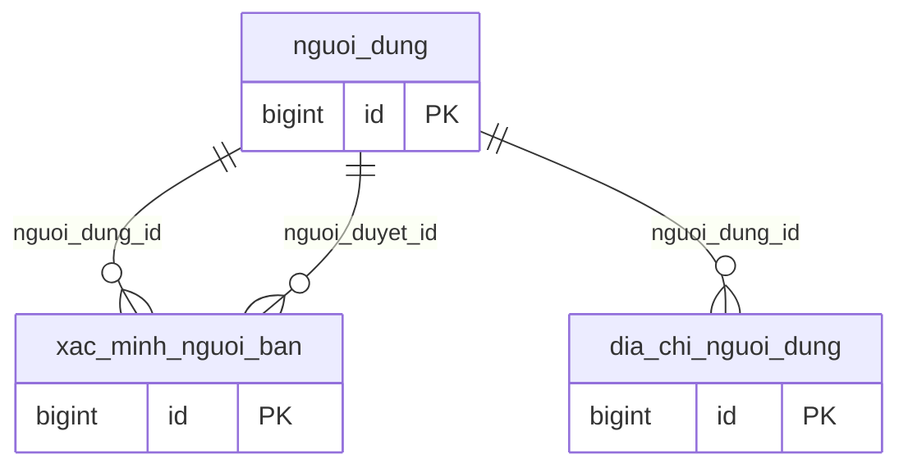
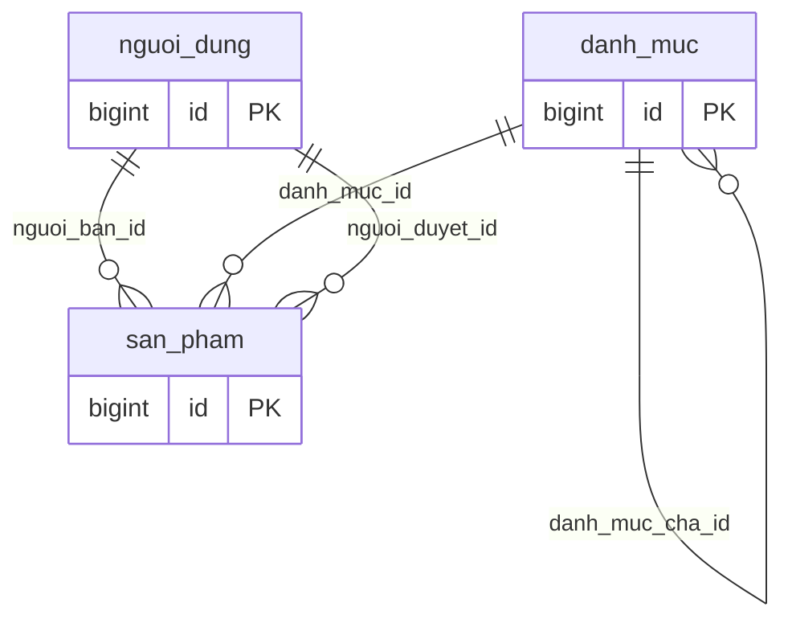
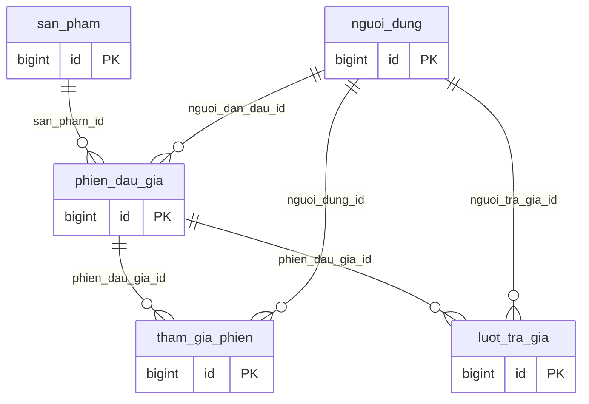
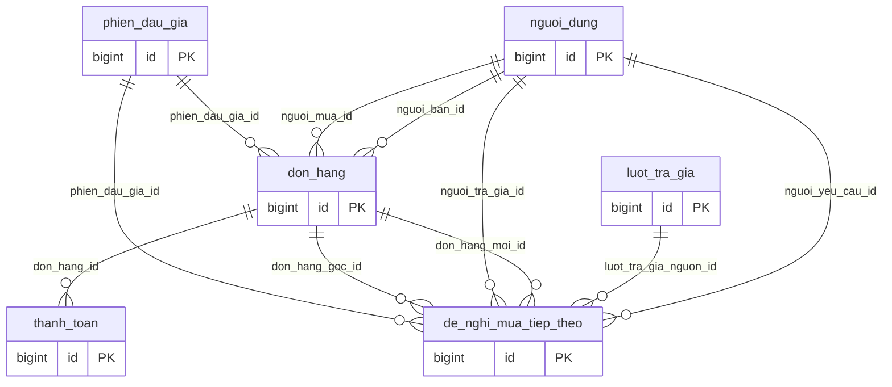
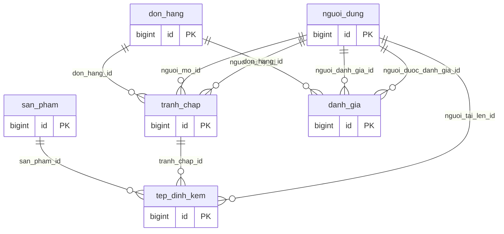
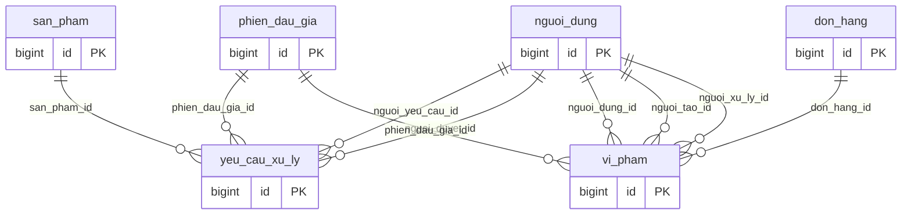
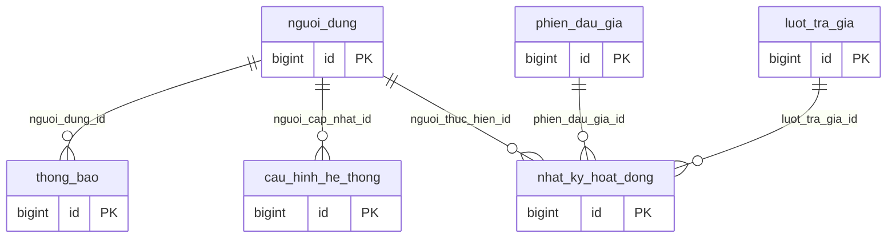

# Sơ đồ quan hệ — 19 bảng

Mỗi hình chỉ vẽ quan hệ có bảng con thuộc nhóm. Bảng tham chiếu xuất hiện ở nhiều hình nhưng chỉ có một bảng vật lý. SQL giữ đủ 46 khóa ngoại. Các cột hiển thị được rút gọn, chi tiết ở SQL và trình xem HTML.

## Tài khoản

## Danh mục và sản phẩm

## Đấu giá

## Đơn hàng và thanh toán

## Tranh chấp, tệp và đánh giá

## Yêu cầu và vi phạm

## Thông báo, cấu hình và nhật ký

